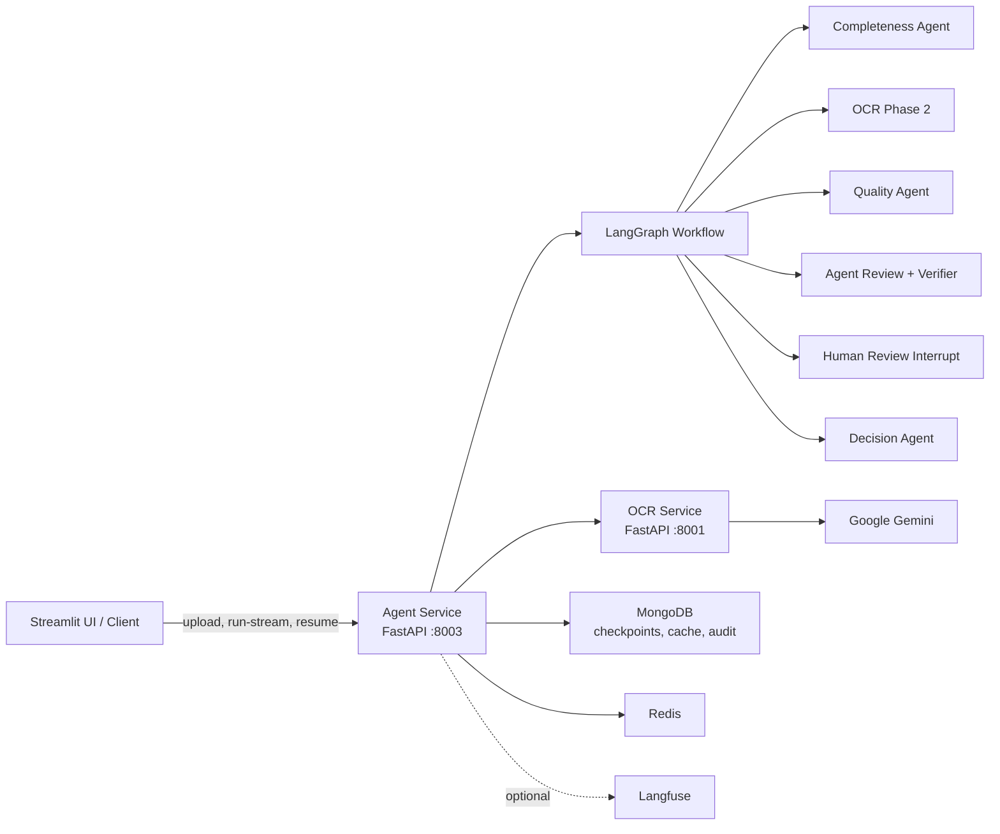

# Agentic AI Insurance Claims Processing System

Hệ thống xử lý hồ sơ bồi thường bảo hiểm sức khỏe bằng kiến trúc agentic AI. Dự án này được xây dựng trong phạm vi khóa luận tốt nghiệp, tập trung vào quy trình tiếp nhận chứng từ, số hóa tài liệu, kiểm tra tính đầy đủ, thẩm định chất lượng y tế và ra quyết định với cơ chế human-in-the-loop.

Mục tiêu của hệ thống là minh họa một pipeline có thể kiểm thử và tái lập trong môi trường nghiên cứu: các service có ranh giới rõ ràng, trạng thái workflow được lưu bền vững, kết quả OCR/agent có audit log, và các bước cần thẩm định thủ công được tách khỏi các bước tự động.

## Phạm Vi Khóa Luận

Hệ thống xử lý một hồ sơ bồi thường theo luồng nghiệp vụ sau:

1. Người dùng tải bộ chứng từ PDF/ảnh lên Agent Service hoặc giao diện vận hành.
2. OCR Service dùng Google Gemini để phân loại tài liệu, chia đoạn trang và trích xuất dữ liệu có cấu trúc.
3. Completeness Agent kiểm tra hồ sơ có đủ chứng từ bắt buộc theo ngữ cảnh bảo hiểm.
4. Khi hồ sơ đủ điều kiện, OCR phase 2 trích xuất dữ liệu chi tiết theo schema tài liệu.
5. Quality Agent đánh giá thông tin y tế, ICD, thuốc, quyền lợi và điều khoản loại trừ.
6. Agent Review kết hợp verifier và các ràng buộc nghiệp vụ để quyết định tự động đi tiếp hay chuyển thẩm định thủ công.
7. Human reviewer phê duyệt, từ chối hoặc hiệu chỉnh khi workflow tạm dừng.
8. Decision Agent tổng hợp kết quả cuối cùng và trả về kết luận xử lý hồ sơ.

## Thành Phần Chính

| Thành phần | Vai trò |
| --- | --- |
| **Agent Service** | FastAPI service điều phối LangGraph workflow, upload, streaming, resume, checkpoint và API vận hành |
| **OCR Service** | FastAPI service trích xuất dữ liệu tài liệu bằng Gemini OCR, hỗ trợ OCR v1 và OCR v2 hai pha |
| **Streamlit UI** | Giao diện demo/vận hành cho upload hồ sơ, theo dõi tiến trình và human review |
| **MongoDB** | Lưu LangGraph checkpoints, OCR cache/audit và agent audit logs |
| **Redis** | Lưu mapping phiên xử lý và hỗ trợ hạ tầng cache/session |
| **Langfuse** | Observability tùy chọn cho LLM traces và phân tích phiên chạy |
| **Evaluation Toolkit** | Chạy batch evaluation, label dữ liệu và tính metrics trên bộ hồ sơ thử nghiệm |

## Kiến Trúc



Thiết kế chi tiết theo từng layer nằm trong [src/agent-service/docs/README.md](src/agent-service/docs/README.md). OCR v2 và schema trích xuất được mô tả tại [src/ocr-service/README.md](src/ocr-service/README.md).

## Yêu Cầu Môi Trường

Khuyến nghị cho môi trường demo, thực nghiệm hoặc chạy thử trong phạm vi khóa luận:

| Hạng mục | Yêu cầu |
| --- | --- |
| Runtime | Docker và Docker Compose |
| Python local | Python 3.11+ nếu chạy service ngoài Docker |
| API key | `GEMINI_API_KEY` cho OCR và agent runtime |
| Database | MongoDB cho checkpoint/cache/audit |
| Network | Agent Service gọi nội bộ tới OCR Service qua `OCR_SERVICE_URL` |
| Tài nguyên | CPU/RAM đủ chạy MongoDB, Redis, Langfuse tùy chọn và 2 application services |

Trong báo cáo khóa luận, hệ thống được mô tả và đánh giá ở môi trường cục bộ hoặc nội bộ, không đặt trọng tâm vào triển khai công khai hay vận hành thực tế quy mô lớn.

## Chạy Thử Nhanh Bằng Docker Compose

### 1. Tạo cấu hình môi trường

```bash
cp .env.example .env
```

Cập nhật tối thiểu:

```env
GEMINI_API_KEY=<your_gemini_api_key>
DEBUG=false
LOG_LEVEL=INFO
ALLOWED_ORIGINS=http://localhost:8501
OCR_API_VERSION=v2
OCR_V2_PIPELINE=two_phase_gated
```

Nếu dùng để demo trong lớp hoặc trình diễn nội bộ, vẫn nên đổi các mật khẩu mặc định trong `.env` để tránh lộ cấu hình mẫu.

### 2. Khởi động hệ thống

```bash
docker compose up -d --build
```

Root compose sẽ build và chạy:

| Service | Host port | Vai trò |
| --- | --- | --- |
| `ocr-service` | `8001` | OCR và structured extraction |
| `agent-service` | `8003` | LangGraph workflow API |
| `mongodb` | theo compose hạ tầng | Checkpoint/cache/audit |
| `redis` | theo compose hạ tầng | Cache/session |
| `langfuse-web` | `3000` nếu bật | LLM observability |
| `mongo-express` | `8081` nếu bật | Quản trị MongoDB nội bộ/demo |

### 3. Kiểm tra trạng thái

```bash
docker compose ps
curl http://localhost:8001/health
curl http://localhost:8003/health
```

Các URL thường dùng:

| URL | Mục đích |
| --- | --- |
| <http://localhost:8003/docs> | Swagger UI của Agent API |
| <http://localhost:8003/health> | Health check Agent Service |
| <http://localhost:8001/health> | Health check OCR Service |
| <http://localhost:8081> | Mongo Express cho local/demo nội bộ |
| <http://localhost:3000> | Langfuse Web nếu bật |

## Cấu Hình Thực Nghiệm Khuyến Nghị

Các biến môi trường quan trọng:

```env
DEBUG=false
LOG_LEVEL=INFO

GEMINI_API_KEY=<secret>
GEMINI_MODEL=gemini-2.5-pro

MONGODB_URL=mongodb://<user>:<password>@mongodb:27017/claims?authSource=admin
MONGODB_DB=claims
MONGODB_CONNECT_TIMEOUT_MS=5000
MONGODB_SERVER_SELECTION_TIMEOUT_MS=5000
MONGODB_SOCKET_TIMEOUT_MS=20000

REDIS_URL=redis://redis:6379/0
OCR_SERVICE_URL=http://ocr-service:8000
OCR_API_VERSION=v2
OCR_V2_PIPELINE=two_phase_gated
OCR_TIMEOUT=120
OUTBOUND_HTTP_CONNECT_TIMEOUT=10

UPLOADS_DIR=/app/uploads
MAX_UPLOAD_SIZE_MB=20
ALLOWED_ORIGINS=https://claims.example.com

LANGFUSE_ENABLED=false
LANGFUSE_HOST=https://langfuse.example.com
LANGFUSE_PUBLIC_KEY=
LANGFUSE_SECRET_KEY=
```

Khi `DEBUG=false`, Agent Service thực hiện startup validation nghiêm ngặt để hỗ trợ mô phỏng gần với môi trường chạy thật trong quá trình đánh giá. Service sẽ fail sớm nếu thiếu `GEMINI_API_KEY`, `MONGODB_URL`, `OCR_SERVICE_URL` hoặc nếu `ALLOWED_ORIGINS=*`.

## Nguyên Tắc Thiết Kế Trong Khóa Luận

- Application containers nên stateless; dữ liệu bền vững đặt trong MongoDB, object storage hoặc volume được backup.
- OCR Service chỉ nên được gọi nội bộ bởi Agent Service.
- Agent API hoặc UI được mô tả như một lớp tương tác phục vụ thử nghiệm và đánh giá.
- Secret không được hard-code trong image hoặc commit lên Git.
- Các thành phần hạ tầng như MongoDB, Redis và Langfuse được xem là phần hỗ trợ cho thí nghiệm, không phải trọng tâm triển khai.
- Cần theo dõi lỗi OCR timeout, Gemini quota, MongoDB connectivity và các workflow bị dừng ở trạng thái human review.

## API Chính Trong Đề Tài

| Method | Endpoint | Mục đích |
| --- | --- | --- |
| `POST` | `/api/v1/workflows/upload` | Upload tài liệu và nhận `file_path`, `file_hash` |
| `POST` | `/api/v1/workflows/run` | Chạy workflow và trả kết quả khi graph dừng hoặc kết thúc |
| `POST` | `/api/v1/workflows/run-stream` | Chạy workflow với Server-Sent Events |
| `GET` | `/api/v1/workflows/status/{run_id}` | Đọc trạng thái checkpoint của một lần chạy |
| `POST` | `/api/v1/workflows/resume/{run_id}` | Resume workflow sau human review |
| `POST` | `/api/v1/workflows/continue/{run_id}` | Continue một workflow đang pause không phải human review |
| `GET` | `/api/v1/workflows/stream/{run_id}` | Stream trạng thái workflow đã tồn tại |

## Chạy UI Demo

```bash
cd src/agent-service
uv run streamlit run interfaces/web/app.py
```

Mở <http://localhost:8501>, cấu hình Agent API URL trỏ tới `http://localhost:8003`, upload hồ sơ và theo dõi timeline xử lý. Chi tiết UI nằm tại [src/agent-service/interfaces/web/README.md](src/agent-service/interfaces/web/README.md).

## Phát Triển Local

Cài dependency:

```bash
uv sync --all-extras
```

Chạy OCR Service độc lập:

```bash
cd src/ocr-service
uv run uvicorn main:app --reload --host 0.0.0.0 --port 8091
```

Chạy Agent Service trỏ tới OCR local:

```bash
cd src/agent-service
OCR_SERVICE_URL=http://localhost:8091 uv run uvicorn main:app --reload --host 0.0.0.0 --port 8003
```

Chạy test:

```bash
uv run pytest src/agent-service/tests
uv run pytest src/ocr-service/tests
```

## Evaluation

```bash
uv run python -m eval run --skip-existing --build-suggestions
uv run python -m eval metrics --multi-results eval/results/claims
```

Xem thêm [eval/README.md](eval/README.md).

## Tài Liệu Trong Repo

| Tài liệu | Nội dung |
| --- | --- |
| [src/agent-service/README.md](src/agent-service/README.md) | Agent Service API, lifecycle fields, routing và skill system |
| [src/agent-service/docs/README.md](src/agent-service/docs/README.md) | Tài liệu logic từng layer của Agent Service |
| [src/agent-service/interfaces/web/README.md](src/agent-service/interfaces/web/README.md) | Streamlit UI và thao tác human review |
| [src/ocr-service/README.md](src/ocr-service/README.md) | OCR Service, OCR v2 pipeline, schema registry và endpoints |
| [infrastructure/mongodb/README.md](infrastructure/mongodb/README.md) | MongoDB collections, connection, backup/reset |
| [infrastructure/langfuse/README.md](infrastructure/langfuse/README.md) | Langfuse self-hosted setup |
| [eval/README.md](eval/README.md) | Batch evaluation, label UI và metrics |

## License

MIT
