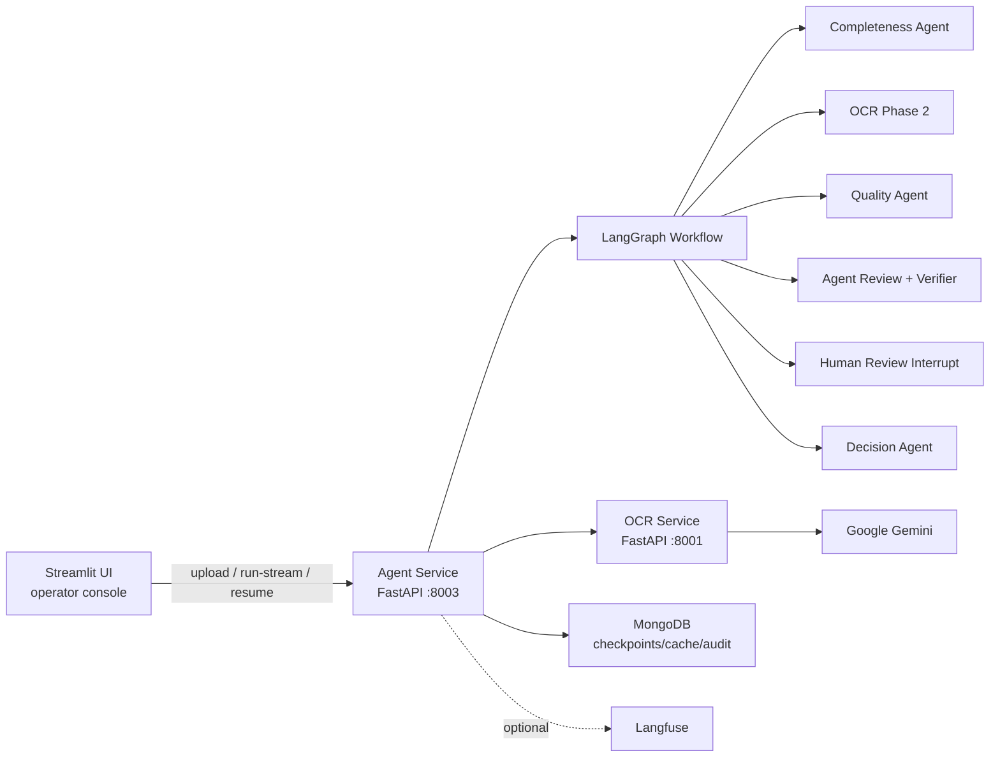

# Agentic AI Insurance Claims Processing System

Hệ thống xử lý hồ sơ bồi thường bảo hiểm sức khỏe bằng kiến trúc multi-agent. Dịch vụ OCR trích xuất dữ liệu từ tài liệu y tế, Agent Service điều phối LangGraph workflow gồm kiểm tra đầy đủ, kiểm tra chất lượng y tế, tự thẩm định bằng verifier, human-in-the-loop và kết luận cuối cùng.

## Mục Lục

- [Concept](#concept)
- [Kiến Trúc](#kiến-trúc)
- [Cài Đặt Chuẩn Trong Phạm Vi Khóa Luận](#cài-đặt-chuẩn-trong-phạm-vi-khóa-luận)
- [Cài Đặt Nhanh Bằng Docker Compose](#cài-đặt-nhanh-bằng-docker-compose)
- [Cấu Hình Chuẩn Tối Thiểu](#cấu-hình-chuẩn-tối-thiểu)
- [Vận Hành](#vận-hành)
- [Phát Triển Local](#phát-triển-local)
- [Tài Liệu Trong Repo](#tài-liệu-trong-repo)

## Concept

Hệ thống được tách thành các service rõ boundary:

| Thành phần | Vai trò |
| --- | --- |
| **OCR Service** | Nhận PDF/ảnh, chạy Gemini OCR, phân loại/chia trang tài liệu, trích xuất dữ liệu có cấu trúc |
| **Agent Service** | FastAPI service điều phối LangGraph workflow, gọi OCR, chạy agent, lưu checkpoint, expose API/SSE |
| **MongoDB** | Lưu LangGraph checkpoints, OCR audit/cache, agent audit logs |
| **Redis** | Hạ tầng cache/queue dùng bởi stack kèm theo và cấu hình service |
| **Langfuse** | Observability/tracing tùy chọn cho LLM calls |
| **Streamlit UI** | Giao diện vận hành: upload hồ sơ, theo dõi tiến trình, human review |
| **Evaluation Toolkit** | Batch evaluation, label UI, metrics cho bộ hồ sơ test |

Workflow nghiệp vụ chính:

1. Upload tài liệu vào Agent Service.
2. OCR phase 1 phân loại/chia đoạn tài liệu.
3. Completeness Agent kiểm tra chứng từ bắt buộc.
4. OCR phase 2 trích xuất dữ liệu chi tiết khi hồ sơ đủ điều kiện.
5. Quality Agent kiểm tra ICD, thuốc, điều khoản loại trừ.
6. Agent Review dùng verifier + ràng buộc cứng để quyết định tự duyệt hay chuyển human review.
7. Human reviewer approve/reject/edit khi workflow pause.
8. Decision Agent tổng hợp kết luận cuối cùng.

## Kiến Trúc



Chi tiết logic theo module nằm ở [src/agent-service/docs/README.md](src/agent-service/docs/README.md).

## Cài Đặt Chuẩn Trong Phạm Vi Khóa Luận

Trong phạm vi khóa luận, mục tiêu là một cấu hình chạy ổn định, dễ tái lập, có ranh giới service rõ ràng và tránh các cấu hình nguy hiểm thường gặp. Cách tổ chức dưới đây phục vụ demo, đánh giá và vận hành thử đáng tin cậy.

### 1. Tách runtime khỏi dữ liệu

- App containers phải stateless: `ocr-service`, `agent-service`, `streamlit UI` nếu dùng.
- Dữ liệu bền vững đặt ở managed services hoặc volume được backup:
  - MongoDB cho checkpoints, OCR cache/audit.
  - Object storage hoặc persistent volume cho upload nếu cần giữ file lâu dài.
  - Langfuse/Postgres/ClickHouse/MinIO nếu bật observability self-hosted.

### 2. Chỉ public các endpoint cần thiết

Khuyến nghị public qua reverse proxy/API gateway:

| Public? | Service | Ghi chú |
| --- | --- | --- |
| Yes | Streamlit UI hoặc frontend riêng | Đặt authentication trước UI |
| Yes/Private | Agent API | Chỉ mở nếu có client backend gọi trực tiếp; nên bảo vệ bằng auth/network policy |
| No | OCR Service | Chỉ Agent Service gọi nội bộ |
| No | MongoDB, Redis, Langfuse internals | Không expose Internet |
| Optional | Langfuse Web | Chỉ mở qua SSO/VPN/basic auth |

### 3. Cấu hình qua secret manager

Không hard-code secret trong image hoặc commit `.env`.

Các secret/cấu hình nhạy cảm:

- `GEMINI_API_KEY`
- `MONGODB_URL`
- `MONGO_ROOT_PASSWORD`
- `LANGFUSE_SECRET_KEY`
- `NEXTAUTH_SECRET`, `SALT`, `ENCRYPTION_KEY`
- `POSTGRES_PASSWORD`, `CLICKHOUSE_PASSWORD`, `MINIO_ROOT_PASSWORD`
- API keys phụ trợ như `TAVILY_API_KEY`, `OPENAI_API_KEY` nếu bật tool tương ứng.

### 4. Cấu hình chạy nghiêm ngặt

Cấu hình chuẩn nên chạy:

- `DEBUG=false`
- `ALLOWED_ORIGINS` là danh sách domain cụ thể, không dùng `*`
- `LANGFUSE_ENABLED=true` nếu cần trace LLM
- MongoDB có timeout rõ ràng
- Upload giới hạn bằng `MAX_UPLOAD_SIZE_MB`
- OCR v2 pipeline cố định `OCR_V2_PIPELINE=two_phase_gated`

Agent Service có startup validation khi `DEBUG=false`: thiếu `GEMINI_API_KEY`, `MONGODB_URL`, `OCR_SERVICE_URL` hoặc wildcard CORS sẽ fail sớm.

### 5. Health check và rollout

Trước khi nhận traffic:

```bash
curl http://<agent-host>/health
curl http://<ocr-host>/health
```

Trước khi demo hoặc chạy batch evaluation nên có:

- readiness/liveness probe cho Agent/OCR.
- structured logs được ship về log backend.
- alert cho OCR timeout, Gemini/API quota, MongoDB connectivity.
- backup/retention policy cho MongoDB và Langfuse data.
- migration/runbook cho thay đổi schema prompt/tool quan trọng.

## Cài Đặt Nhanh Bằng Docker Compose

### 1. Chuẩn bị `.env`

```bash
cp .env.example .env
```

Sửa ít nhất:

```env
GEMINI_API_KEY=your_gemini_api_key
DEBUG=false
ALLOWED_ORIGINS=http://localhost:8501
```

Nếu chạy demo cho hội đồng hoặc chia sẻ máy chủ, đổi toàn bộ password mặc định trong `.env.example`.

### 2. Start stack

```bash
docker compose up -d --build
```

Root compose sẽ build:

- `ocr-service`: container port `8000`, host port `8001`
- `agent-service`: container port `8000`, host port `8003`

Và include hạ tầng:

- MongoDB/Mongo Express từ [infrastructure/mongodb](infrastructure/mongodb/README.md)
- Langfuse stack từ [infrastructure/langfuse](infrastructure/langfuse/README.md)

### 3. Kiểm tra

```bash
docker compose ps
curl http://localhost:8001/health
curl http://localhost:8003/health
```

Endpoint thường dùng:

| URL | Mục đích |
| --- | --- |
| <http://localhost:8003/docs> | Swagger của Agent API |
| <http://localhost:8003/health> | Agent health |
| <http://localhost:8001/health> | OCR health |
| <http://localhost:8081> | Mongo Express, chỉ dùng local/demo nội bộ |
| <http://localhost:3000> | Langfuse Web nếu bật |

## Cấu Hình Chuẩn Tối Thiểu

Ví dụ `.env` tối thiểu cho một lần chạy chuẩn trong phạm vi khóa luận:

```env
DEBUG=false
LOG_LEVEL=INFO

GEMINI_API_KEY=<secret>
GEMINI_MODEL=gemini-2.5-pro

MONGODB_URL=mongodb://<user>:<password>@mongodb:27017/claims?authSource=admin
MONGODB_DB=claims
MONGODB_CONNECT_TIMEOUT_MS=5000
MONGODB_SERVER_SELECTION_TIMEOUT_MS=5000
MONGODB_SOCKET_TIMEOUT_MS=20000

OCR_SERVICE_URL=http://ocr-service:8000
OCR_API_VERSION=v2
OCR_V2_PIPELINE=two_phase_gated
OCR_TIMEOUT=120
OUTBOUND_HTTP_CONNECT_TIMEOUT=10

UPLOADS_DIR=/app/uploads
MAX_UPLOAD_SIZE_MB=20
ALLOWED_ORIGINS=https://claims.example.com

LANGFUSE_ENABLED=false
LANGFUSE_HOST=https://langfuse.example.com
LANGFUSE_PUBLIC_KEY=
LANGFUSE_SECRET_KEY=
```

Nếu dùng Langfuse self-hosted, đọc thêm [infrastructure/langfuse/README.md](infrastructure/langfuse/README.md) để thay `NEXTAUTH_SECRET`, `SALT`, `ENCRYPTION_KEY`, database/object storage credentials và public URL.

## Vận Hành

### Agent API chính

| Method | Endpoint | Mục đích |
| --- | --- | --- |
| `POST` | `/api/v1/workflows/upload` | Upload tài liệu, nhận `file_path` và `file_hash` |
| `POST` | `/api/v1/workflows/run` | Chạy workflow và trả kết quả khi graph dừng/kết thúc |
| `POST` | `/api/v1/workflows/run-stream` | Chạy workflow với SSE progress |
| `GET` | `/api/v1/workflows/status/{run_id}` | Lấy trạng thái checkpoint |
| `POST` | `/api/v1/workflows/resume/{run_id}` | Resume sau human review |
| `POST` | `/api/v1/workflows/continue/{run_id}` | Continue pause không phải human review |
| `GET` | `/api/v1/workflows/stream/{run_id}` | Stream workflow đã tồn tại |

### UI vận hành

```bash
cd src/agent-service
uv run streamlit run interfaces/web/app.py
```

Mở <http://localhost:8501> và cấu hình API URL trỏ tới Agent Service. Xem thêm [src/agent-service/interfaces/web/README.md](src/agent-service/interfaces/web/README.md).

### Evaluation

```bash
uv run python -m eval run --skip-existing --build-suggestions
uv run python -m eval metrics --multi-results eval/results/claims
```

Xem [eval/README.md](eval/README.md).

## Phát Triển Local

### Cài dependency

```bash
uv sync --all-extras
```

### Chạy từng service không dùng Docker

OCR standalone mặc định dùng port `8091`:

```bash
cd src/ocr-service
uv run uvicorn main:app --reload --host 0.0.0.0 --port 8091
```

Agent Service:

```bash
cd src/agent-service
OCR_SERVICE_URL=http://localhost:8091 uv run uvicorn main:app --reload --host 0.0.0.0 --port 8003
```

Streamlit UI:

```bash
cd src/agent-service
uv run streamlit run interfaces/web/app.py
```

### Test

```bash
uv run pytest src/agent-service/tests
uv run pytest src/ocr-service/tests
```

Một số nhóm test quan trọng của Agent Service được mô tả ở [src/agent-service/docs/07-testing-operations.md](src/agent-service/docs/07-testing-operations.md).

## Tài Liệu Trong Repo

| Tài liệu | Nội dung |
| --- | --- |
| [src/agent-service/README.md](src/agent-service/README.md) | Agent Service API, state fields, skill system |
| [src/agent-service/docs/README.md](src/agent-service/docs/README.md) | Logic từng layer/module của Agent Service |
| [src/agent-service/interfaces/web/README.md](src/agent-service/interfaces/web/README.md) | Streamlit UI và workflow vận hành |
| [src/ocr-service/README.md](src/ocr-service/README.md) | OCR Service, OCR v2 pipeline, endpoints |
| [infrastructure/mongodb/README.md](infrastructure/mongodb/README.md) | MongoDB collections, connection, backup/reset |
| [infrastructure/langfuse/README.md](infrastructure/langfuse/README.md) | Langfuse self-hosted setup |
| [eval/README.md](eval/README.md) | Batch evaluation, label UI, metrics |

## License

MIT
