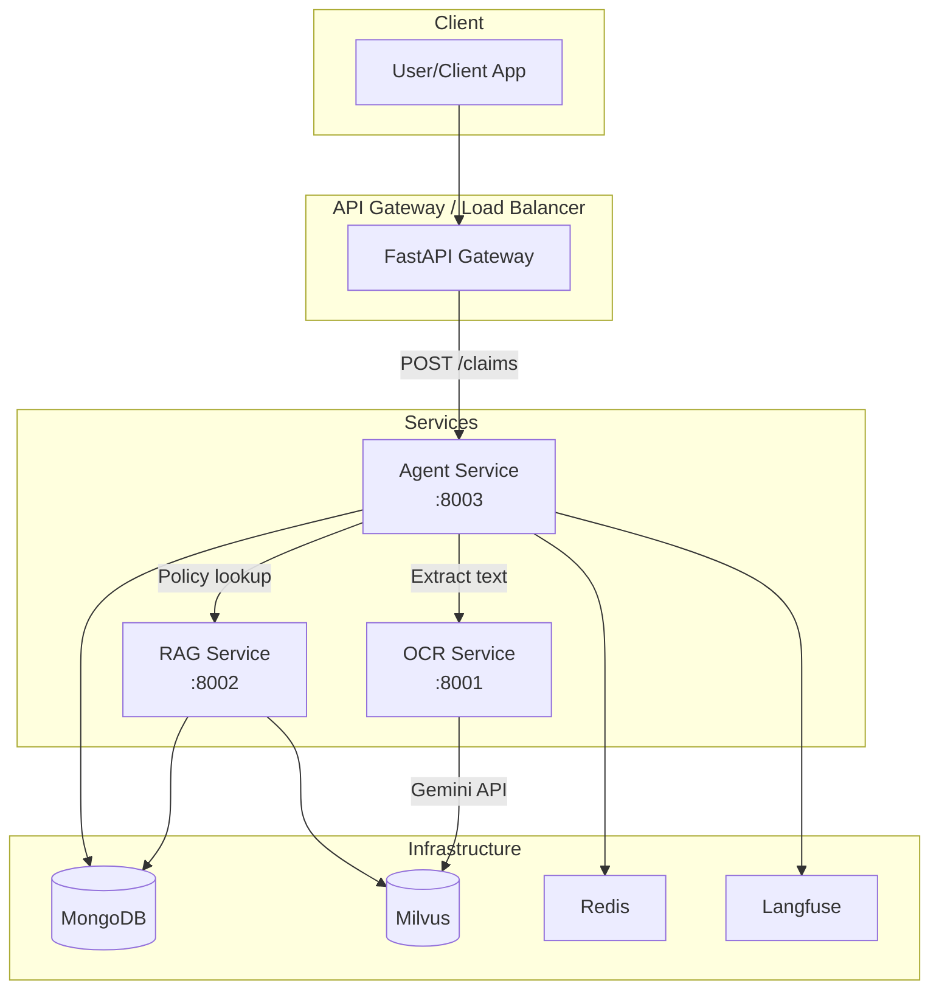
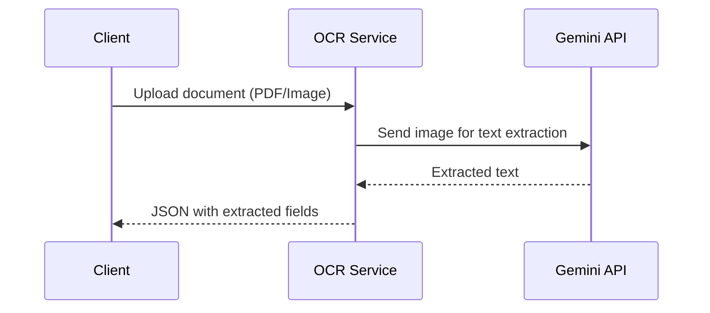
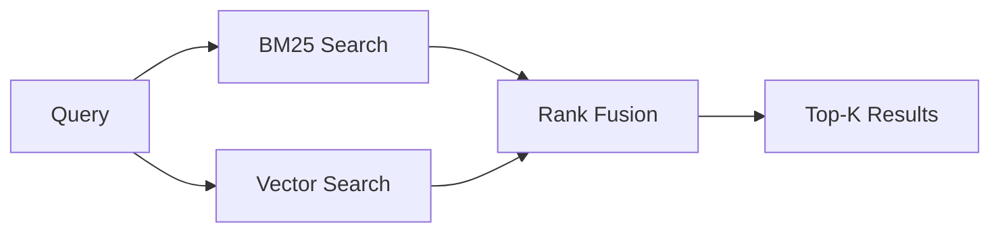
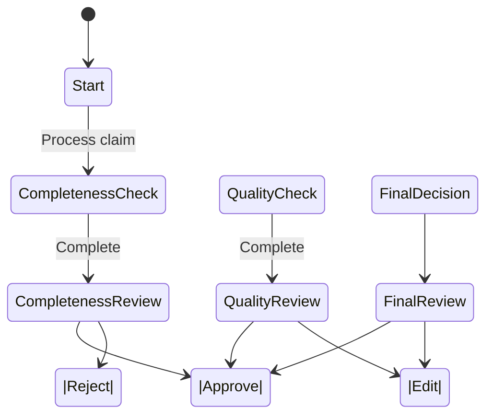
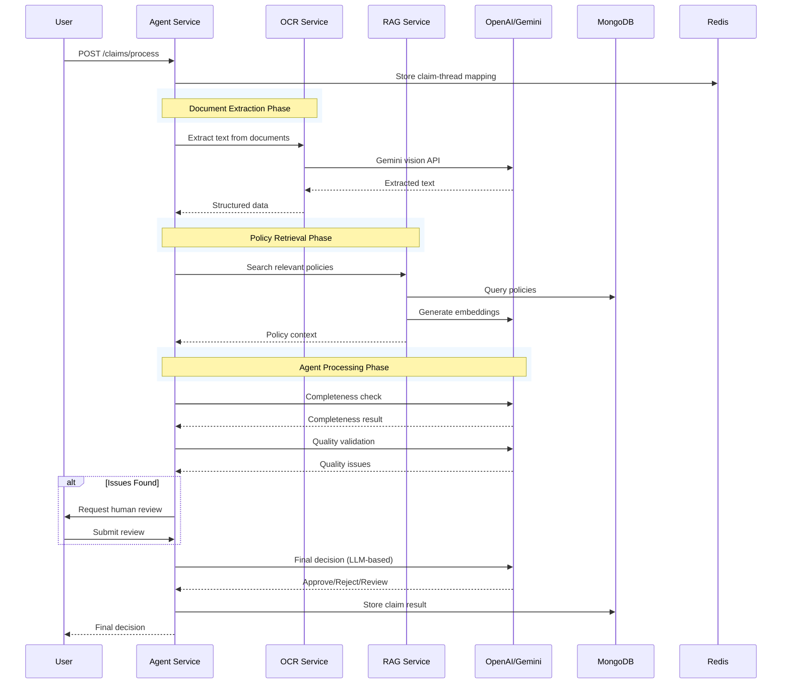

# Agentic AI Insurance Claims Processing System - Architecture Documentation

## Table of Contents

1. [System Overview](#system-overview)
2. [High-Level Architecture](#high-level-architecture)
3. [Service Architecture](#service-architecture)
   - [OCR Service](#ocr-service)
   - [RAG Service](#rag-service)
   - [Agent Service](#agent-service)
4. [Infrastructure Components](#infrastructure-components)
5. [Data Flow](#data-flow)
6. [Technology Stack](#technology-stack)

---

## System Overview

This is an **undergraduate thesis project** that implements an **Agentic AI Insurance Claims Processing System** using a multi-agent AI architecture. The system automates health insurance claims processing through three specialized microservices:

| Service | Port | Purpose |
|---------|------|---------|
| OCR Service | 8001 | Document text extraction using Google Gemini |
| RAG Service | 8002 | Hybrid search (BM25 + Vector) for policy retrieval |
| Agent Service | 8003 | ReAct-based AI agent for claim decision-making |

---

## High-Level Architecture



---

## Service Architecture

### OCR Service

**Purpose:** Extract text from medical documents (claims, receipts, prescriptions) using Google Gemini Vision API.

**Tech Stack:**
- FastAPI
- Google Gemini API (vision model)
- Python

**Key Components:**

| File | Description |
|------|-------------|
| `api/routes.py` | REST endpoints for OCR |
| `core/ocr_engine.py` | Gemini OCR processing logic |
| `core/utils.py` | Document preprocessing utilities |

**API Endpoints:**

| Method | Endpoint | Description |
|--------|----------|-------------|
| POST | `/ocr/extract` | Extract text from uploaded document |
| POST | `/ocr/extract-url` | Extract text from URL |
| GET | `/health` | Health check |

**Data Flow:**


---

### RAG Service

**Purpose:** Retrieve relevant policy documents and coverage information using hybrid search (BM25 + Vector search).

**Tech Stack:**
- FastAPI
- Milvus (vector database)
- MongoDB (document storage)
- LangChain (embedding generation)
- Google Gemini (embeddings)

**Key Components:**

| File | Description |
|------|-------------|
| `api/routes/search.py` | Hybrid search endpoint |
| `api/routes/ingest.py` | Document ingestion endpoint |
| `core/search/hybrid_search.py` | BM25 + Vector search logic |
| `core/chunking/parent_child.py` | Document chunking strategy |
| `core/embeddings/generator.py` | Embedding generation |

**API Endpoints:**

| Method | Endpoint | Description |
|--------|----------|-------------|
| POST | `/rag/ingest` | Ingest policy documents |
| POST | `/rag/search` | Hybrid search (BM25 + Vector) |
| POST | `/rag/query` | Query with context |
| GET | `/health` | Health check |

**Search Strategy:**


---

### Agent Service

**Purpose:** Multi-agent AI system for automated insurance claims processing using LangGraph.

**Architecture:**
- **Framework:** LangGraph (stateful multi-agent orchestration)
- **LLM:** OpenAI GPT-4 (primary) / Google Gemini (fallback)
- **Observability:** Langfuse

**Key Components:**

```
src/agent-service/
├── core/                    # Core infrastructure
│   ├── base/               # Base classes (Agent, Tool, ToolRegistry)
│   ├── config/             # Configuration loading
│   ├── llm/               # LLM client wrapper
│   ├── ports/             # Port interfaces (Hexagonal architecture)
│   └── storage/           # Redis storage
├── features/              # Feature agents
│   ├── completeness/       # Document completeness check
│   ├── quality/           # Quality validation (diagnosis, medication, exclusions)
│   ├── decision/          # Final decision aggregation
│   └── orchestration/      # Human review workflow
├── interfaces/            # API layer
│   ├── api/              # REST endpoints
│   └── web/              # Web UI (Streamlit)
├── workflow/              # LangGraph workflow
│   ├── graph.py          # Multi-agent graph definition
│   ├── state.py          # Graph state schema
│   └── router.py         # Routing logic
└── tests/                # Unit and integration tests
```

**Agent Workflow:**



**Feature Agents:**

| Agent | Purpose | Tools |
|-------|---------|-------|
| **Completeness Agent** | Check required documents | ExtractDocuments, CheckRequiredDocuments, ClassifyBenefit |
| **Quality Agent** | Validate diagnosis, medication, exclusions | ValidateDiagnosis, ValidateConsistency, CheckExclusion, ValidateMedication |
| **Decision Agent** | Aggregate issues, make final decision | AggregateIssues (LLM-based) |

**API Endpoints:**

| Method | Endpoint | Description |
|--------|----------|-------------|
| POST | `/multi-agent/process` | Start claim processing |
| GET | `/multi-agent/status/{claim_id}` | Get processing status |
| GET | `/multi-agent/pending-reviews` | List claims needing human review |
| POST | `/multi-agent/review` | Submit human review decision |

---

## Infrastructure Components

### MongoDB

| Property | Value |
|----------|-------|
| Version | 7.0.4 |
| Port | 27017 |
| Purpose | Document storage, agent memory |
| Credentials | admin/admin123 (default) |

**Collections:**
- `claims` - Claim documents
- `policies` - Insurance policy data
- `agent_memory` - Agent conversation history

### Milvus

| Property | Value |
|----------|-------|
| Version | 2.4.5 |
| Port | 19530 |
| Purpose | Vector database for RAG embeddings |
| UI | Attu (port 8000) |

### Redis

| Property | Value |
|----------|-------|
| Version | Latest |
| Port | 6379 |
| Purpose | Claim-thread mapping, session state |

### Langfuse

| Property | Value |
|----------|-------|
| Version | Latest |
| Port | 3000 (external) |
| Purpose | LLM observability, tracing |

---

## Data Flow

### Complete Claim Processing Flow



---

## Technology Stack

### Application Layer

| Technology | Version | Purpose |
|------------|---------|---------|
| Python | 3.11+ | Runtime |
| FastAPI | 0.109.0 | Web framework |
| Uvicorn | 0.27.0 | ASGI server |
| LangGraph | 0.0.50 | Agent orchestration |
| LangChain | 0.1.0 | LLM framework |
| Pydantic | 2.5.3 | Data validation |

### Infrastructure Layer

| Technology | Version | Purpose |
|------------|---------|---------|
| MongoDB | 7.0.4 | Document database |
| Milvus | 2.4.5 | Vector database |
| Redis | Latest | In-memory cache |
| Docker | Latest | Containerization |

### LLM Providers

| Provider | Model | Purpose |
|----------|-------|---------|
| OpenAI | GPT-4 | Primary decision LLM |
| Google Gemini | gemini-1.5-flash | OCR embeddings, fallback |

---

## Configuration

### Environment Variables

| Variable | Description | Default |
|----------|-------------|---------|
| `GEMINI_API_KEY` | Google Gemini API key | - |
| `OPENAI_API_KEY` | OpenAI API key | - |
| `MONGODB_URL` | MongoDB connection string | mongodb://localhost:27017 |
| `MILVUS_HOST` | Milvus host | localhost |
| `REDIS_URL` | Redis connection string | redis://localhost:6379 |

### Service Ports

| Service | Internal Port | External Port |
|---------|---------------|---------------|
| OCR Service | 8000 | 8001 |
| RAG Service | 8000 | 8002 |
| Agent Service | 8000 | 8003 |
| Mongo Express | 8081 | 8081 |
| Milvus Attu | 3000 | 8000 |

---

## Getting Started

### Quick Start

```bash
# 1. Copy environment template
cp .env.example .env

# 2. Edit .env with your API keys
vim .env

# 3. Start all services
docker-compose up -d

# 4. Check status
docker-compose ps

# 5. View logs
docker-compose logs -f
```

### Development Mode

```bash
# Start infrastructure only
docker-compose up -d mongodb milvus redis

# Start individual services
cd src/agent-service
pip install -r requirements.txt
uvicorn main:app --reload --port 8003
```

---

## Testing

```bash
# Run all tests
cd src/agent-service
pytest tests/ -v

# Run specific test file
pytest tests/test_config.py -v

# Run with coverage
pytest tests/ --cov=. --cov-report=html
```

---

## API Documentation

Once running, access Swagger UI at:

| Service | URL |
|---------|-----|
| OCR Service | http://localhost:8001/docs |
| RAG Service | http://localhost:8002/docs |
| Agent Service | http://localhost:8003/docs |

---

*Last Updated: 2026-02-28*
*Undergraduate Thesis Project - AI Insurance Claims Processing*
