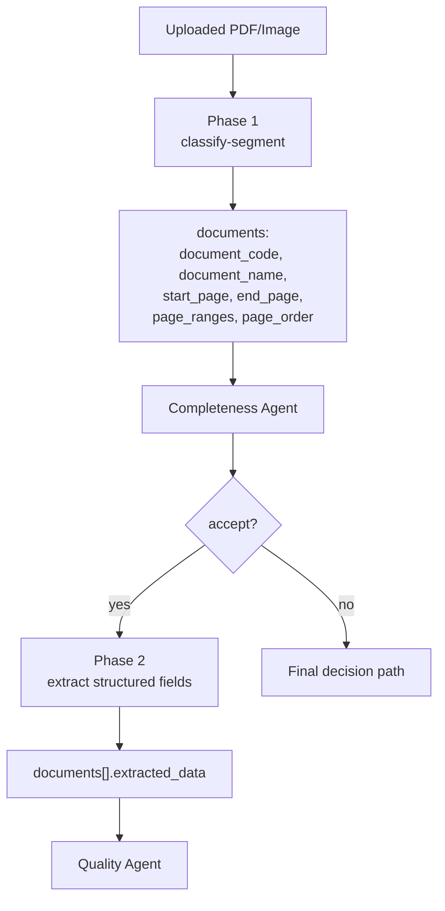
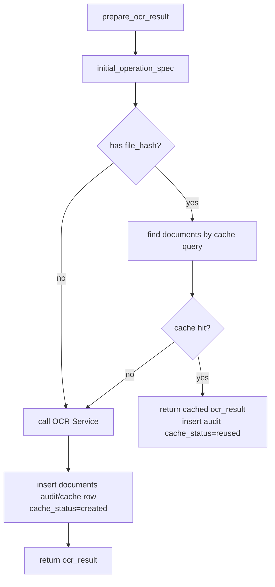

# Section 06 - OCR and Data Flow

OCR là bridge giữa file chứng từ và agent workflow. Agent không trực tiếp đọc PDF/ảnh; agent đọc `extracted_documents` do OCR Service trả về.

## Upload boundary

Upload đi qua `api/upload.py` và `services/file_policy.py`.

Guardrail:

- Chỉ nhận `.pdf`, `.png`, `.jpg`, `.jpeg`.
- MIME phải là `application/pdf`, `image/png`, `image/jpeg`.
- Extension phải khớp MIME.
- File không vượt `MAX_UPLOAD_SIZE_MB`.
- `input_file` khi chạy workflow phải nằm trong `UPLOADS_DIR`.

Sau upload, API trả:

```text
filename
file_path
size_bytes
file_hash
```

`file_hash` là khóa quan trọng để cache OCR.

## OCR v2 hai phase

Thiết kế mặc định là OCR v2 `two_phase_gated`.



Phase 1 trả về metadata chứng từ. Ngoài `start_page` và `end_page`, OCR v2 hiện giữ thêm metadata page-aware:

- `page_ranges`: các khoảng trang vật lý thuộc cùng một chứng từ, kể cả khi không liền nhau.
- `page_order`: thứ tự đọc logic của trang, dùng khi file scan bị đảo trang.
- `duplicate_pages`: trang trùng lặp cần bỏ khỏi extraction nếu không có thông tin mới.

Phase 2 chỉ chạy nếu hồ sơ đủ điều kiện đi tiếp. Cách này tiết kiệm chi phí và tránh trích xuất chi tiết trên hồ sơ thiếu tài liệu nền tảng. Khi có metadata page-aware, Phase 2 cắt PDF theo `page_order/page_ranges`; nếu metadata mới không có thì fallback về `start_page-end_page`.

## OCR cache identity

Cache không chỉ dựa trên `file_hash`. Nó còn dựa trên operation fingerprint.

| Thành phần cache | Ý nghĩa |
| --- | --- |
| `file_hash` | Nội dung file |
| `ocr_version` | `v1` hoặc `v2` |
| `ocr_stage` | `v1_document`, `phase1_classified`, `phase2_extracted` |
| `ocr_pipeline` | Ví dụ `two_phase_gated` |
| `document_codes` | Bộ schema/candidate đang dùng |
| `extract_all_fields` | Có trích xuất toàn bộ field hay không |
| `source_documents_fingerprint` | Fingerprint của phase 1 documents khi chạy phase 2 |

Nhờ vậy phase 2 không reuse nhầm kết quả nếu phase 1 documents hoặc cấu hình extraction thay đổi.

## Flow prepare initial OCR



## Flow prepare phase 2 OCR

`graphs/ocr_extraction.py` lấy `extracted_documents.documents` từ phase 1, lọc lại những field cần thiết:

```text
document_code
document_name
suggested_document_code
suggested_document_name
start_page
end_page
page_ranges
page_order
duplicate_pages
```

Sau đó `prepare_phase2_ocr(...)` gọi OCR Service `/api/v2/ocr/extract/form` với cùng file và danh sách documents này. `extracted_data` từ bất kỳ kết quả cũ nào không được truyền ngược vào Phase 2.

## Shape của `extracted_documents`

Sau phase 1:

```json
{
  "ocr_version": "v2",
  "ocr_pipeline": "two_phase_gated",
  "ocr_stage": "phase1_classified",
  "documents": [
    {
      "document_code": "medical_report",
      "document_name": "Báo cáo y tế",
      "start_page": 1,
      "end_page": 5,
      "page_ranges": [[1, 2], [5, 5]],
      "page_order": [1, 2, 5],
      "duplicate_pages": []
    }
  ],
  "document_codes": ["medical_report"]
}
```

Sau phase 2:

```json
{
  "ocr_version": "v2",
  "ocr_pipeline": "two_phase_gated",
  "ocr_stage": "phase2_extracted",
  "phase1_documents": [...],
  "documents": [
    {
      "document_code": "medical_report",
      "start_page": 1,
      "end_page": 5,
      "page_ranges": [[1, 2], [5, 5]],
      "page_order": [1, 2, 5],
      "duplicate_pages": [],
      "extracted_data": {
        "diagnosis": "Viêm họng",
        "patient_name": "..."
      }
    }
  ]
}
```

## Khi OCR lỗi

Nếu phase 2 lỗi, graph không dừng đột ngột. Node `ocr_extraction` tạo kết quả `agent_2_result` dạng reject với issue:

```text
severity = high
code = OCR_EXTRACTION_FAILED
```

Điều này giúp workflow vẫn đi tới Decision Agent để có kết luận rõ ràng và có audit trail.
