# Biểu đồ Kiến trúc Hệ thống - Khóa luận Tốt nghiệp

## 5. Kiến trúc tổng thể của hệ thống

### 5.1 Kiến trúc triển khai hệ thống (Deployment Architecture)

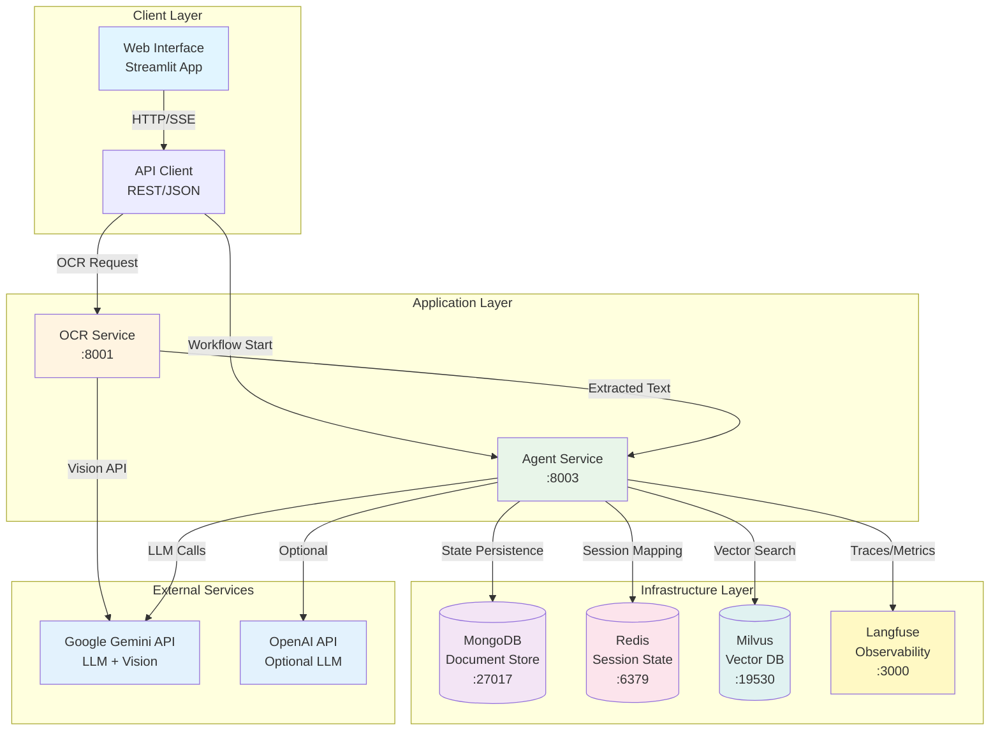

### 5.2 Biểu đồ thành phần chức năng (Component Diagram)

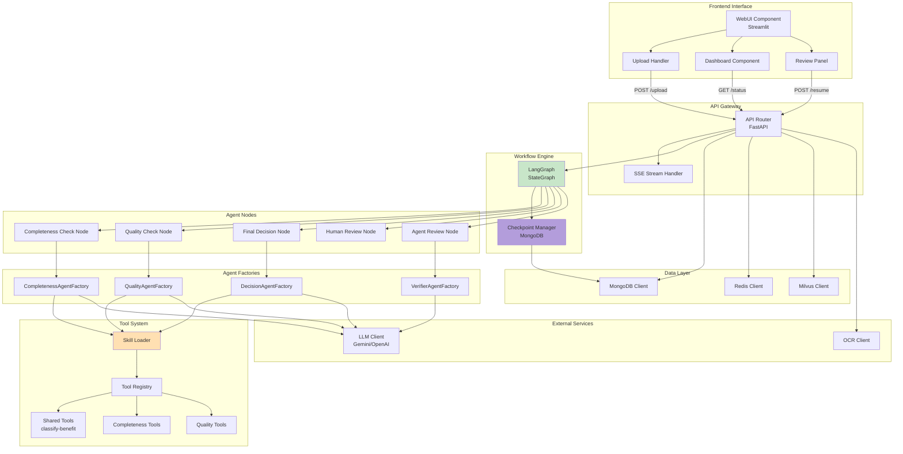

### 5.3 Biểu đồ luồng dữ liệu tổng quát (Data Flow)

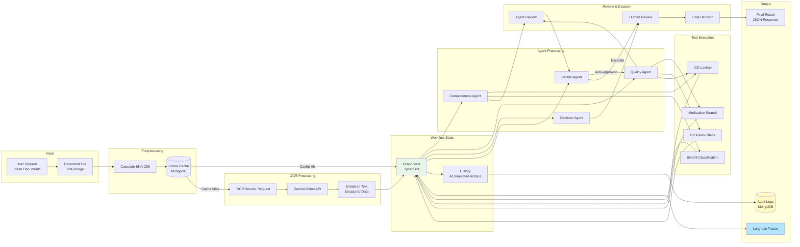

### 5.4 Nguyên tắc tích hợp và giao tiếp giữa các thành phần

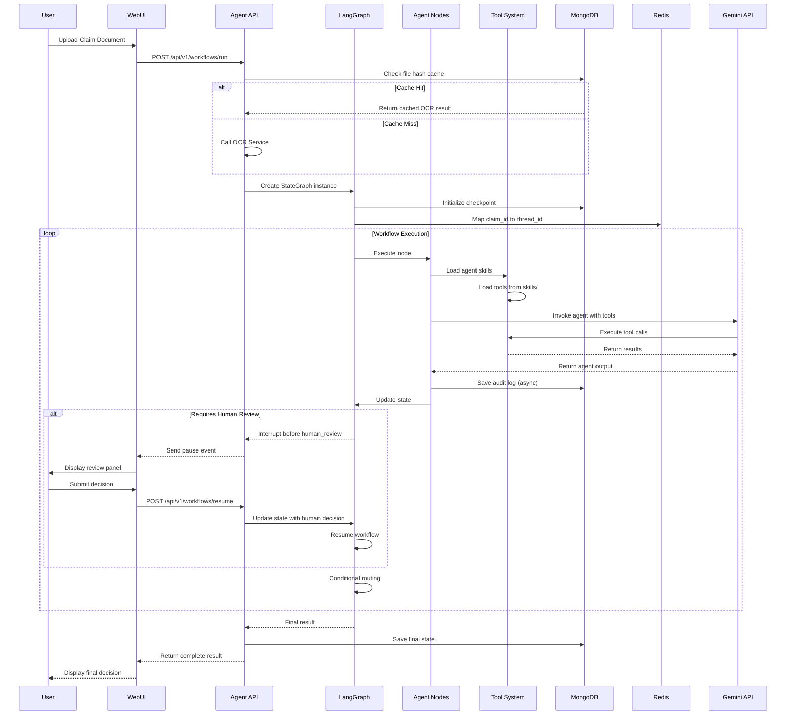

---

## 6. Thiết kế kiến trúc đa tác nhân dựa trên LangGraph

### 6.2 Thiết kế các tác nhân chuyên biệt (Agent Roles)

#### Bảng định nghĩa đầu vào và đầu ra của tác nhân

| Tác nhân | Đầu vào | Đầu ra | Công cụ sử dụng |
|----------|---------|--------|----------------|
| **CompletenessAgent** | claim_id, policy_number, extracted_documents, history | AssessmentOutput (valid, decision, issues, suggested_updates, evidence) | check-required-docs, validate-consistency, classify-benefit |
| **QualityAgent** | claim_id, policy_number, extracted_documents, history | AssessmentOutput (valid, decision, issues, medical_findings, suggested_updates) | check-icd, validate-medication, check-exclusion, search-medicine, web-search |
| **DecisionAgent** | claim_id, policy_number, agent_1_result, agent_2_result, human_review_result | FinalDecisionOutput (decision, approved_amount, rejection_reason, issues_summary) | aggregate-issues |
| **VerifierAgent** | primary_assessment, extracted_evidence, extracted_documents, current_step | VerifierOutput (verdict, reason, contradictions) | Cross-verification logic |

### 6.3 Thiết kế đồ thị xử lý (Graph Topology)

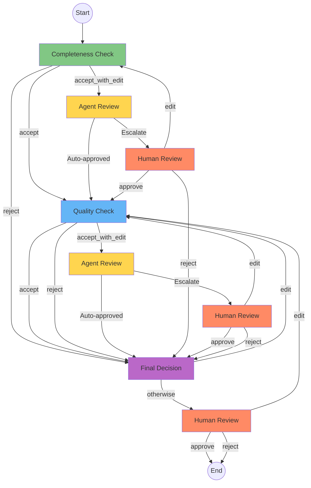

### 6.3.1 Lược đồ trạng thái dùng chung (State Schema)

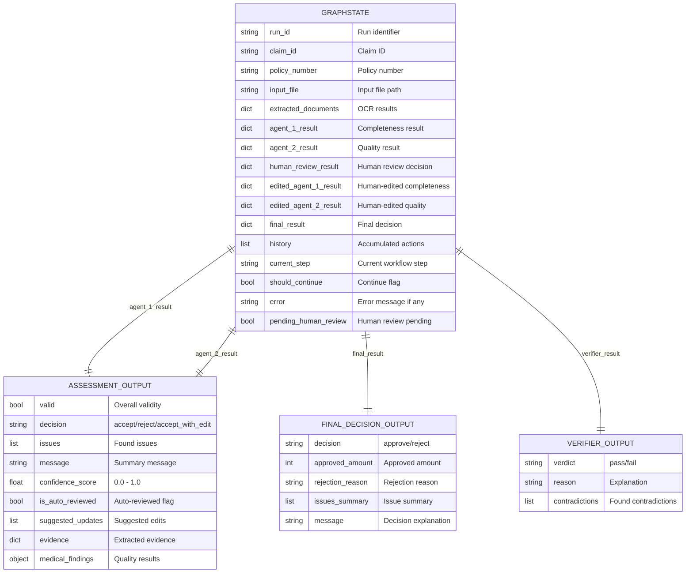

### 6.3.2 Cơ chế điều hướng và định tuyến có điều kiện (Conditional Routing)

```mermaid
graph TB
    subgraph "Completeness Check Routing"
        COMP_RESULT[completeness_check<br/>result]
        COMP_DECISION{decision field?}

        COMP_RESULT --> COMP_DECISION
        COMP_DECISION -->|accept| NEXT_QUALITY[→ quality_check]
        COMP_DECISION -->|reject| NEXT_FINAL[→ final_decision]
        COMP_DECISION -->|accept_with_edit| NEXT_AGENT_REVIEW[→ agent_review]

        COMP_DECISION -->|critical/high<br/>issues| NEXT_FINAL
        COMP_DECISION -->|medium/low<br/>issues| NEXT_AGENT_REVIEW
    end

    subgraph "Quality Check Routing"
        QUAL_RESULT[quality_check<br/>result]
        QUAL_DECISION{decision field?}

        QUAL_RESULT --> QUAL_DECISION
        QUAL_DECISION -->|accept| NEXT_FINAL2[→ final_decision]
        QUAL_DECISION -->|reject| NEXT_FINAL2
        QUAL_DECISION -->|accept_with_edit| NEXT_AGENT_REVIEW2[→ agent_review]
    end

    subgraph "Agent Review Routing"
        AGENT_REV_RESULT[agent_review<br/>result]
        AUTO_CHECK{is_auto_reviewed?}

        AGENT_REV_RESULT --> AUTO_CHECK
        AUTO_CHECK -->|True| STAGE_CHECK{current_step?}
        AUTO_CHECK -->|False| NEXT_HUMAN[→ human_review]

        STAGE_CHECK -->|completeness| NEXT_QUALITY2[→ quality_check]
        STAGE_CHECK -->|quality| NEXT_FINAL3[→ final_decision]
    end

    subgraph "Final Decision Routing"
        FINAL_RESULT[final_decision<br/>result]
        FINAL_CHECK{decision field?}

        FINAL_RESULT --> FINAL_CHECK
        FINAL_CHECK -->|edit| NEXT_QUALITY3[→ quality_check]
        FINAL_CHECK -->|otherwise| NEXT_HUMAN2[→ human_review]
    end

    subgraph "Human Review Routing"
        HUMAN_RESULT[human_review_result]
        STAGE_DETERMINE{stage?}

        HUMAN_RESULT --> STAGE_DETERMINE
        STAGE_DETERMINE -->|completeness| HUMAN_COMP_DECISION{decision?}
        STAGE_DETERMINE -->|quality| HUMAN_QUAL_DECISION{decision?}
        STAGE_DETERMINE -->|final/None| HUMAN_FINAL_DECISION{decision?}

        HUMAN_COMP_DECISION -->|approve| NEXT_QUALITY4[→ quality_check]
        HUMAN_COMP_DECISION -->|reject| NEXT_FINAL4[→ final_decision]
        HUMAN_COMP_DECISION -->|edit| NEXT_COMP[→ completeness_check]

        HUMAN_QUAL_DECISION -->|approve| NEXT_FINAL5[→ final_decision]
        HUMAN_QUAL_DECISION -->|reject| NEXT_FINAL5
        HUMAN_QUAL_DECISION -->|edit| NEXT_QUALITY5[→ quality_check]

        HUMAN_FINAL_DECISION -->|approve| END[→ END]
        HUMAN_FINAL_DECISION -->|reject| END
        HUMAN_FINAL_DECISION -->|edit| NEXT_QUALITY6[→ quality_check]
    end

    style COMP_RESULT fill:#81c784
    style QUAL_RESULT fill:#64b5f6
    style FINAL_RESULT fill:#ba68c8
    style AGENT_REV_RESULT fill:#ffd54f
    style HUMAN_RESULT fill:#ff8a65
    style END fill:#ef5350
```

### 6.4 Cơ chế phối hợp và tương tác giữa các tác nhân

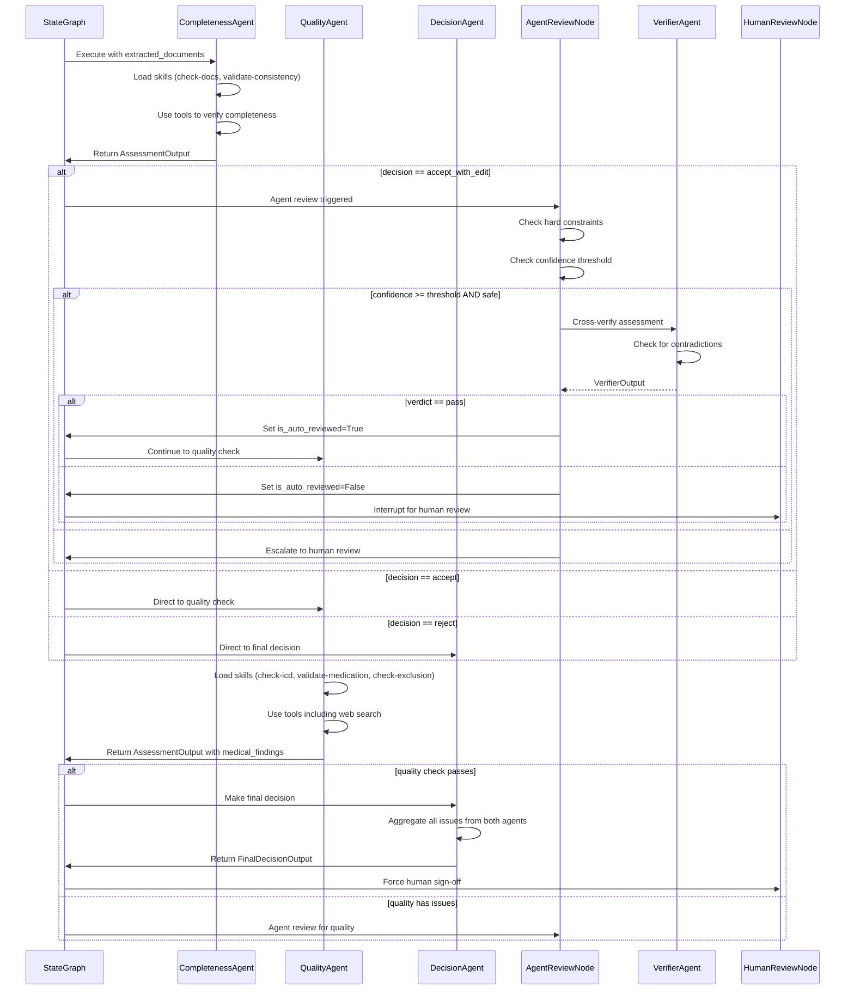

### 6.5 Cơ chế quản lý trạng thái bền vững (Persistence & Checkpointing)

```mermaid
graph TB
    subgraph "LangGraph Checkpoint System"
        STATE[GraphState<br/>TypedDict]
        REDUCER[operator.add<br/>for history]
    end

    subgraph "Checkpoint Storage"
        MONGO_CP[(MongoDB<br/>Checkpoint Collection)]
        THREAD_ID[thread_id<br/>Identifier]
    end

    subgraph "Session Management"
        CLAIM_ID[claim_id]
        REDIS_MAP[(Redis<br/>claim_id → thread_id)]
    end

    subgraph "Interrupt Mechanism"
        INTERRUPT[interrupt_before<br/>human_review]
        PAUSED[Paused State<br/>pending_human_review=True]
    end

    subgraph "Resume Flow"
        RESUME[POST /resume/{run_id}]
        UPDATE[Update state<br/>human_review_result]
        CONTINUE[Resume execution]
    end

    STATE --> REDUCER
    REDUCER --> MONGO_CP
    MONGO_CP --> THREAD_ID

    CLAIM_ID --> REDIS_MAP
    REDIS_MAP --> THREAD_ID

    STATE --> INTERRUPT
    INTERRUPT --> PAUSED
    PAUSED --> MONGO_CP

    PAUSED --> RESUME
    RESUME --> UPDATE
    UPDATE --> MONGO_CP
    MONGO_CP --> CONTINUE

    style STATE fill:#e8f5e9
    style MONGO_CP fill:#f3e5f5
    style REDIS_MAP fill:#fce4ec
    style PAUSED fill:#fff9c4
```

---

## 7. Thiết kế dữ liệu và trạng thái xử lý

### 7.1 Mô hình dữ liệu yêu cầu và kết quả thẩm định

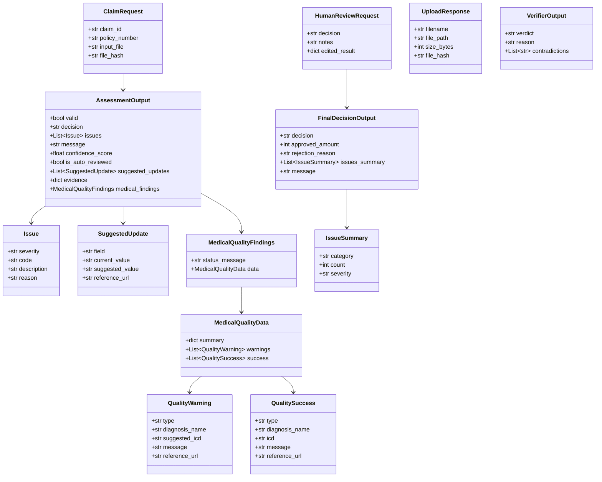

### 7.3 Thiết kế lưu trữ nhật ký kiểm toán (Audit Trail)

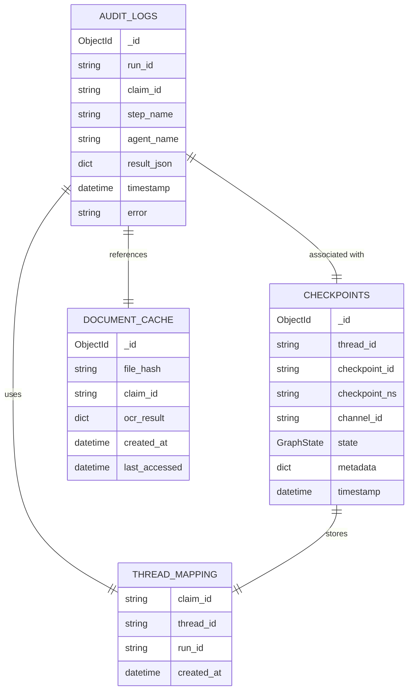

---

## 8. Thiết kế quy trình xử lý nghiệp vụ chi tiết

### 8.1 Quy trình tiếp nhận và tiền xử lý dữ liệu

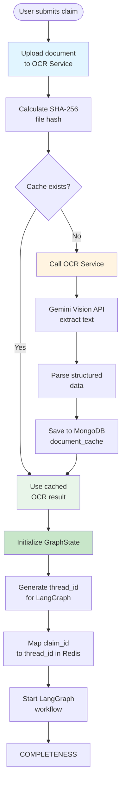

### 8.2 Quy trình phân tích và đối soát nghiệp vụ tự động

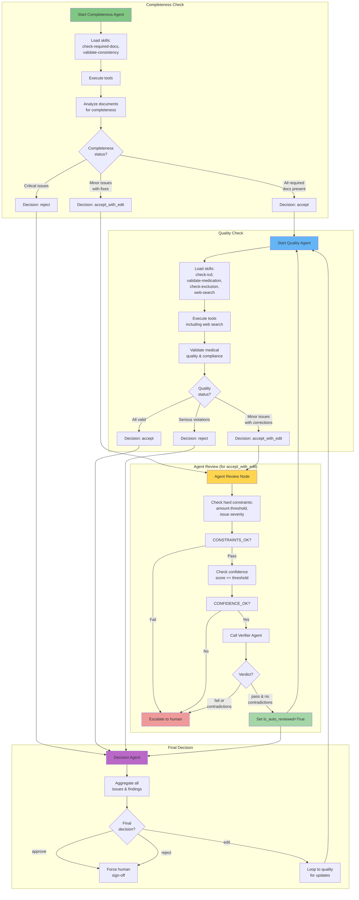

### 8.3 Cơ chế cộng tác Người-AI (Human-in-the-Loop)

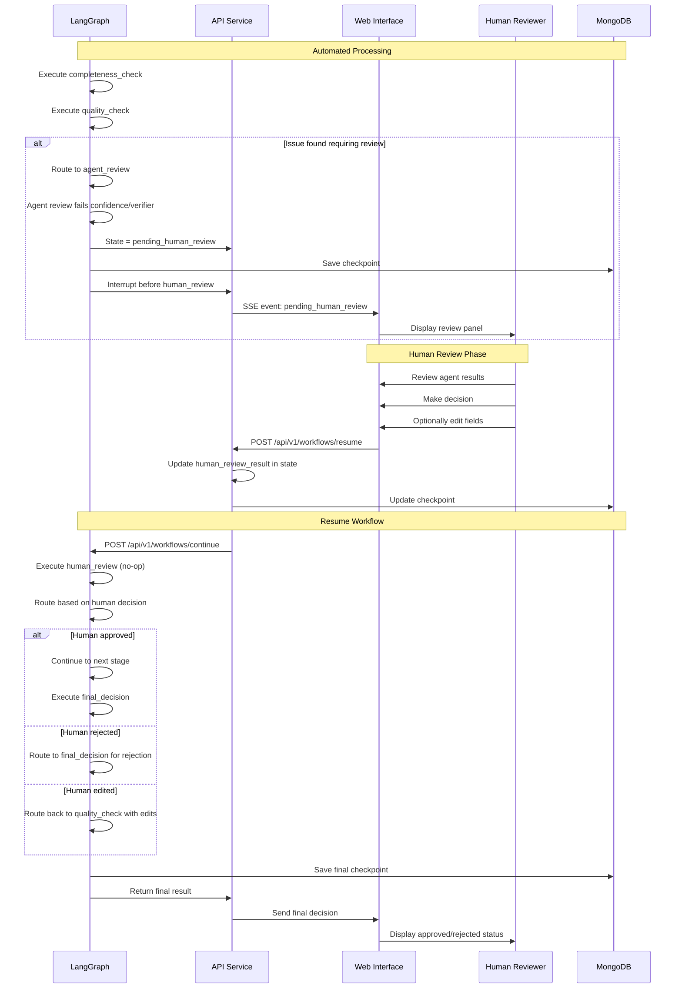

### 8.4 Quy trình tổng hợp và phản hồi kết quả

```mermaid
flowchart LR
    subgraph "Result Aggregation"
        AGG_START[Final Decision Agent] --> COLLECT
        COLLECT[Collect results:<br/>agent_1_result,<br/>agent_2_result,<br/>human_review_result] --> ANALYZE
        ANALYZE[Analyze aggregated data] --> DETERMINE
        DETERMINE[Determine final<br/>decision] --> CALC_AMOUNT
        CALC_AMOUNT[Calculate approved<br/>amount] --> GENERATE
    end

    subgraph "Response Generation"
        GENERATE[Generate FinalDecisionOutput] --> CREATE_SUMMARY
        CREATE_SUMMARY[Create issues summary<br/>by category] --> EXPLAIN
        EXPLAIN[Write detailed<br/>explanation] --> FINAL_OUTPUT
    end

    subgraph "Response Delivery"
        FINAL_OUTPUT[Final JSON Response] --> AUDIT_LOG
        AUDIT_LOG[Save to audit_logs<br/>collection] --> SSE_STREAM
        SSE_STREAM[Stream via SSE<br/>to client] --> UI_UPDATE
        UI_UPDATE[Update Web UI<br/>dashboard] --> NOTIFICATION
        NOTIFICATION[Send notification<br/>to user]
    end

    subgraph "Audit & Observability"
        AUDIT_LOG --> LANGFUSE
        LANGFUSE[Send trace to<br/>Langfuse] --> ANALYTICS
        ANALYTICS[Store metrics &<br/>performance data]
    end

    style AGG_START fill:#ba68c8
    style GENERATE fill:#9575cd
    style FINAL_OUTPUT fill:#7e57c2
    style AUDIT_LOG fill:#fff9c4
    style LANGFUSE fill:#b3e5fc
```

---

## 9. Thiết kế cơ chế giám sát và giải trình

### 9.1 Kiến trúc giám sát hiệu năng với Langfuse

```mermaid
graph TB
    subgraph "Application Layer"
        AGENT[Agent Service]
        WORKFLOW[LangGraph Workflow]
    end

    subgraph "LangChain Integration"
        LANGCHAIN[LangChain Tracing<br/>@observe decorator]
        LLM_CALL[LLM Calls]
        TOOL_CALL[Tool Invocations]
    end

    subgraph "Langfuse SDK"
        SDK_INIT[Langfuse.init]
        OBSERVER[@observe<br/>decorator]
        TRACE[Trace Object]
        SPAN[Span Object]
    end

    subgraph "Langfuse Platform"
        INGESTION[Ingestion API]
        STORAGE[(Trace Storage)]
        DASHBOARD[Langfuse Dashboard]
        ANALYTICS[Analytics Engine]
    end

    subgraph "Monitoring Data"
        TRACES[Trace Data<br/>workflow executions]
        SPANS[Span Data<br/>individual operations]
        METRICS[Metrics<br/>latency, tokens, costs]
        FEEDBACK[Feedback<br/>user ratings]
    end

    AGENT --> LANGCHAIN
    WORKFLOW --> LANGCHAIN

    LANGCHAIN --> LLM_CALL
    LANGCHAIN --> TOOL_CALL

    AGENT --> SDK_INIT
    SDK_INIT --> OBSERVER
    OBSERVER --> TRACE
    OBSERVER --> SPAN

    TRACE --> INGESTION
    SPAN --> INGESTION
    LLM_CALL --> SPAN
    TOOL_CALL --> SPAN

    INGESTION --> STORAGE
    STORAGE --> DASHBOARD
    STORAGE --> ANALYTICS

    STORAGE --> TRACES
    STORAGE --> SPANS
    ANALYTICS --> METRICS
    DASHBOARD --> FEEDBACK

    style AGENT fill:#e8f5e9
    style LANGCHAIN fill:#fff4e1
    style SDK_INIT fill:#e1f5ff
    style INGESTION fill:#c8e6c9
    style DASHBOARD fill:#b3e5fc
    style STORAGE fill:#f3e5f5
```

### 9.2 Cơ chế truy vết chuỗi tư duy (Chain-of-Thought)

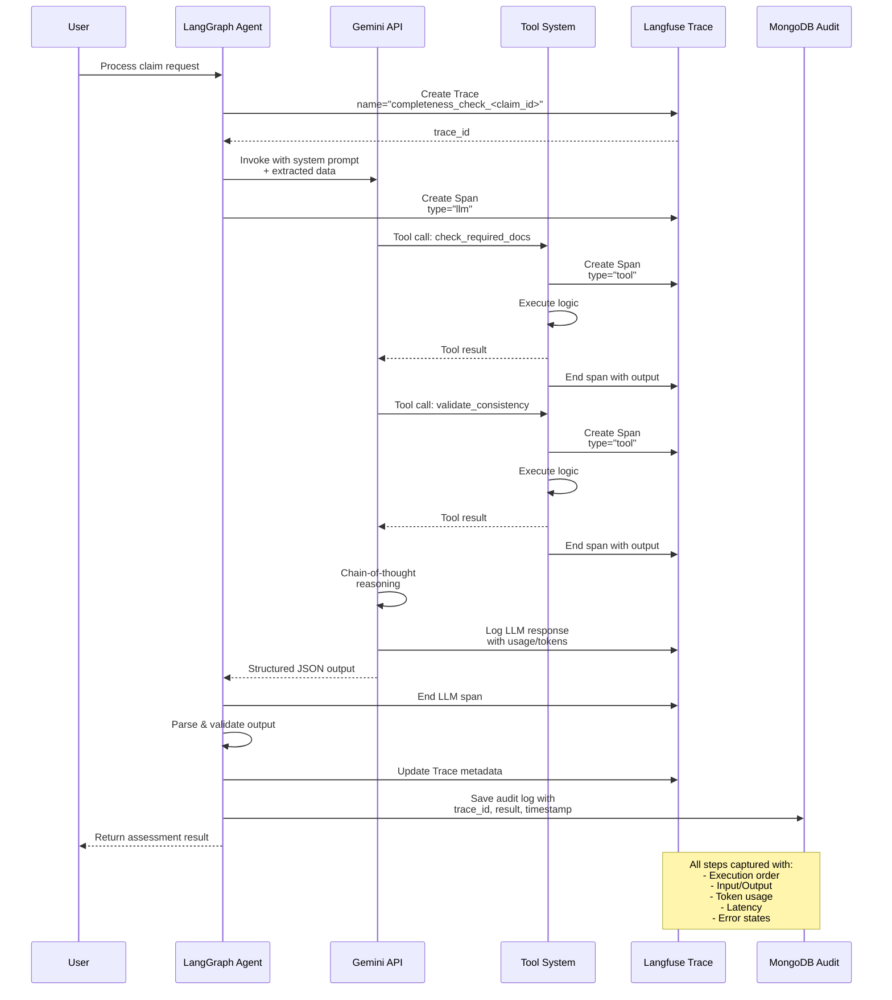

### 9.3 Thiết kế báo cáo giải trình kết quả thẩm định

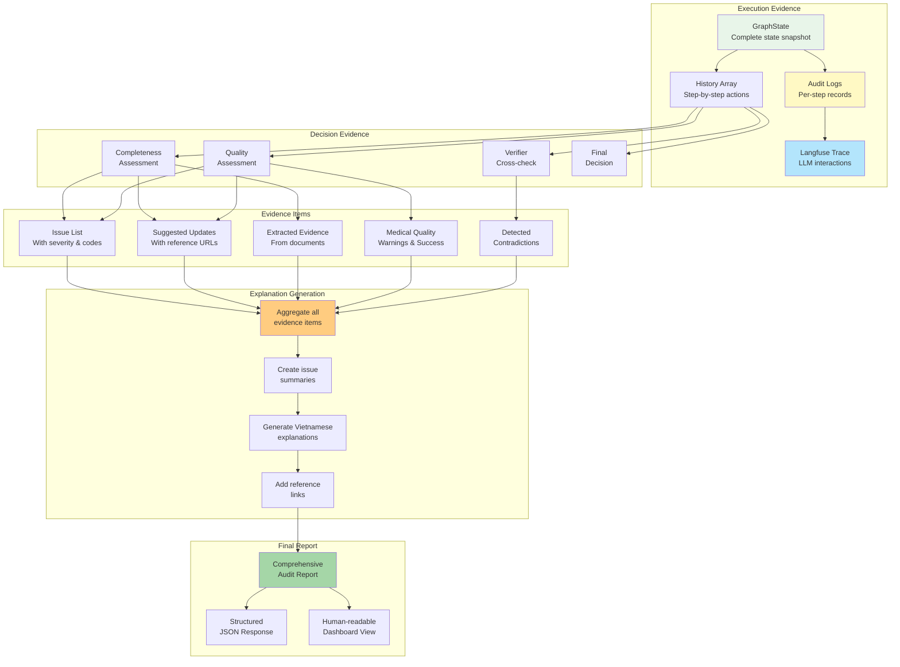

---

## Phụ lục: Chú thích kỹ thuật

### Ký hiệu đồ thị

| Ký hiệu | Ý nghĩa |
|---------|---------|
| `[]` | Thành phần/Component |
| `()` | Sự kiện/Event |
| `(())` | Bắt đầu/Kết thúc |
| `{}` | Điều kiện rẽ nhánh |
| `||--||` | Mối quan hệ một-một |
| `||--o{` | Mối quan hệ một-nhiều |

### Màu sắc biểu đồ

| Màu sắc | Thành phần |
|---------|------------|
| 🟢 Xanh lá | Completeness Agent, State, Success |
| 🔵 Xanh dương | Quality Agent, Database, Tools |
| 🟡 Vàng | Agent Review, Human-in-the-loop |
| 🟣 Tím | Decision Agent, Final Output |
| 🔴 Đỏ | Rejection, Errors, Escalation |
| 🟠 Cam | Human Review, External Services |
| 🟤 Nâu | Infrastructure, Storage |

### Ràng buộc hệ thống

| Ràng buộc | Giá trị mặc định | Mô tả |
|-----------|-----------------|--------|
| `AGENT_REVIEW_AMOUNT_THRESHOLD` | 5,000,000 VNĐ | Ngưỡng số tiền cho auto-approve |
| `AGENT_REVIEW_CONFIDENCE_THRESHOLD` | 0.9 | Độ tin cậy tối thiểu cho auto-approve |
| Mức độ vấn đề nghiêm trọng | critical, high, medium, low | Phân loại độ nghiêm trọng |
| Quyết định tác nhân | accept, reject, accept_with_edit | Các loại quyết định có thể |
| Quyết định cuối cùng | approve, reject, edit | Quyết định cuối cùng của hệ thống |
