# Agent Service

Multi-agent AI system for automated insurance claims processing using LangGraph. This service implements a hierarchical multi-agent workflow with human-in-the-loop capabilities for high-stakes insurance decisions.

## Table of Contents

- [Overview](#overview)
- [High-Level Architecture](#high-level-architecture)
- [System Context](#system-context)
- [Service Architecture](#service-architecture)
- [Clean Architecture](#clean-architecture)
- [Multi-Agent Workflow](#multi-agent-workflow)
- [Data Flow](#data-flow)
- [Component Details](#component-details)
  - [Agents](#agents)
  - [Tools](#tools)
  - [Core Engine](#core-engine)
  - [API Layer](#api-layer)
- [State Management](#state-management)
- [Configuration](#configuration)
- [Getting Started](#getting-started)
- [API Reference](#api-reference)
- [Project Structure](#project-structure)
- [Architecture Decisions](#architecture-decisions)

---

## Overview

The Agent Service orchestrates multiple specialized AI agents to process health insurance claims through a structured workflow:

1. **Completeness Check Agent** - Validates document completeness
2. **Quality Check Agent** - Validates claim quality and consistency
3. **Human Review** - Human-in-the-loop checkpoint for edge cases
4. **Final Decision Agent** - Aggregates results and makes final decision

---

## High-Level Architecture

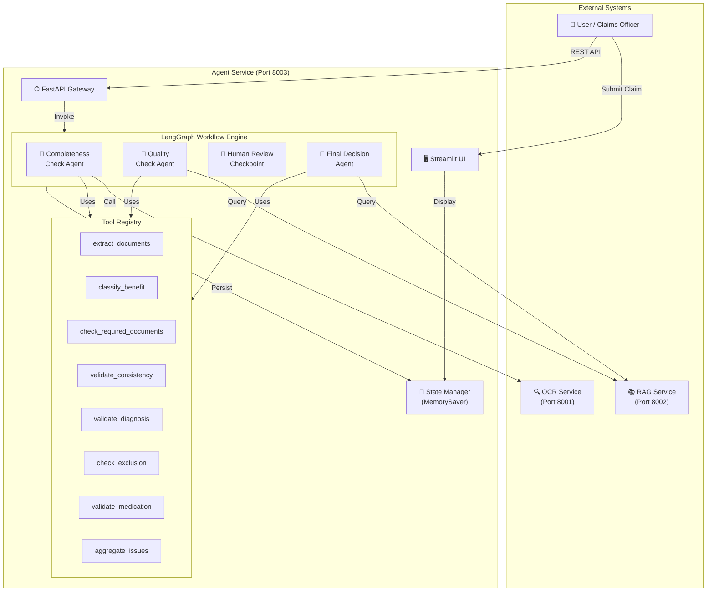
```mermaid
graph TB
    subgraph External["External Systems"]
        User["👤 User / Claims Officer"]
        OCR["🔍 OCR Service<br/>(Port 8001)"]
        RAG["📚 RAG Service<br/>(Port 8002)"]
    end

    subgraph AgentService["Agent Service (Port 8003)"]
        API["🌐 FastAPI Gateway"]

        subgraph Workflow["LangGraph Workflow Engine"]
            A1["🤖 Completeness<br/>Check Agent"]
            A2["🤖 Quality<br/>Check Agent"]
            HR["👤 Human Review<br/>Checkpoint"]
            FA["🤖 Final Decision<br/>Agent"]
        end

        subgraph Tools["Tool Registry"]
            T1["extract_documents"]
            T2["classify_benefit"]
            T3["check_required_documents"]
            T4["validate_consistency"]
            T5["validate_diagnosis"]
            T6["check_exclusion"]
            T7["validate_medication"]
            T8["aggregate_issues"]
        end

        State["💾 State Manager<br/>(MemorySaver)"]
        UI["🖥️ Streamlit UI"]
    end

    User -->|Submit Claim| UI
    User -->|REST API| API
    API -->|Invoke| Workflow
    A1 -->|Uses| Tools
    A2 -->|Uses| Tools
    FA -->|Uses| Tools
    Workflow -->|Persist| State
    A1 -->|Call| OCR
    A2 -->|Query| RAG
    FA -->|Query| RAG
    UI -->|Display| State
```

---

## System Context

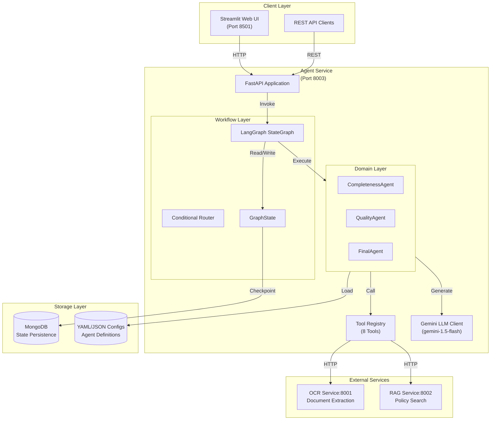
```mermaid
graph TB
    subgraph Client["Client Layer"]
        WebUI["Streamlit Web UI<br/>(Port 8501)"]
        APIClient["REST API Clients"]
    end

    subgraph AgentService["Agent Service<br/>(Port 8003)"]
        FastAPI["FastAPI Application"]

        subgraph Agents["Domain Layer"]
            A1["CompletenessAgent"]
            A2["QualityAgent"]
            A3["FinalAgent"]
        end

        subgraph Core["Workflow Layer"]
            Graph["LangGraph StateGraph"]
            Router["Conditional Router"]
            State["GraphState"]
        end

        ToolRegistry["Tool Registry<br/>(8 Tools)"]
        LLM["Gemini LLM Client<br/>(gemini-1.5-flash)"]
    end

    subgraph ExternalServices["External Services"]
        OCR["OCR Service:8001<br/>Document Extraction"]
        RAG["RAG Service:8002<br/>Policy Search"]
    end

    subgraph Storage["Storage Layer"]
        Mongo[(MongoDB<br/>State Persistence)]
        Config[("YAML/JSON Configs<br/>Agent Definitions")]
    end

    WebUI -->|HTTP| FastAPI
    APIClient -->|REST| FastAPI
    FastAPI -->|Invoke| Graph
    Graph -->|Execute| Agents
    Agents -->|Call| ToolRegistry
    Agents -->|Generate| LLM
    ToolRegistry -->|HTTP| OCR
    ToolRegistry -->|HTTP| RAG
    Graph -->|Read/Write| State
    State -->|Checkpoint| Mongo
    Agents -->|Load| Config
```

---

## Service Architecture

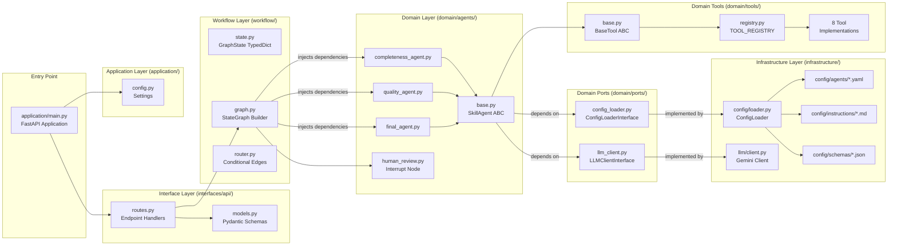
```mermaid
graph LR
    subgraph EntryPoint["Entry Point"]
        Main["application/main.py<br/>FastAPI Application"]
    end

    subgraph APILayer["Interface Layer (interfaces/api/)"]
        Routes["routes.py<br/>Endpoint Handlers"]
        Models["models.py<br/>Pydantic Schemas"]
    end

    subgraph AgentLayer["Domain Layer (domain/agents/)"]
        Base["base.py<br/>SkillAgent ABC"]
        A1["completeness_agent.py"]
        A2["quality_agent.py"]
        A3["final_agent.py"]
        HR["human_review.py<br/>Interrupt Node"]
    end

    subgraph PortsLayer["Domain Ports (domain/ports/)"]
        LLMInt["llm_client.py<br/>LLMClientInterface"]
        ConfigInt["config_loader.py<br/>ConfigLoaderInterface"]
    end

    subgraph WorkflowLayer["Workflow Layer (workflow/)"]
        State["state.py<br/>GraphState TypedDict"]
        Graph["graph.py<br/>StateGraph Builder"]
        Router["router.py<br/>Conditional Edges"]
    end

    subgraph ToolLayer["Domain Tools (domain/tools/)"]
        ToolBase["base.py<br/>BaseTool ABC"]
        Registry["registry.py<br/>TOOL_REGISTRY"]
        ToolImpl["8 Tool<br/>Implementations"]
    end

    subgraph InfraLayer["Infrastructure Layer (infrastructure/)"]
        Loader["config/loader.py<br/>ConfigLoader"]
        LLM["llm/client.py<br/>Gemini Client"]
        YAML["config/agents/*.yaml"]
        MD["config/instructions/*.md"]
        JSON["config/schemas/*.json"]
    end

    subgraph AppLayer["Application Layer (application/)"]
        Config["config.py<br/>Settings"]
    end

    Main --> Routes
    Routes --> Models
    Routes --> Graph

    Graph -->|injects dependencies| A1
    Graph -->|injects dependencies| A2
    Graph -->|injects dependencies| A3
    Graph --> HR

    A1 --> Base
    A2 --> Base
    A3 --> Base

    Base -->|depends on| LLMInt
    Base -->|depends on| ConfigInt
    Base --> ToolBase

    LLMInt -->|implemented by| LLM
    ConfigInt -->|implemented by| Loader

    Loader --> YAML
    Loader --> MD
    Loader --> JSON

    ToolBase --> Registry
    Registry --> ToolImpl

    Main --> Config
```

---

## Multi-Agent Workflow

### Workflow State Machine

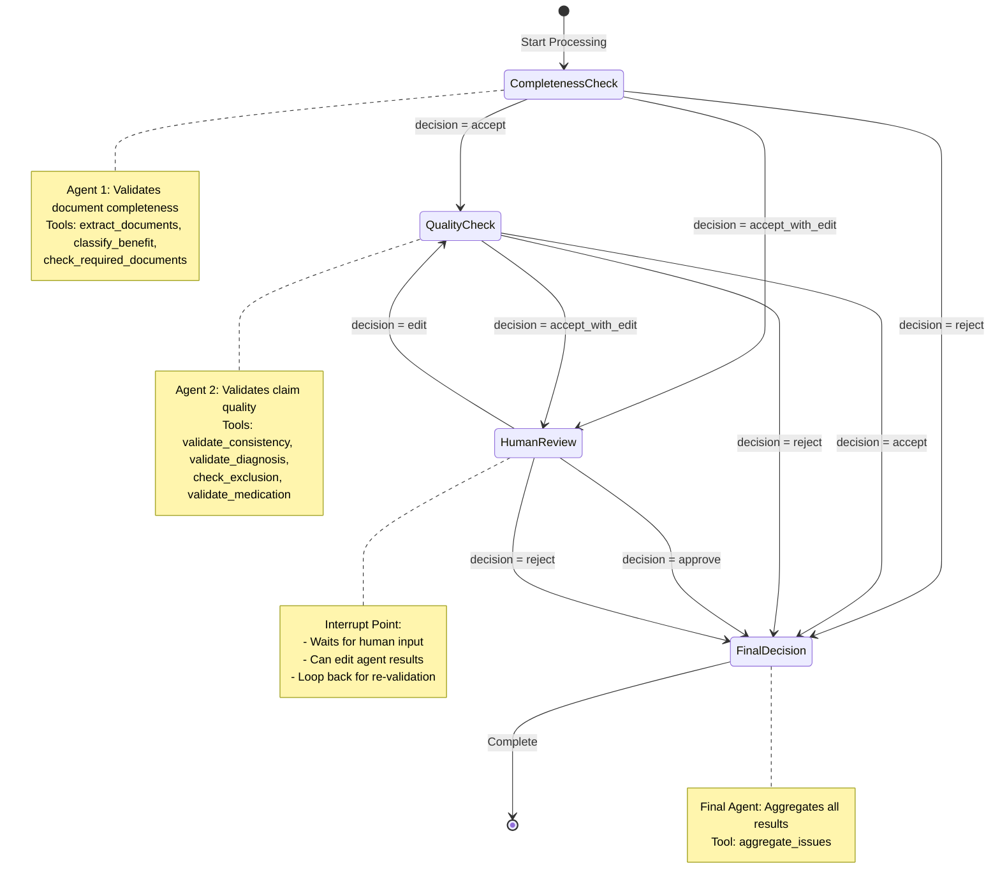
```mermaid
stateDiagram-v2
    [*] --> CompletenessCheck: Start Processing

    CompletenessCheck --> QualityCheck: decision = accept
    CompletenessCheck --> HumanReview: decision = accept_with_edit
    CompletenessCheck --> FinalDecision: decision = reject

    QualityCheck --> FinalDecision: decision = accept
    QualityCheck --> FinalDecision: decision = reject
    QualityCheck --> HumanReview: decision = accept_with_edit

    HumanReview --> QualityCheck: decision = edit
    HumanReview --> FinalDecision: decision = approve
    HumanReview --> FinalDecision: decision = reject

    FinalDecision --> [*]: Complete

    note right of CompletenessCheck
        Agent 1: Validates document completeness
        Tools: extract_documents, classify_benefit,
               check_required_documents
    end note

    note right of QualityCheck
        Agent 2: Validates claim quality
        Tools: validate_consistency, validate_diagnosis,
               check_exclusion, validate_medication
    end note

    note right of HumanReview
        Interrupt Point:
        - Waits for human input
        - Can edit agent results
        - Loop back for re-validation
    end note

    note right of FinalDecision
        Final Agent: Aggregates all results
        Tool: aggregate_issues
    end note
```

### Agent Execution Flow

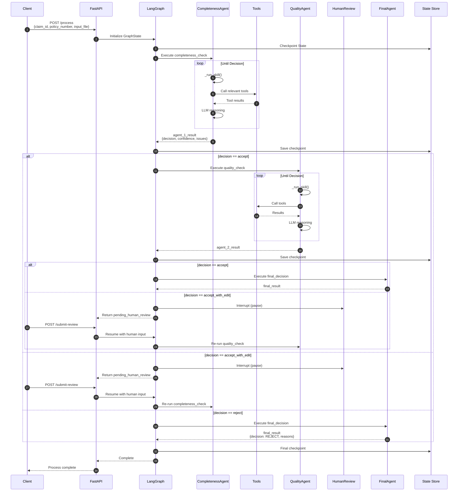
```mermaid
sequenceDiagram
    autonumber
    participant C as Client
    participant API as FastAPI
    participant G as LangGraph
    participant A1 as CompletenessAgent
    participant T1 as Tools
    participant A2 as QualityAgent
    participant HR as HumanReview
    participant A3 as FinalAgent
    participant S as State Store

    C->>API: POST /process<br/>{claim_id, policy_number, input_file}
    API->>G: Initialize GraphState
    G->>S: Checkpoint State
    G->>A1: Execute completeness_check

    loop Until Decision
        A1->>A1: _run_skill()
        A1->>T1: Call relevant tools
        T1-->>A1: Tool results
        A1->>A1: LLM reasoning
    end
    A1-->>G: agent_1_result<br/>{decision, confidence, issues}
    G->>S: Save checkpoint

    alt decision == accept
        G->>A2: Execute quality_check
        loop Until Decision
            A2->>A2: _run_skill()
            A2->>T1: Call tools
            T1-->>A2: Results
            A2->>A2: LLM reasoning
        end
        A2-->>G: agent_2_result
        G->>S: Save checkpoint

        alt decision == accept
            G->>A3: Execute final_decision
            A3-->>G: final_result
        else decision == accept_with_edit
            G->>HR: Interrupt (pause)
            G-->>API: Return pending_human_review
            C->>API: POST /submit-review
            API->>G: Resume with human input
            G->>A2: Re-run quality_check
        end

    else decision == accept_with_edit
        G->>HR: Interrupt (pause)
        G-->>API: Return pending_human_review
        C->>API: POST /submit-review
        API->>G: Resume with human input
        G->>A1: Re-run completeness_check

    else decision == reject
        G->>A3: Execute final_decision
        A3-->>G: final_result<br/>{decision: REJECT, reasons}
    end

    G->>S: Final checkpoint
    G-->>API: Complete
    API-->>C: Process complete
```

---

## Data Flow

### Claim Processing Data Flow

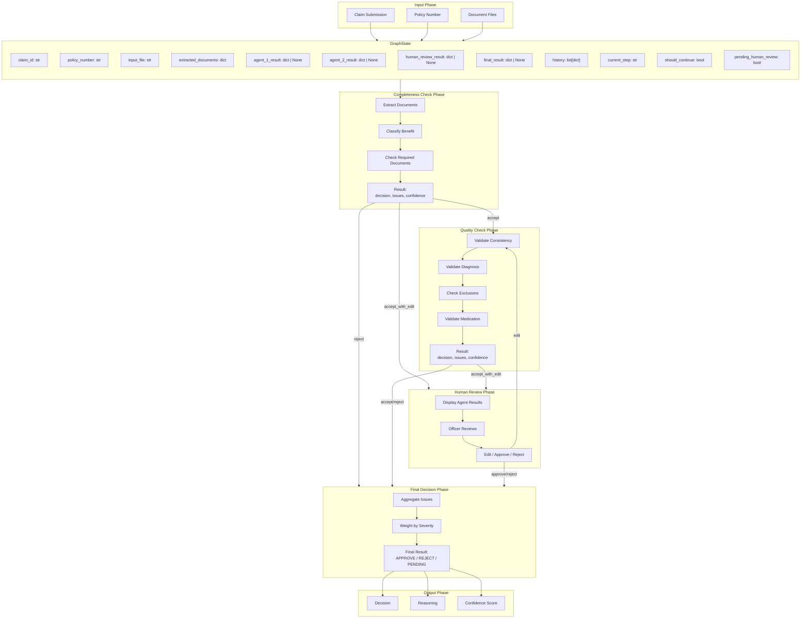
```mermaid
flowchart TD
    subgraph Input["Input Phase"]
        I1["Claim Submission"]
        I2["Policy Number"]
        I3["Document Files"]
    end

    subgraph State["GraphState"]
        direction TB
        S1["claim_id: str"]
        S2["policy_number: str"]
        S3["input_file: str"]
        S4["extracted_documents: dict"]
        S5["agent_1_result: dict | None"]
        S6["agent_2_result: dict | None"]
        S7["human_review_result: dict | None"]
        S8["final_result: dict | None"]
        S9["history: list[dict]"]
        S10["current_step: str"]
        S11["should_continue: bool"]
        S12["pending_human_review: bool"]
    end

    subgraph Agent1["Completeness Check Phase"]
        A1_1["Extract Documents"]
        A1_2["Classify Benefit"]
        A1_3["Check Required Documents"]
        A1_R["Result:<br/>decision, issues, confidence"]
    end

    subgraph Agent2["Quality Check Phase"]
        A2_1["Validate Consistency"]
        A2_2["Validate Diagnosis"]
        A2_3["Check Exclusions"]
        A2_4["Validate Medication"]
        A2_R["Result:<br/>decision, issues, confidence"]
    end

    subgraph Human["Human Review Phase"]
        H1["Display Agent Results"]
        H2["Officer Reviews"]
        H3["Edit / Approve / Reject"]
    end

    subgraph Final["Final Decision Phase"]
        F1["Aggregate Issues"]
        F2["Weight by Severity"]
        F_R["Final Result:<br/>APPROVE / REJECT / PENDING"]
    end

    subgraph Output["Output Phase"]
        O1["Decision"]
        O2["Reasoning"]
        O3["Confidence Score"]
    end

    I1 --> State
    I2 --> State
    I3 --> State

    State --> A1_1
    A1_1 --> A1_2
    A1_2 --> A1_3
    A1_3 --> A1_R

    A1_R -->|accept| A2_1
    A1_R -->|accept_with_edit| Human
    A1_R -->|reject| Final

    A2_1 --> A2_2
    A2_2 --> A2_3
    A2_3 --> A2_4
    A2_4 --> A2_R

    A2_R -->|accept/reject| Final
    A2_R -->|accept_with_edit| Human

    H1 --> H2
    H2 --> H3
    H3 -->|edit| A2_1
    H3 -->|approve/reject| Final

    F1 --> F2
    F2 --> F_R
    F_R --> O1
    F_R --> O2
    F_R --> O3
```

### State Transitions

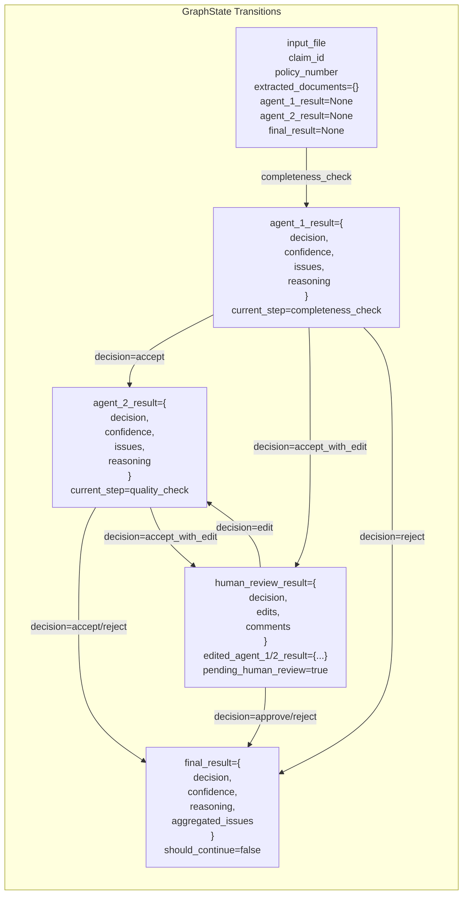
```mermaid
flowchart LR
    subgraph States["GraphState Transitions"]
        S0["Initial State"]
        S1["After Completeness"]
        S2["After Quality"]
        S3["After Human Review"]
        S4["Final State"]
    end

    S0 -->|completeness_check| S1
    S1 -->|decision=accept| S2
    S1 -->|decision=accept_with_edit| S3
    S1 -->|decision=reject| S4

    S2 -->|decision=accept/reject| S4
    S2 -->|decision=accept_with_edit| S3

    S3 -->|decision=edit| S2
    S3 -->|decision=approve/reject| S4

    S0["input_file<br/>claim_id<br/>policy_number<br/>extracted_documents={}<br/>agent_1_result=None<br/>agent_2_result=None<br/>final_result=None"]

    S1["agent_1_result={<br/>  decision,<br/>  confidence,<br/>  issues,<br/>  reasoning<br/>}<br/>current_step=completeness_check"]

    S2["agent_2_result={<br/>  decision,<br/>  confidence,<br/>  issues,<br/>  reasoning<br/>}<br/>current_step=quality_check"]

    S3["human_review_result={<br/>  decision,<br/>  edits,<br/>  comments<br/>}<br/>edited_agent_1/2_result={...}<br/>pending_human_review=true"]

    S4["final_result={<br/>  decision,<br/>  confidence,<br/>  reasoning,<br/>  aggregated_issues<br/>}<br/>should_continue=false"]
```

---

## Component Details

### Agents

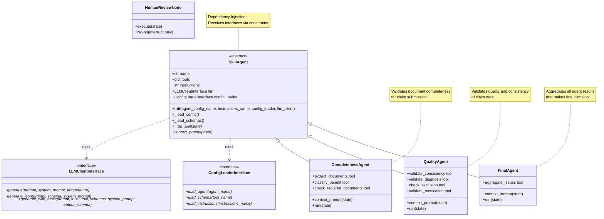
```mermaid
classDiagram
    class LLMClientInterface {
        <<interface>>
        +generate(prompt, system_prompt, temperature)*
        +generate_json(prompt, schema, system_prompt)*
        +generate_with_tools(prompt, tools, tool_schemas, system_prompt, output_schema)*
    }

    class ConfigLoaderInterface {
        <<interface>>
        +load_agent(agent_name)*
        +load_schema(tool_name)*
        +load_instructions(instructions_name)*
    }

    class SkillAgent {
        <<abstract>>
        +str name
        +dict tools
        +str instructions
        +LLMClientInterface llm
        +ConfigLoaderInterface config_loader
        +__init__(agent_config_name, instructions_name, config_loader, llm_client)
        +_load_config()
        +_load_schemas()
        +_run_skill(state)*
        +context_prompt(state)*
    }

    class CompletenessAgent {
        +extract_documents tool
        +classify_benefit tool
        +check_required_documents tool
        +context_prompt(state)
        +run(state)
    }

    class QualityAgent {
        +validate_consistency tool
        +validate_diagnosis tool
        +check_exclusion tool
        +validate_medication tool
        +context_prompt(state)
        +run(state)
    }

    class FinalAgent {
        +aggregate_issues tool
        +context_prompt(state)
        +run(state)
    }

    class HumanReviewNode {
        +execute(state)
        +No-op (interrupt only)
    }

    SkillAgent ..> LLMClientInterface : uses
    SkillAgent ..> ConfigLoaderInterface : uses
    SkillAgent <|-- CompletenessAgent
    SkillAgent <|-- QualityAgent
    SkillAgent <|-- FinalAgent

    note for SkillAgent "Dependency Injection:<br/>Receives interfaces via constructor"
    note for CompletenessAgent "Validates document completeness<br/>for claim submission"
    note for QualityAgent "Validates quality and consistency<br/>of claim data"
    note for FinalAgent "Aggregates all agent results<br/>and makes final decision"
```

### Tools

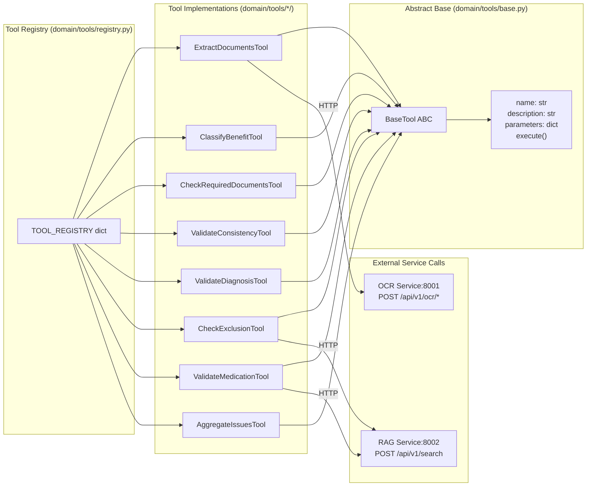
```mermaid
graph LR
    subgraph ToolRegistry["Tool Registry (domain/tools/registry.py)"]
        TR["TOOL_REGISTRY dict"]
    end

    subgraph ToolClasses["Tool Implementations (domain/tools/*/)"]
        T1["ExtractDocumentsTool"]
        T2["ClassifyBenefitTool"]
        T3["CheckRequiredDocumentsTool"]
        T4["ValidateConsistencyTool"]
        T5["ValidateDiagnosisTool"]
        T6["CheckExclusionTool"]
        T7["ValidateMedicationTool"]
        T8["AggregateIssuesTool"]
    end

    subgraph BaseTool["Abstract Base (domain/tools/base.py)"]
        BT["BaseTool ABC"]
        BT_attrs["name: str<br/>description: str<br/>parameters: dict<br/>execute()"]
    end

    subgraph ExternalCalls["External Service Calls"]
        OCR["OCR Service:8001<br/>POST /api/v1/ocr/*"]
        RAG["RAG Service:8002<br/>POST /api/v1/search"]
    end

    TR --> T1
    TR --> T2
    TR --> T3
    TR --> T4
    TR --> T5
    TR --> T6
    TR --> T7
    TR --> T8

    T1 --> BT
    T2 --> BT
    T3 --> BT
    T4 --> BT
    T5 --> BT
    T6 --> BT
    T7 --> BT
    T8 --> BT

    T1 -->|HTTP| OCR
    T6 -->|HTTP| RAG
    T7 -->|HTTP| RAG

    BT --> BT_attrs
```

### Tool Details

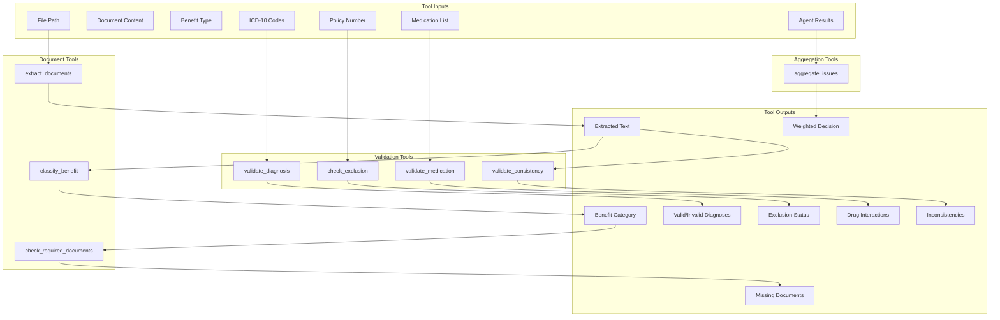
```mermaid
flowchart TB
    subgraph DocumentTools["Document Tools"]
        T1["extract_documents"]
        T2["classify_benefit"]
        T3["check_required_documents"]
    end

    subgraph ValidationTools["Validation Tools"]
        T4["validate_consistency"]
        T5["validate_diagnosis"]
        T6["check_exclusion"]
        T7["validate_medication"]
    end

    subgraph AggregationTools["Aggregation Tools"]
        T8["aggregate_issues"]
    end

    subgraph Inputs["Tool Inputs"]
        I1["File Path"]
        I2["Document Content"]
        I3["Benefit Type"]
        I4["ICD-10 Codes"]
        I5["Policy Number"]
        I6["Medication List"]
        I7["Agent Results"]
    end

    subgraph Outputs["Tool Outputs"]
        O1["Extracted Text"]
        O2["Benefit Category"]
        O3["Missing Documents"]
        O4["Inconsistencies"]
        O5["Valid/Invalid Diagnoses"]
        O6["Exclusion Status"]
        O7["Drug Interactions"]
        O8["Weighted Decision"]
    end

    I1 --> T1
    T1 --> O1

    O1 --> T2
    T2 --> O2

    O2 --> T3
    T3 --> O3

    O1 --> T4
    T4 --> O4

    I4 --> T5
    T5 --> O5

    I5 --> T6
    T6 --> O6

    I6 --> T7
    T7 --> O7

    I7 --> T8
    T8 --> O8
```

### Core Engine

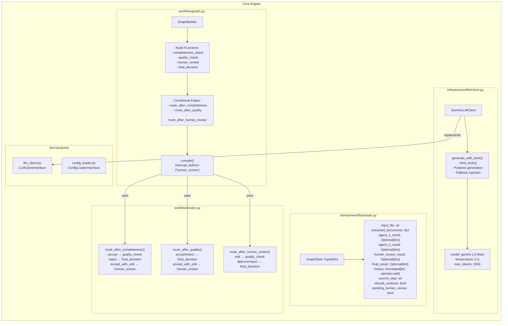
```mermaid
graph TB
    subgraph CoreEngine["Core Engine"]
        direction TB

        subgraph StateModule["domain/workflow/state.py"]
            StateDef["GraphState TypedDict"]
            StateAttrs["input_file: str<br/>extracted_documents: dict<br/>agent_1_result: Optional[dict]<br/>agent_2_result: Optional[dict]<br/>human_review_result: Optional[dict]<br/>final_result: Optional[dict]<br/>history: Annotated[list, operator.add]<br/>current_step: str<br/>should_continue: bool<br/>pending_human_review: bool"]
        end

        subgraph GraphModule["workflow/graph.py"]
            Builder["GraphBuilder"]
            Nodes["Node Functions:<br/>- completeness_check<br/>- quality_check<br/>- human_review<br/>- final_decision"]
            Edges["Conditional Edges:<br/>- route_after_completeness<br/>- route_after_quality<br/>- route_after_human_review"]
            Compile["compile()<br/>interrupt_before=['human_review']"]
        end

        subgraph RouterModule["workflow/router.py"]
            R1["route_after_completeness()<br/>accept → quality_check<br/>reject → final_decision<br/>accept_with_edit → human_review"]
            R2["route_after_quality()<br/>accept/reject → final_decision<br/>accept_with_edit → human_review"]
            R3["route_after_human_review()<br/>edit → quality_check<br/>approve/reject → final_decision"]
        end

        subgraph LLMModule["infrastructure/llm/client.py"]
            Client["GeminiLLMClient"]
            Methods["generate_with_tools()<br/>- bind_tools()<br/>- Pydantic generation<br/>- Fallback injection"]
            Config["model: gemini-1.5-flash<br/>temperature: 0.3<br/>max_tokens: 2000"]
        end

        subgraph PortsModule["domain/ports/"]
            LLMInt["llm_client.py<br/>LLMClientInterface"]
            ConfigInt["config_loader.py<br/>ConfigLoaderInterface"]
        end
    end

    StateDef --> StateAttrs
    Builder --> Nodes
    Nodes --> Edges
    Edges --> Compile
    Compile -->|uses| R1
    Compile -->|uses| R2
    Compile -->|uses| R3
    Client -->|implements| LLMInt
    Client --> Methods
    Methods --> Config
```

---

## State Management

### State Persistence Flow

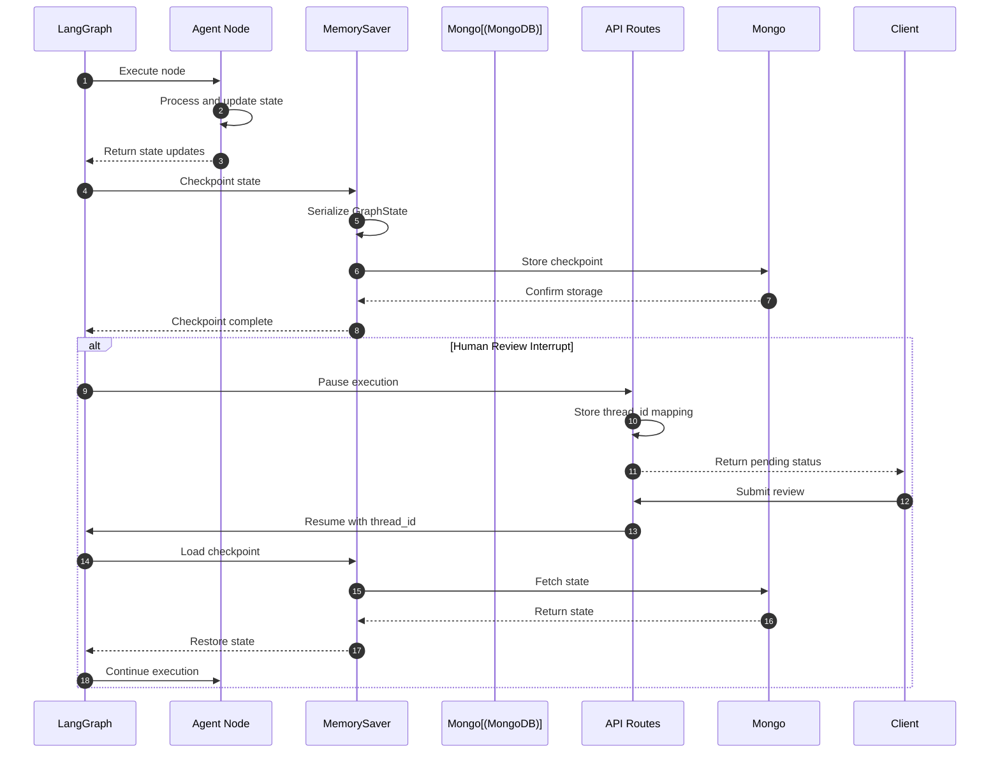
```mermaid
sequenceDiagram
    autonumber
    participant Graph as LangGraph
    participant Node as Agent Node
    participant Check as MemorySaver
    participant Mongo[(MongoDB)]
    participant API as API Routes

    Graph->>Node: Execute node
    Node->>Node: Process and update state
    Node-->>Graph: Return state updates

    Graph->>Check: Checkpoint state
    Check->>Check: Serialize GraphState
    Check->>Mongo: Store checkpoint
    Mongo-->>Check: Confirm storage
    Check-->>Graph: Checkpoint complete

    alt Human Review Interrupt
        Graph->>API: Pause execution
        API->>API: Store thread_id mapping
        API-->>Client: Return pending status

        Client->>API: Submit review
        API->>Graph: Resume with thread_id
        Graph->>Check: Load checkpoint
        Check->>Mongo: Fetch state
        Mongo-->>Check: Return state
        Check-->>Graph: Restore state
        Graph->>Node: Continue execution
    end
```

### State Schema

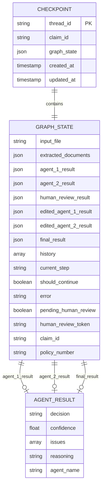
```mermaid
erDiagram
    CHECKPOINT {
        string thread_id PK
        string claim_id
        json graph_state
        timestamp created_at
        timestamp updated_at
    }

    GRAPH_STATE {
        string input_file
        json extracted_documents
        json agent_1_result
        json agent_2_result
        json human_review_result
        json edited_agent_1_result
        json edited_agent_2_result
        json final_result
        array history
        string current_step
        boolean should_continue
        string error
        boolean pending_human_review
        string human_review_token
        string claim_id
        string policy_number
    }

    AGENT_RESULT {
        string decision
        float confidence
        array issues
        string reasoning
        string agent_name
    }

    CHECKPOINT ||--|| GRAPH_STATE : contains
    GRAPH_STATE ||--o| AGENT_RESULT : agent_1_result
    GRAPH_STATE ||--o| AGENT_RESULT : agent_2_result
    GRAPH_STATE ||--o| AGENT_RESULT : final_result
```

---

## Configuration

### Configuration Hierarchy

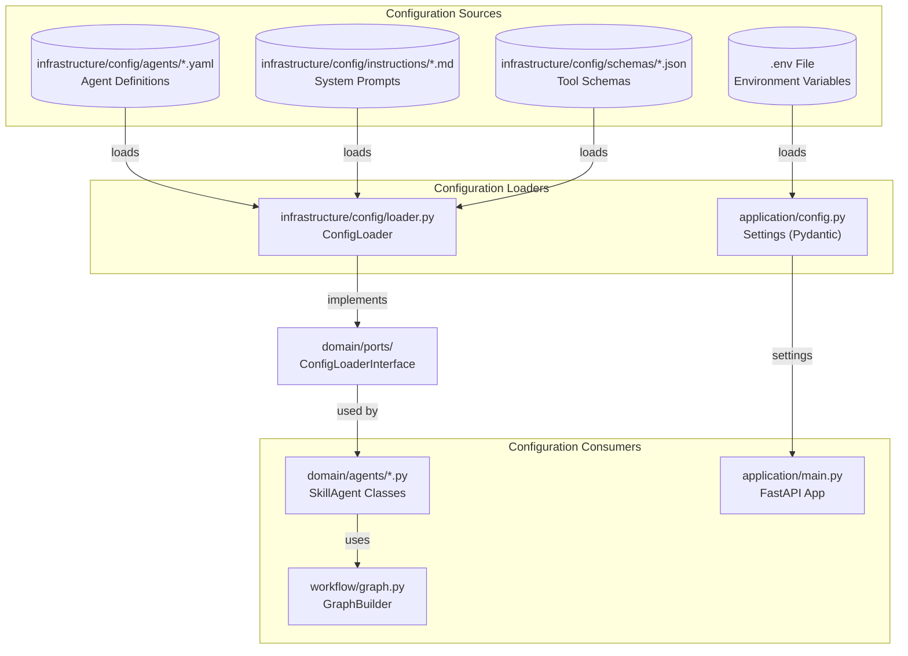
```mermaid
graph TB
    subgraph ConfigSources["Configuration Sources"]
        Env[(".env File<br/>Environment Variables")]
        YAML[("infrastructure/config/agents/*.yaml<br/>Agent Definitions")]
        MD[("infrastructure/config/instructions/*.md<br/>System Prompts")]
        JSON[("infrastructure/config/schemas/*.json<br/>Tool Schemas")]
    end

    subgraph Loaders["Configuration Loaders"]
        AppConfig["application/config.py<br/>Settings (Pydantic)"]
        ConfigLoader["infrastructure/config/loader.py<br/>ConfigLoader"]
    end

    subgraph Consumers["Configuration Consumers"]
        Agents["domain/agents/*.py<br/>SkillAgent Classes"]
        Graph["workflow/graph.py<br/>GraphBuilder"]
        Main["application/main.py<br/>FastAPI App"]
    end

    Env -->|loads| AppConfig
    YAML -->|loads| ConfigLoader
    MD -->|loads| ConfigLoader
    JSON -->|loads| ConfigLoader

    AppConfig -->|settings| Main
    ConfigLoader -->|implements| ConfigInt["domain/ports/<br/>ConfigLoaderInterface"]
    ConfigInt -->|used by| Agents

    Agents -->|uses| Graph
```

### Agent Configuration Structure

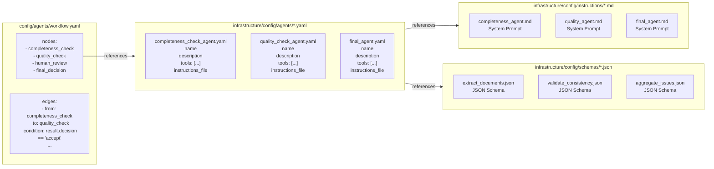
```mermaid
flowchart LR
    subgraph WorkflowConfig["config/agents/workflow.yaml"]
        Nodes["nodes:<br/>- completeness_check<br/>- quality_check<br/>- human_review<br/>- final_decision"]
        Edges["edges:<br/>- from: completeness_check<br/>  to: quality_check<br/>  condition: result.decision == 'accept'<br/>..."]
    end

    subgraph AgentConfigs["infrastructure/config/agents/*.yaml"]
        A1["completeness_check_agent.yaml<br/>name<br/>description<br/>tools: [...]<br/>instructions_file"]
        A2["quality_check_agent.yaml<br/>name<br/>description<br/>tools: [...]<br/>instructions_file"]
        A3["final_agent.yaml<br/>name<br/>description<br/>tools: [...]<br/>instructions_file"]
    end

    subgraph Instructions["infrastructure/config/instructions/*.md"]
        I1["completeness_agent.md<br/>System Prompt"]
        I2["quality_agent.md<br/>System Prompt"]
        I3["final_agent.md<br/>System Prompt"]
    end

    subgraph Schemas["infrastructure/config/schemas/*.json"]
        S1["extract_documents.json<br/>JSON Schema"]
        S2["validate_consistency.json<br/>JSON Schema"]
        S8["aggregate_issues.json<br/>JSON Schema"]
    end

    Nodes -->|references| AgentConfigs
    AgentConfigs -->|references| Instructions
    AgentConfigs -->|references| Schemas
```

---

## Getting Started

### Prerequisites

- Python 3.11+
- MongoDB (running on port 27017 or configured via env)
- OCR Service (port 8001)
- RAG Service (port 8002)
- Gemini API Key

### Installation

```bash
# Install dependencies
pip install -r requirements.txt

# Set environment variables
export GEMINI_API_KEY="your-api-key"
export MONGODB_URL="mongodb://localhost:27017"
export RAG_SERVICE_URL="http://localhost:8002"

# Run the service
uvicorn main:app --reload --port 8003
```

### Docker

```bash
# Start with docker-compose
docker-compose up -d agent-service
```

---

## API Reference

### Endpoints

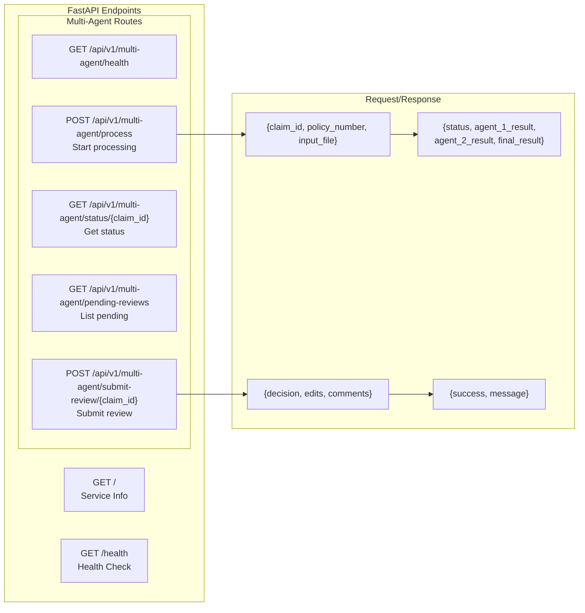
```mermaid
graph LR
    subgraph API["FastAPI Endpoints"]
        Root["GET /<br/>Service Info"]
        Health["GET /health<br/>Health Check"]

        subgraph MultiAgent["Multi-Agent Routes"]
            MAHealth["GET /api/v1/multi-agent/health"]
            Process["POST /api/v1/multi-agent/process<br/>Start processing"]
            Status["GET /api/v1/multi-agent/status/{claim_id}<br/>Get status"]
            Pending["GET /api/v1/multi-agent/pending-reviews<br/>List pending"]
            Submit["POST /api/v1/multi-agent/submit-review/{claim_id}<br/>Submit review"]
        end
    end

    subgraph RequestResponse["Request/Response"]
        Req1["{claim_id, policy_number, input_file}"]
        Res1["{status, agent_1_result,<br/>agent_2_result, final_result}"]
        Req2["{decision, edits, comments}"]
        Res2["{success, message}"]
    end

    Process --> Req1
    Req1 --> Res1
    Submit --> Req2
    Req2 --> Res2
```

### Example Usage

```bash
# Start claim processing
curl -X POST http://localhost:8003/api/v1/multi-agent/process \
  -H "Content-Type: application/json" \
  -d '{
    "claim_id": "CLM-001",
    "policy_number": "POL-001",
    "input_file": "/path/to/claim.pdf"
  }'

# Check status
curl http://localhost:8003/api/v1/multi-agent/status/CLM-001

# Submit human review
curl -X POST http://localhost:8003/api/v1/multi-agent/submit-review/CLM-001 \
  -H "Content-Type: application/json" \
  -d '{
    "decision": "approve",
    "comments": "Reviewed and approved"
  }'
```

---

## Project Structure

This project follows **Clean Architecture / Domain-Driven Design** principles with clear layer separation:

```
.
├── application/                     # Application Layer (Use Cases)
│   ├── __init__.py
│   ├── config.py                    # Settings management (Pydantic)
│   └── main.py                      # FastAPI entry point
│
├── domain/                          # Domain Layer (Business Logic)
│   ├── agents/                      # Agent implementations
│   │   ├── base.py                  # SkillAgent base class with DI
│   │   ├── completeness_agent.py    # Agent 1: Completeness check
│   │   ├── quality_agent.py         # Agent 2: Quality check
│   │   ├── final_agent.py           # Final decision agent
│   │   └── human_review.py          # Human review node
│   ├── ports/                       # Domain interfaces (Dependency Inversion)
│   │   ├── llm_client.py            # LLMClientInterface
│   │   └── config_loader.py         # ConfigLoaderInterface
│   ├── tools/                       # Business logic tools
│   │   ├── base.py                  # BaseTool abstract class
│   │   ├── registry.py              # Tool registry
│   │   ├── aggregation/
│   │   ├── document/
│   │   └── validation/
│   └── workflow/                    # Workflow state
│       └── state.py                 # GraphState TypedDict
│
├── infrastructure/                  # Infrastructure Layer
│   ├── config/                      # Configuration loading
│   │   ├── loader.py                # ConfigLoader implementation
│   │   ├── agents/                  # Agent YAML configs
│   │   ├── instructions/            # System prompts (Markdown)
│   │   └── schemas/                 # Tool JSON schemas
│   └── llm/                         # LLM client
│       └── client.py                # Gemini client implementation
│
├── interfaces/                      # Interface Layer
│   ├── api/                         # REST API
│   │   ├── routes.py                # FastAPI endpoints
│   │   └── models.py                # Pydantic models
│   └── web/                         # Streamlit interface
│       └── app.py                   # Human-in-the-loop UI
│
├── workflow/                        # Workflow orchestration
│   ├── graph.py                     # LangGraph builder
│   └── router.py                    # Conditional routing logic
│
├── requirements.txt                 # Python dependencies
└── README.md                        # This file
```

### Clean Architecture

The codebase follows **Clean Architecture** principles with proper dependency flow:

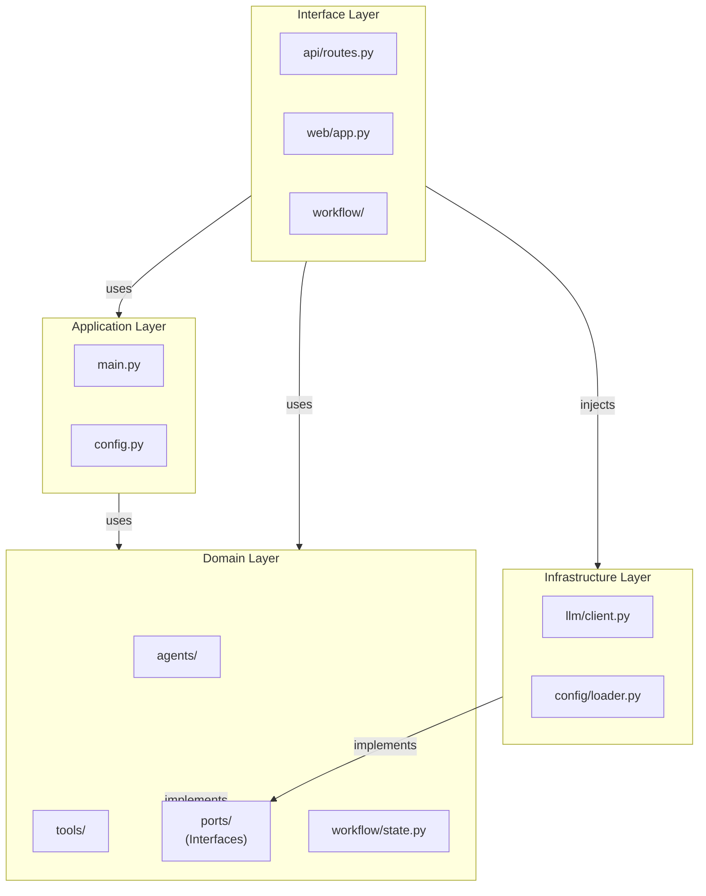
```mermaid
graph TB
    subgraph Domain["Domain Layer"]
        direction TB
        Agents["agents/"]
        Tools["tools/"]
        Ports["ports/<br/>(Interfaces)"]
        State["workflow/state.py"]
    end

    subgraph Application["Application Layer"]
        Main["main.py"]
        Config["config.py"]
    end

    subgraph Infrastructure["Infrastructure Layer"]
        LLM["llm/client.py"]
        ConfigLoader["config/loader.py"]
    end

    subgraph Interfaces["Interface Layer"]
        API["api/routes.py"]
        Web["web/app.py"]
        Workflow["workflow/"]
    end

    Domain -->|implements| Ports
    Infrastructure -->|implements| Ports
    Application -->|uses| Domain
    Interfaces -->|uses| Application
    Interfaces -->|injects| Infrastructure
    Interfaces -->|uses| Domain
```

**Dependency Rule**: Dependencies always point inward:
- **Domain** has no external dependencies (only Python stdlib)
- **Application** depends on Domain
- **Infrastructure** depends on Application (Settings) and implements Domain ports
- **Interfaces** depends on Application and Domain

**Key Benefits**:
1. **Testability**: Domain logic can be unit tested without mocking infrastructure
2. **Flexibility**: Easy to swap implementations (e.g., different LLM providers)
3. **Framework Independence**: Domain has no framework dependencies
4. **Maintainability**: Clear boundaries make the codebase easier to understand

---

## Architecture Decisions

1. **Clean Architecture / Domain-Driven Design**: The codebase follows Clean Architecture principles with clear layer separation (Domain → Application → Infrastructure → Interfaces). Domain layer has no external dependencies, making it highly testable and framework-independent.

2. **Dependency Injection**: Infrastructure dependencies (LLM client, Config loader) are injected into domain agents via abstract interfaces (`domain/ports/`), enabling easy testing and implementation swapping.

3. **Skill-Based Agent Architecture**: Agents are configured via YAML files with tool schemas, enabling flexible agent definitions without code changes.

4. **Human-in-the-Loop**: Critical decisions pass through human review checkpoint with ability to edit agent outputs and loop back for re-validation.

5. **LangGraph for Workflow**: StateGraph provides deterministic execution, state persistence, and interrupt capabilities for human review.

6. **Tool Registry Pattern**: Tools are registered in a central registry, allowing dynamic tool instantiation based on YAML configuration.

7. **Gemini LLM**: Chosen for cost-effectiveness and strong function-calling capabilities for tool use.

8. **State Checkpointing**: MongoDB persistence ensures claim processing can survive restarts and enables human review workflows.
