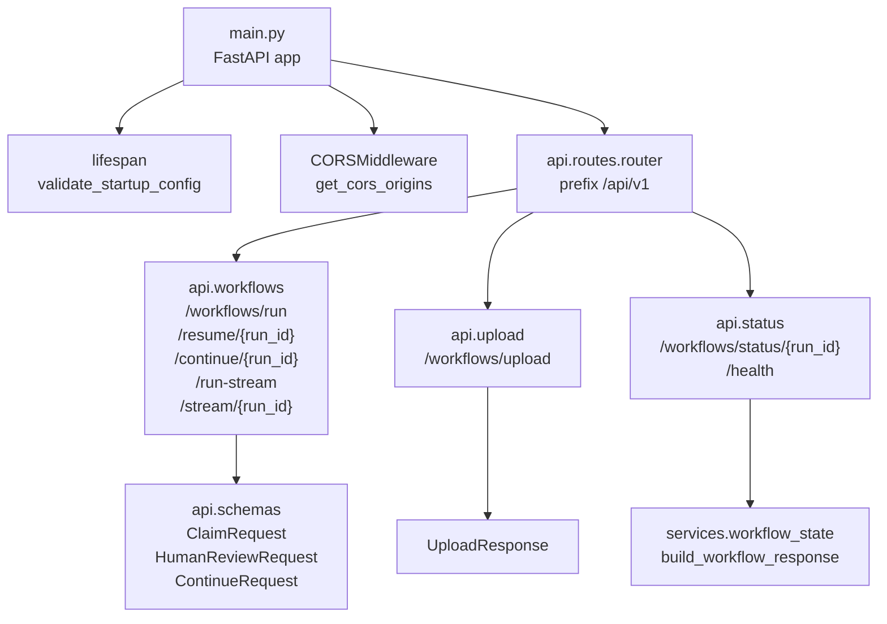
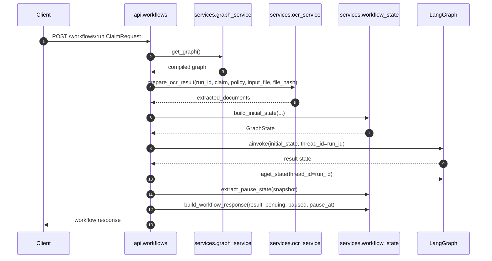
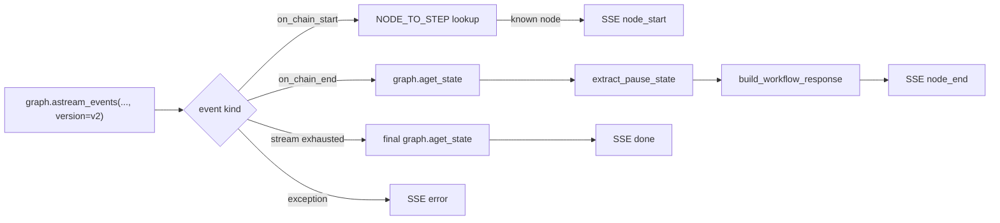
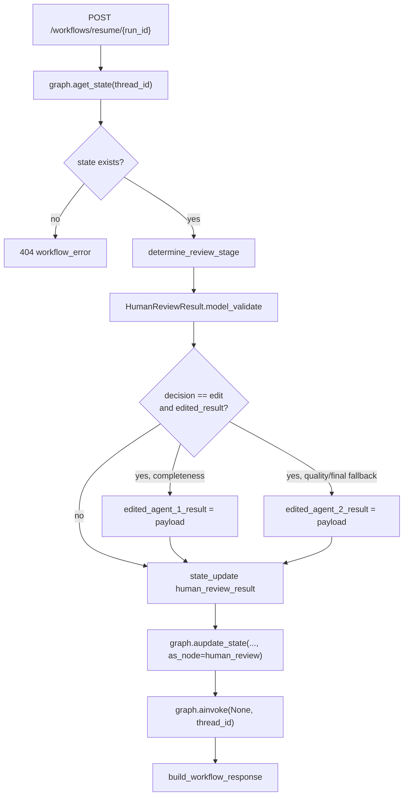
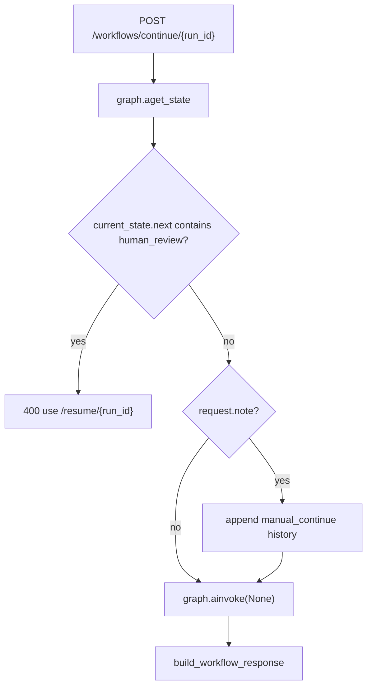
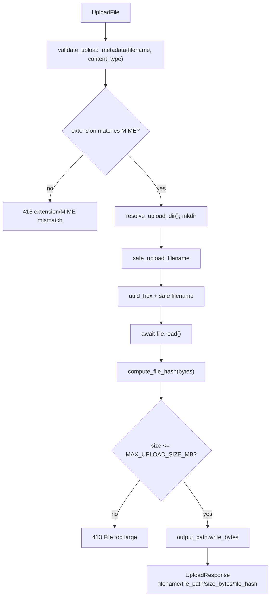

# API Layer

Layer API nằm trong `main.py` và `api/`. Đây là boundary HTTP của agent-service: nhận hồ sơ, upload tài liệu, chạy workflow LangGraph, resume sau human review, stream tiến trình bằng SSE, và đọc trạng thái checkpoint.

## Module map

| Module | Logic chính |
| --- | --- |
| `main.py` | Tạo FastAPI app, validate startup config trong lifespan, gắn CORS, include router `/api/v1` |
| `api/routes.py` | Router tổng hợp, include `workflows`, `upload`, `status` |
| `api/schemas.py` | Request/response model cho claim, human review, continue, upload, lỗi |
| `api/upload.py` | Nhận multipart file, validate metadata, hash, size, ghi vào `UPLOADS_DIR` |
| `api/workflows.py` | Run/resume/continue workflow; endpoint streaming `run-stream`, `stream/{run_id}` |
| `api/status.py` | Lấy checkpoint state theo `run_id`, health check |
| `api/sse.py` | Chuyển LangGraph events thành SSE event payload cho UI |
| `api/errors.py` | Tạo lỗi chuẩn hóa dạng `detail.error/error_detail/status_code/endpoint` |
| `api/helpers.py` | Helper phụ trợ, hiện dùng để hash file upload |

## Router composition



## Run workflow logic

`POST /api/v1/workflows/run` và `POST /api/v1/workflows/run-stream` dùng cùng pipeline chuẩn bị:

1. Lấy compiled graph qua `services.graph_service.get_graph()`.
2. Sinh `run_id` mới bằng UUID.
3. Gọi `prepare_ocr_result(...)` để lấy OCR phase 1/v1, có cache theo `file_hash`.
4. Build `GraphState` bằng `build_initial_state(...)`.
5. Chạy graph với `configurable.thread_id = run_id`.
6. Đọc snapshot để xác định `pending_human_review`, `paused`, `pause_at`.
7. Trả response chuẩn bằng `build_workflow_response(...)`.



## Streaming SSE logic

`POST /workflows/run-stream` gửi event đầu tiên `run_started`, sau đó delegate sang `stream_graph_events(...)`. `GET /workflows/stream/{run_id}` dùng cho workflow đã tồn tại sau resume/continue.

| Event | Khi nào phát | Payload chính |
| --- | --- | --- |
| `run_started` | Ngay sau khi tạo `run_id` ở `run-stream` | `run_id`, `claim_id` |
| `node_start` | LangGraph `on_chain_start` cho node được map | `step`, `node` |
| `node_end` | LangGraph `on_chain_end` cho node được map | `step`, `node`, `state` |
| `done` | Graph stream kết thúc | Workflow response cuối |
| `error` | Có exception trong stream | `error` |

`NODE_TO_STEP` hiện map các node hiển thị được cho UI, gồm `completeness_check`, `ocr_extraction`, `agent_review`, `quality_check`, `human_review`, và `final_decision`. Nếu thêm node mới vào graph, cập nhật map này để SSE không bỏ qua event của node đó.



## Human review resume

`POST /workflows/resume/{run_id}` không tạo run mới. Endpoint đọc checkpoint hiện tại, xác định stage cần review, validate payload thành `HumanReviewResult`, update graph state `as_node="human_review"`, rồi tiếp tục graph.

`determine_review_stage` nằm trong `services.workflow_state` và dùng thứ tự ưu tiên: `review_stage` explicit nếu khác `none`, sau đó `final_result`, sau đó `agent_2_result`, cuối cùng fallback `completeness`. Stage này được ghi vào `human_review_result.stage`, nên `route_after_human_review` có dữ liệu rõ ràng để quyết định approve/reject/edit sẽ đi đâu.



## Continue workflow

`POST /workflows/continue/{run_id}` chỉ dành cho pause không phải human review. Nếu snapshot đang chờ `human_review`, API trả 400 và yêu cầu dùng resume.



## Upload policy at API boundary

`api/upload.py` chỉ nhận file có extension/MIME được phép, normalize tên file, thêm UUID prefix, tính SHA-256 và kiểm tra `MAX_UPLOAD_SIZE_MB` trước khi ghi.
Extension và MIME cũng phải khớp theo cặp hợp lệ: `.pdf` với `application/pdf`, `.png` với `image/png`, `.jpg/.jpeg` với `image/jpeg`.



## Error contract

Các lỗi workflow nên dùng `workflow_error(...)` để UI nhận được shape ổn định:

```json
{
  "detail": {
    "error": "Human-readable message",
    "error_detail": "Technical detail or null",
    "status_code": 502,
    "endpoint": "/workflows/run"
  }
}
```
