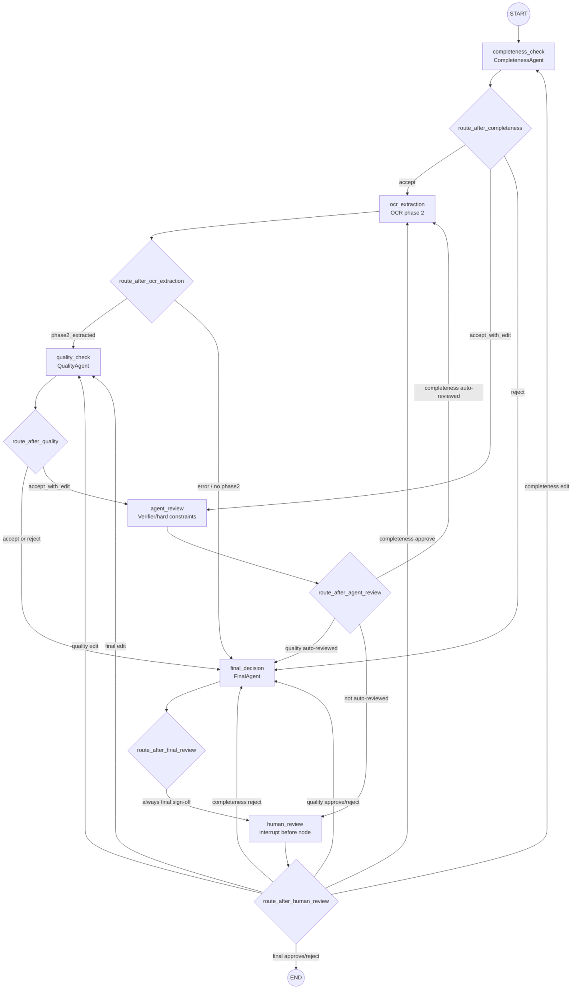
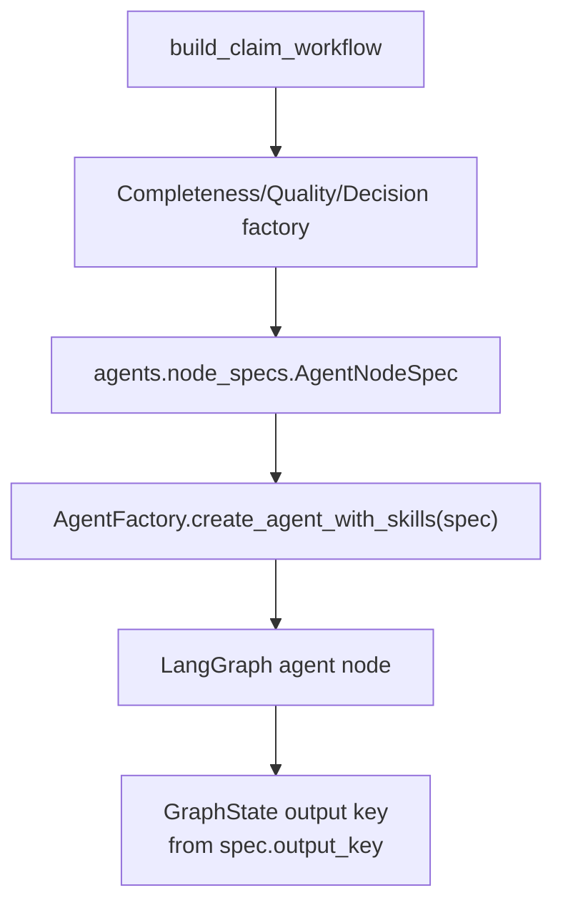
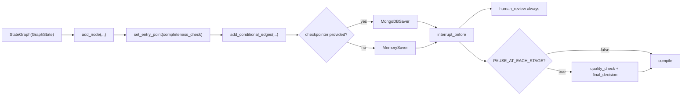
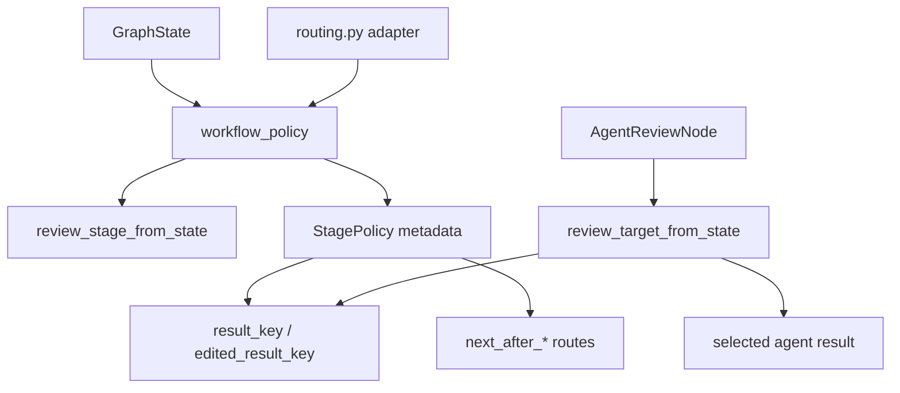
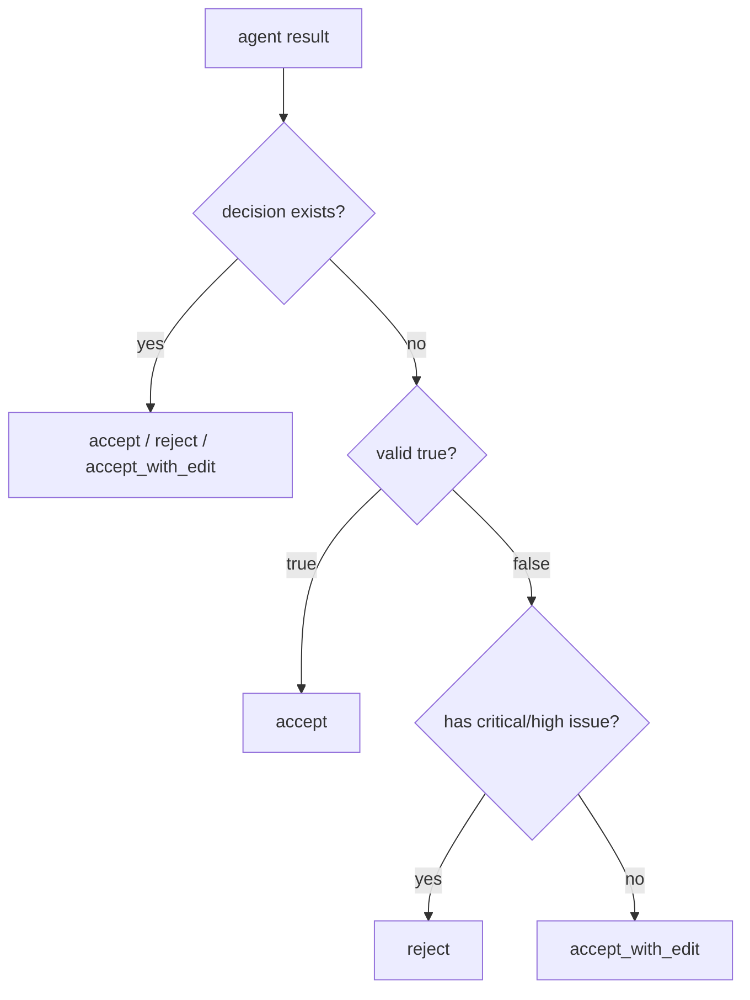
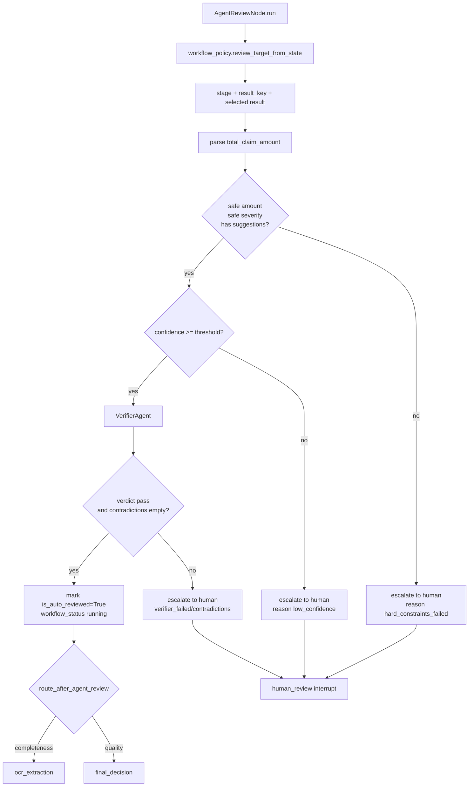
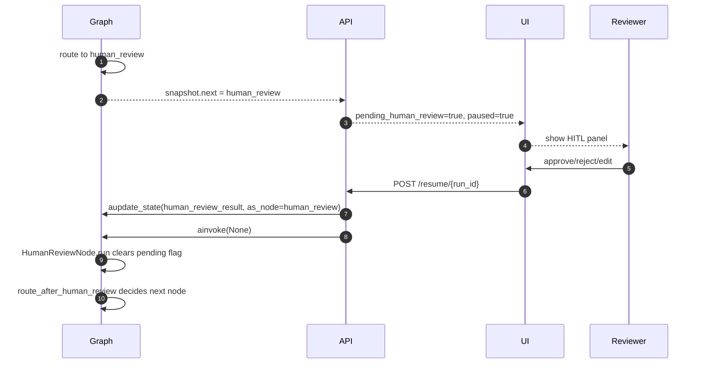
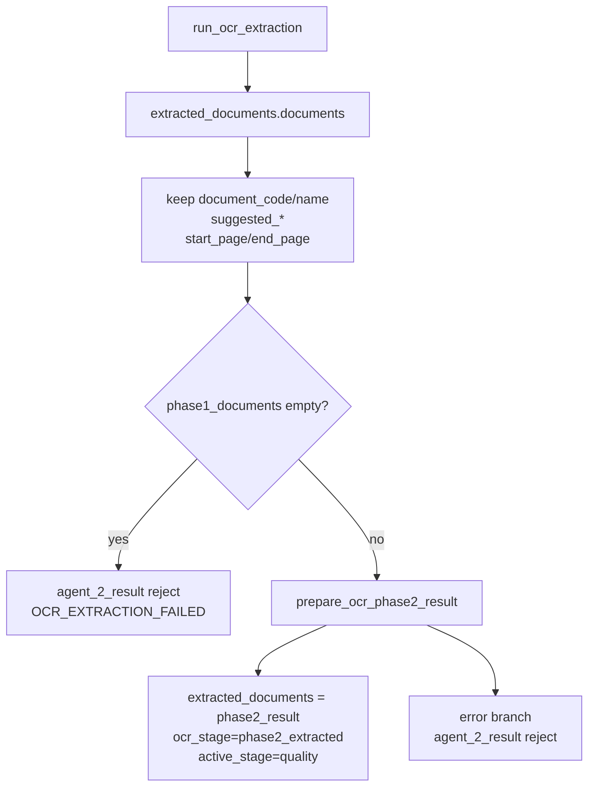

# Workflow Graph

Folder `graphs/` chứa state machine nghiệp vụ của claim workflow. Graph chạy theo LangGraph, có checkpoint MongoDB, và dừng trước node `human_review` để UI/API inject quyết định của thẩm định viên.

## Module map

| Module | Logic chính |
| --- | --- |
| `graphs/state.py` | `GraphState` TypedDict, các field lifecycle và kết quả agent |
| `graphs/constants.py` | Node names, stage names, workflow statuses, severity constants |
| `graphs/claim_workflow.py` | Build LangGraph, đăng ký nodes, conditional edges, compile interrupt |
| `graphs/workflow_policy.py` | Policy tập trung stage metadata, result-key mapping, decision normalization, routing decision |
| `graphs/routing.py` | Adapter mỏng giữ các routing function mà LangGraph đang gọi |
| `graphs/ocr_extraction.py` | OCR phase 2 sau khi Completeness approve phase 1 |
| `graphs/agent_review.py` | Tự duyệt `accept_with_edit` bằng hard constraints + VerifierAgent |
| `graphs/human_review.py` | Virtual interrupt node; chạy no-op sau khi API resume |

## Graph topology

## Build and compile logic

`build_claim_workflow(llm_client, checkpointer=None)` tạo các factory. Các factory này là wrapper mỏng quanh `agents.node_specs.AGENT_NODE_SPECS`; role metadata như prompt name, skill name, output key, schema và active/review stage nằm trong `AgentNodeSpec`.

| Factory | Node | Output key |
| --- | --- | --- |
| `CompletenessAgentFactory` | `completeness_check` | `agent_1_result` |
| `QualityAgentFactory` | `quality_check` | `agent_2_result` |
| `DecisionAgentFactory` | `final_decision` | `final_result` |
| `AgentReviewNode` | `agent_review` | update `agent_1_result` hoặc `agent_2_result` |
| `HumanReviewNode` | `human_review` | clear pending review sau resume |
| `run_ocr_extraction` | `ocr_extraction` | update `extracted_documents` phase 2 |

Graph compile:

## Workflow routing policy

`graphs/workflow_policy.py` là điểm tập trung routing policy của insurance claim workflow. Module này sở hữu stage metadata, chuẩn hóa decision, chọn target cho verifier gate, và quyết định node tiếp theo cho các nhánh agent review/human review/OCR.

- `routing.py` là adapter để LangGraph gọi các function như `route_after_completeness`, `route_after_agent_review`, `route_after_human_review`.
- `workflow_policy.py` sở hữu stage metadata và routing rules.
- `AgentReviewNode` gọi `review_target_from_state(state)` để lấy `stage`, `result_key`, và `agent_result`.
- `review_stage_from_state` ưu tiên `review_stage`, rồi fallback qua `current_step`/`final_result` cho checkpoint cũ.

Stage metadata hiện có:

| Stage | Result key | Edited result key | Accept route | Reject route | Human edit route | Agent review? |
| --- | --- | --- | --- | --- | --- | --- |
| `completeness` | `agent_1_result` | `edited_agent_1_result` | `ocr_extraction` nếu OCR phase 1, ngược lại `quality_check` | `final_decision` | `completeness_check` | Yes |
| `quality` | `agent_2_result` | `edited_agent_2_result` | `final_decision` | `final_decision` | `quality_check` | Yes |
| `final` | `final_result` | none | `human_review` | `human_review` | `quality_check` | No |

Policy là Python module explicit, không phải runtime plugin/config framework. Khi thêm stage mới, cập nhật `StagePolicy`, routing tests, và các consumer liên quan như UI timeline nếu stage cần hiển thị riêng.

## Routing by decision and severity

`workflow_policy.py` chuẩn hóa quyết định từ agent output:

- Nếu output có `decision`, dùng trực tiếp.
- Nếu thiếu `decision`, suy ra từ `valid` và issue severity.
- `critical/high` được xem là reject-level escalation.
- Issue thấp hơn có thể thành `accept_with_edit`.

## Agent Review logic

`AgentReviewNode` chỉ xử lý stage có `supports_agent_review=True` trong `StagePolicy`, hiện là `completeness` và `quality`. Nó không tự sửa kết quả; nó chỉ đánh dấu `is_auto_reviewed=True` nếu đủ an toàn.

Verifier gate không tự biết `agent_1_result` hay `agent_2_result`. Nó dùng `review_target_from_state(state)` để lấy đúng target:

| Policy output | AgentReviewNode dùng để |
| --- | --- |
| `stage` | ghi `current_step`, `review_stage`, history |
| `result_key` | update lại đúng state key với `is_auto_reviewed` |
| `result` | đọc confidence, issues, suggested updates, evidence |
| `active_stage_after_auto_review` | set `active_stage` sau khi verifier pass |

Điều kiện tự duyệt:

| Check | Ý nghĩa |
| --- | --- |
| `total_claim_amount < AGENT_REVIEW_AMOUNT_THRESHOLD` | Hồ sơ không vượt ngưỡng tiền cấu hình |
| Không có severity `critical/high/medium` | Không có cảnh báo cần người xem |
| Có `suggested_updates` | Có đề xuất cụ thể để xác thực |
| `confidence_score >= AGENT_REVIEW_CONFIDENCE_THRESHOLD` | Agent chính đủ tự tin |
| Verifier verdict `pass` và không có contradictions | Xác minh chéo không phát hiện mâu thuẫn |

## Human review logic

Graph được compile với `interrupt_before=["human_review"]`, nên node `HumanReviewNode.run` chỉ chạy sau khi API đã update `human_review_result`.

## OCR phase 2 node

`ocr_extraction.py` nhận `documents` từ OCR phase 1, lọc lại classification fields để tránh lẫn `extracted_data`, rồi gọi `prepare_ocr_phase2_result(...)`. Nếu lỗi, nó tạo `agent_2_result` reject với issue `OCR_EXTRACTION_FAILED` để graph vẫn có thể route về `final_decision`.

