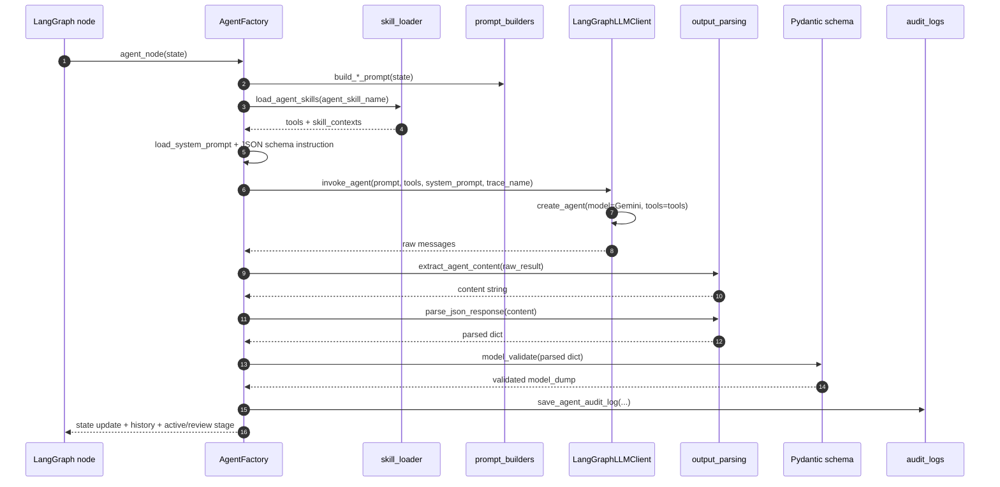
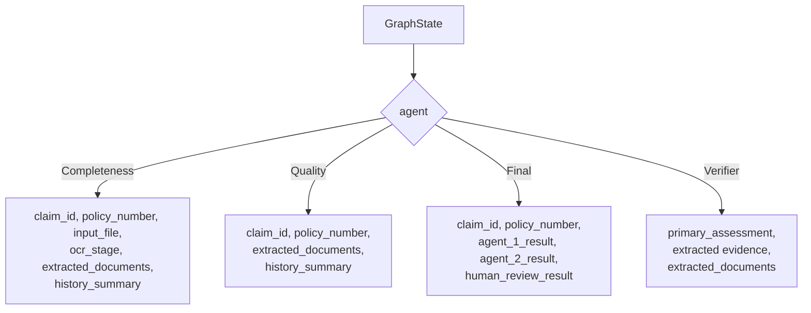
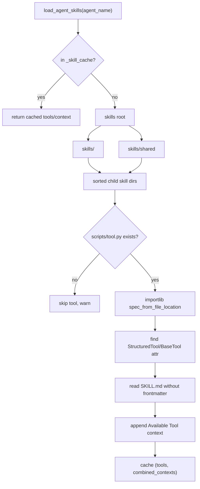
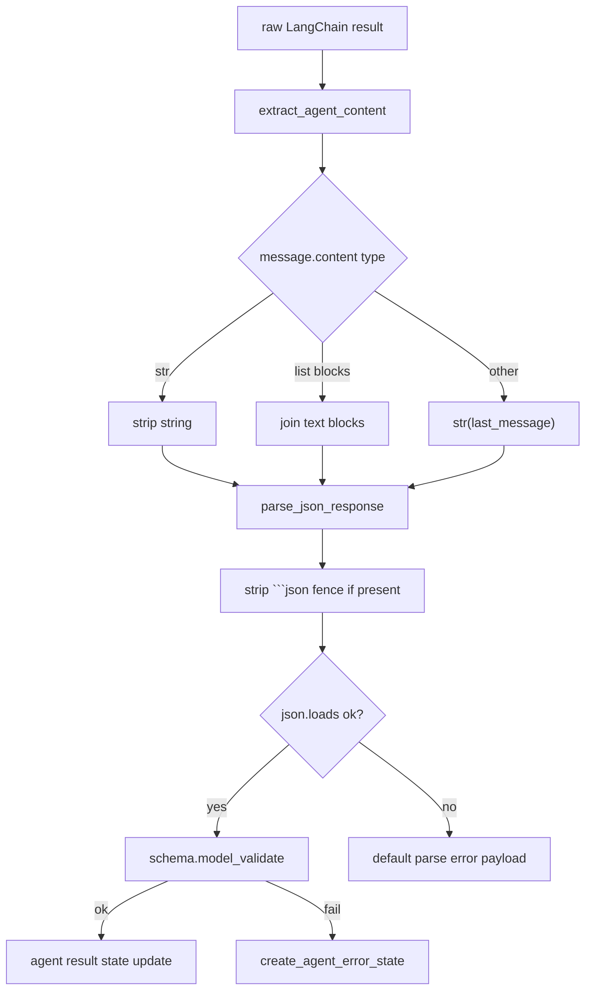
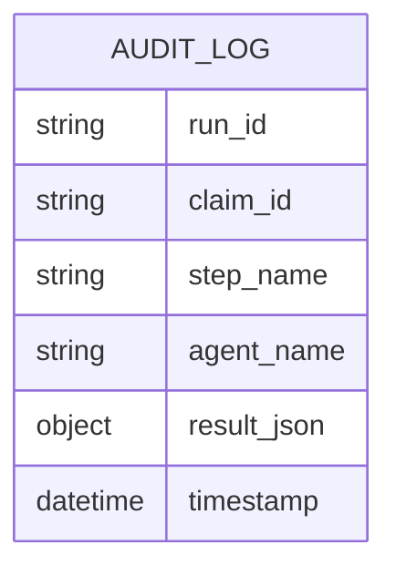

# Agents, Prompts, Skills

Folder `agents/`, `prompts/`, `skills/`, và `tools/` tạo thành agent runtime. Mỗi LangGraph agent node được tạo bởi factory, nhận `GraphState`, build prompt tiếng Việt, nạp system prompt + skill context, gọi LLM qua LangChain agent, parse JSON, validate schema, rồi ghi audit.

## Module map

| Module/folder | Logic chính |
| --- | --- |
| `agent.py` | `LangGraphLLMClient`, Gemini model, LangChain `create_agent`, optional Langfuse tracing |
| `agents/factory.py` | Tạo node cho Completeness, Quality, Final Decision, Verifier |
| `agents/prompt_builders.py` | Build user prompt từ `GraphState` cho từng agent |
| `agents/helpers.py` | Load system prompt, tạo history entry, error state |
| `agents/output_parsing.py` | Extract message content, strip JSON fences, parse JSON |
| `agents/audit.py` | Insert audit log vào MongoDB `audit_logs` |
| `tools/skill_loader.py` | Tự động discover `scripts/tool.py` trong `skills/<agent>` và `skills/shared` |
| `prompts/*.md` | System prompt chính cho từng agent |
| `skills/**/SKILL.md` | Mô tả tool/context được inject vào prompt |
| `skills/**/scripts/tool.py` | LangChain tool implementation |

## Agent invocation pipeline

## Agent factories

| Factory | Skill name | Prompt file | Output key | Schema |
| --- | --- | --- | --- | --- |
| `CompletenessAgentFactory` | `completeness_agent` | `prompts/completeness_agent.md` | `agent_1_result` | `AssessmentOutput` |
| `QualityAgentFactory` | `quality_agent` | `prompts/quality_agent.md` | `agent_2_result` | `AssessmentOutput` |
| `DecisionAgentFactory` | `decision_agent` | `prompts/final_agent.md` | `final_result` | `FinalDecisionOutput` |
| `VerifierAgentFactory` | `verifier_agent` | `prompts/verifier_agent.md` | `verifier_result` | `VerifierOutput` |

## Prompt composition

System prompt:

1. Read `prompts/{instructions_name}.md`.
2. Replace `{{skill_contexts}}` bằng nội dung `SKILL.md` đã load.
3. Append `<output_format>` chứa Pydantic JSON schema.
4. Bỏ `is_auto_reviewed` khỏi schema instruction để LLM không tự quyết cờ nội bộ.

User prompt:

## Skill loading

`load_agent_skills(agent_name)` có cache theo `agent_name`. Loader đọc hai nơi:

- `skills/<agent-name-kebab>/...`
- `skills/shared/...`

Mỗi skill folder có thể cung cấp:

- `SKILL.md`: context được inject vào system prompt.
- `scripts/tool.py`: module được import động để tìm một `StructuredTool` hoặc `LangChainBaseTool`.

## Output parsing and validation

`parse_json_response` chấp nhận JSON thuần hoặc markdown fenced JSON. Nếu parse lỗi, helper trả fallback reject-like payload. Với các agent có schema, factory validate ngay bằng Pydantic; validation fail trở thành agent error state.

## Audit behavior

Agent audit log là side effect không làm fail workflow nếu Mongo insert lỗi. `save_agent_audit_log` dùng `asyncio.to_thread` để insert vào collection `audit_logs`; nếu insert fail, exception bị catch và ghi warning log `Failed to save audit log`.

