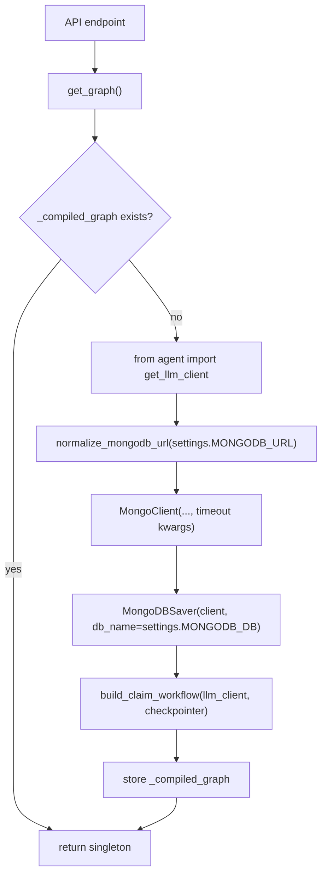
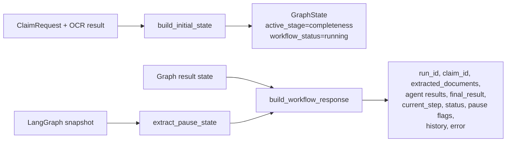
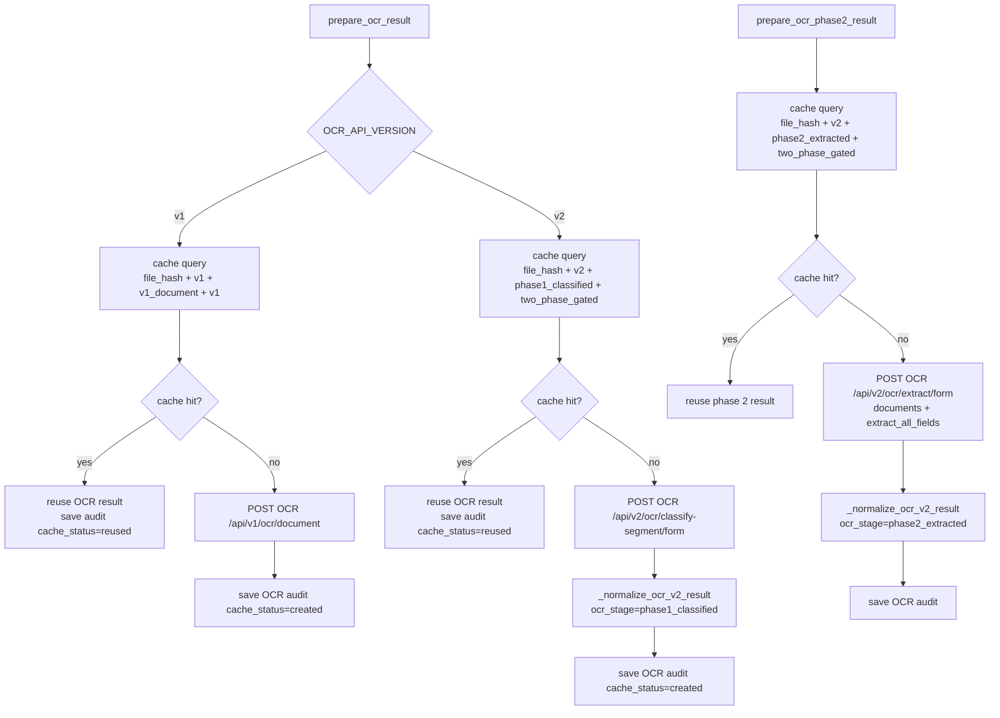
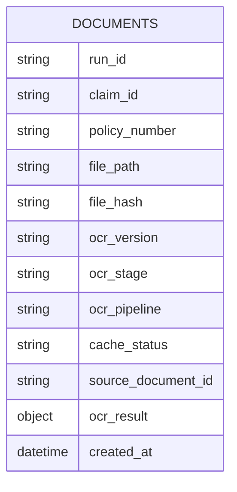
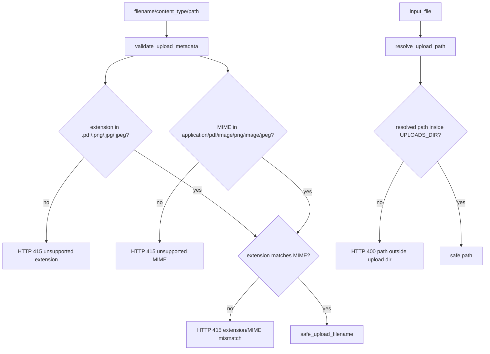
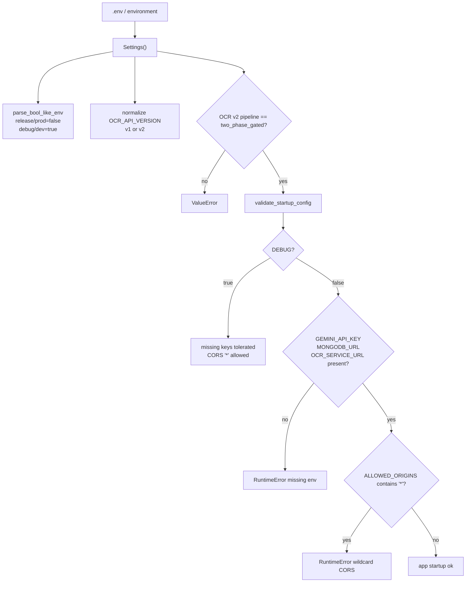

# Services and Persistence

Folder `services/` chứa logic dùng chung cho API và graph: compiled graph lifecycle, OCR orchestration/cache, file upload policy, response shaping, và MongoDB connection config.

## Module map

| Module | Logic chính |
| --- | --- |
| `services/graph_service.py` | Singleton compiled graph, MongoDBSaver checkpointer, LLM client injection |
| `services/workflow_state.py` | Build initial `GraphState`, build API response, pause/review-stage helpers |
| `services/ocr_service.py` | Gọi OCR v1/v2, cache theo hash, audit OCR result vào MongoDB |
| `services/file_policy.py` | Upload dir, safe filename, metadata validation, path containment |
| `services/mongodb_config.py` | Normalize MongoDB URL và timeout kwargs cho PyMongo |
| `mongodb_client.py` | Shared MongoDB client/collection helpers cho audit/cache |
| `config.py` | Settings/env validation cho toàn service |

## Graph lifecycle and checkpointing

`get_graph()` lazy-load compiled graph một lần trong process. Checkpointer dùng `MongoDBSaver`, nên mỗi workflow dùng `thread_id = run_id` để lưu và resume state.

## Workflow state helpers

`build_initial_state` chuẩn hóa mọi run mới về cùng shape. `build_workflow_response` là boundary response cho UI/API, không expose toàn bộ internal fields.

Pause rules:

| Snapshot condition | Response flags |
| --- | --- |
| `snapshot.next` empty | `pending=false`, `paused=false`, `pause_at=null` |
| `snapshot.next` contains `human_review` | `pending=true`, `paused=true`, `pause_at=human_review` |
| Other next node exists | `pending=false`, `paused=true`, `pause_at=<next node>` |

## OCR service logic

Service hỗ trợ:

- v1: `/api/v1/ocr/document`
- v2 phase 1: `/api/v2/ocr/classify-segment/form`
- v2 phase 2: `/api/v2/ocr/extract/form`

Default pipeline hiện tại là v2 `two_phase_gated`.

## OCR cache/audit document

Cache lookup chỉ reuse documents có `cache_status` absent hoặc `created`; mỗi reuse vẫn insert một audit row mới với `cache_status="reused"` và `source_document_id`.

## Upload file policy

`file_policy.py` bảo vệ hai boundary:

- Metadata upload: extension và MIME.
- Pairing giữa extension và MIME.
- Path resolution: path phải nằm trong `UPLOADS_DIR`, kể cả absolute path.

## Config lifecycle

`Settings` đọc `.env`, parse bool-like string, validate OCR version/pipeline, và `validate_startup_config` chặn production thiếu key hoặc CORS wildcard.

