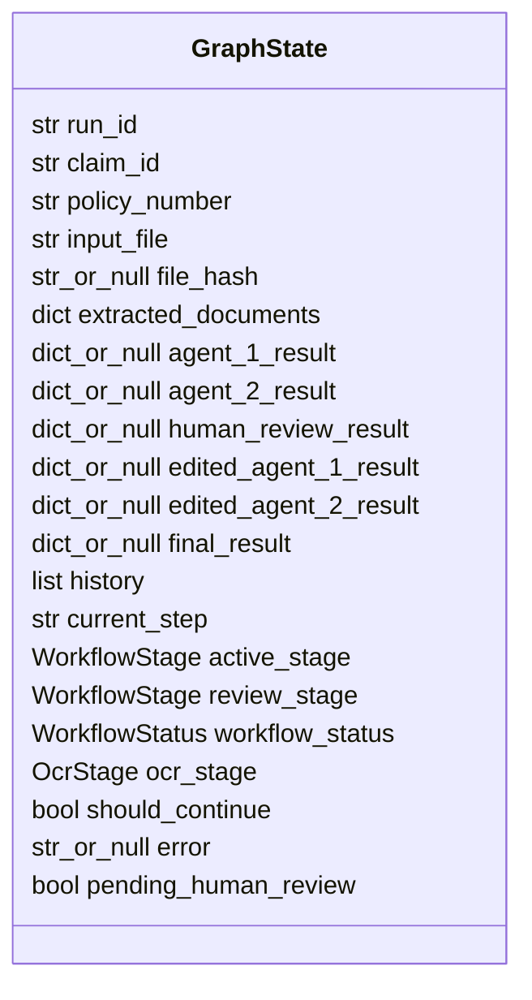
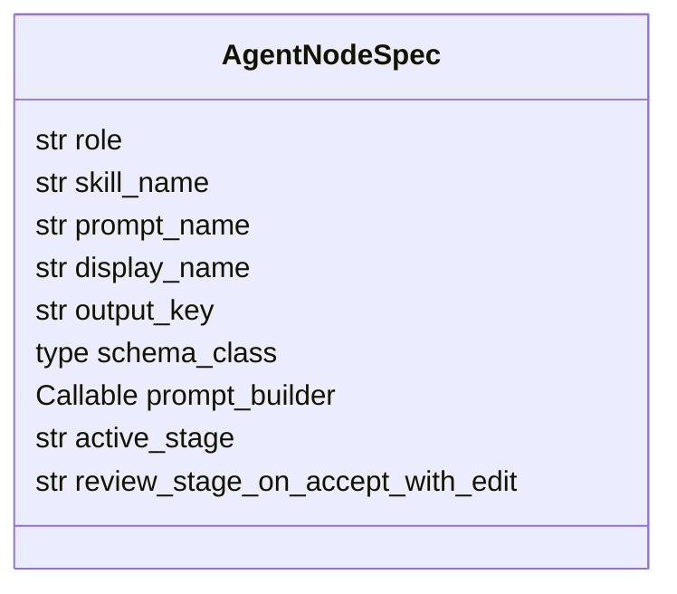
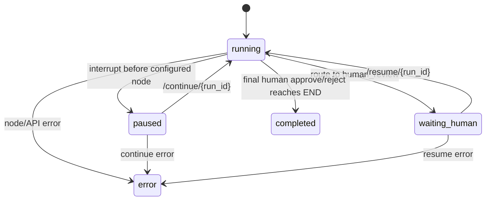
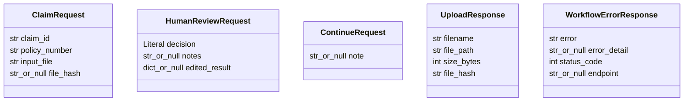
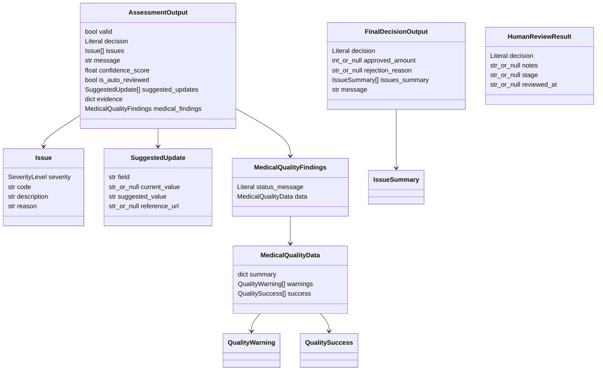
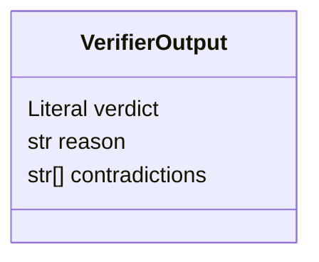
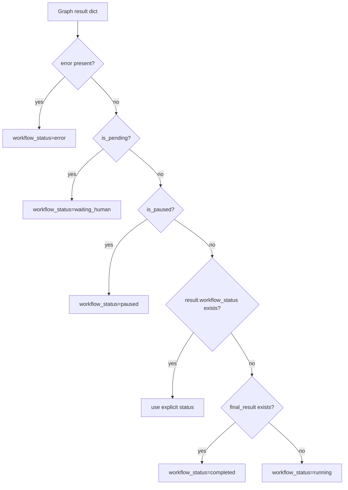

# Schemas and State Contracts

Các schema trong `schemas/`, `api/schemas.py`, và `graphs/state.py` là hợp đồng giữa API, graph, agent, UI. Khi sửa workflow, ưu tiên cập nhật contract trước rồi mới chỉnh route/UI tương ứng.

## GraphState contract

`GraphState` là state nội bộ của LangGraph. Trường `history` dùng reducer `operator.add`, nên mỗi node chỉ cần trả list entry mới; LangGraph sẽ append.

## State lifecycle fields

| Field | Producer | Consumer |
| --- | --- | --- |
| `active_stage` | `build_initial_state`, agent nodes via `AgentNodeSpec`, OCR node, human node | UI timeline, routing/debug |
| `review_stage` | agent nodes via `AgentNodeSpec`, agent review, human node | `workflow_policy.review_stage_from_state`, `AgentReviewNode`, routing, human review application |
| `workflow_status` | graph nodes, response helper | API/UI state mapping |
| `ocr_stage` | `build_initial_state`, OCR service/node | completeness prompt, OCR routing |
| `pending_human_review` | agent review/human review/pause extraction | API response, Streamlit HITL panel |
| `history` | all nodes/API continue | UI audit table, prompt history summary |

`workflow_policy.review_stage_from_state` là source of truth cho suy luận review stage. `services.workflow_state.determine_review_stage` chỉ còn là legacy wrapper delegate về policy. HRA dùng policy trực tiếp khi đóng gói `HumanReviewResult.stage`.

`graphs.workflow_policy` tập trung mapping giữa workflow stage và các state key trong `GraphState`.

| Workflow stage | Result key | Edited result key | Ghi chú |
| --- | --- | --- | --- |
| `completeness` | `agent_1_result` | `edited_agent_1_result` | Có thể route qua OCR phase 2 trước `quality_check` |
| `quality` | `agent_2_result` | `edited_agent_2_result` | Route tới `final_decision` sau accept/reject |
| `final` | `final_result` | none | Luôn cần human sign-off, không đi qua Agent Review |

Khi thêm stage, cập nhật `GraphState`/schema contract trước nếu stage cần result key riêng. Sau đó thêm `StagePolicy`, routing tests, UI timeline mapping, và API response nếu field mới cần expose ra ngoài.

## Agent node spec contract

`agents.node_specs.AgentNodeSpec` mô tả metadata runtime cho từng agent role. Contract này không thay thế `GraphState`; nó chỉ tập trung mapping role -> output key/schema/prompt/skill để factory không phải truyền nhiều primitive string rời.

| Role | Output key | Schema | Stage effect |
| --- | --- | --- | --- |
| `completeness` | `agent_1_result` | `AssessmentOutput` | `active_stage=completeness`; `accept_with_edit` sets `review_stage=completeness` |
| `quality` | `agent_2_result` | `AssessmentOutput` | `active_stage=quality`; `accept_with_edit` sets `review_stage=quality` |
| `decision` | `final_result` | `FinalDecisionOutput` | `active_stage=final`; no agent-review stage |
| `verifier` | `verifier_result` | `VerifierOutput` | `active_stage=none`; no agent-review stage |

Khi thêm agent role mới, cập nhật `AgentNodeSpec` trước để output key/schema/prompt contract rõ ràng, sau đó mới cập nhật graph node registration và routing policy nếu role đó là workflow stage mới.

## API request/response schemas

## Agent output schemas

`AssessmentOutput` dùng chung cho Completeness và Quality. `FinalDecisionOutput` dùng cho Final Agent. `HumanReviewResult` là state-injected contract sau khi API resume.

## Verifier schema

Verifier Agent được Agent Review dùng để kiểm tra mâu thuẫn trước khi tự duyệt.

## Response projection

`build_workflow_response` cố ý chỉ trả các trường UI/API cần. Nó tính lại `workflow_status` từ error/pause flags để response phản ánh snapshot hiện tại.

## Decision values

| Contract | Accepted values |
| --- | --- |
| Assessment decision | `accept`, `reject`, `accept_with_edit` |
| Final decision | `approve`, `reject` |
| Human review decision | `approve`, `reject`, `edit` |
| Verifier verdict | `pass`, `fail` |
| Severity | `critical`, `high`, `medium`, `low` |
| Workflow stage | `completeness`, `quality`, `final`, `none` |
| OCR stage | `none`, `v1_document`, `phase1_classified`, `phase2_extracted`, `error` |
