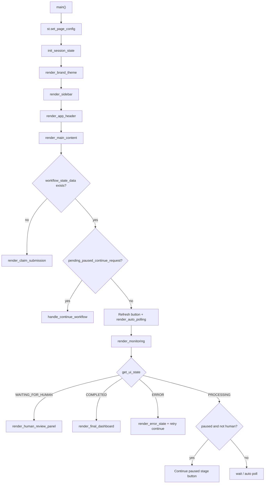
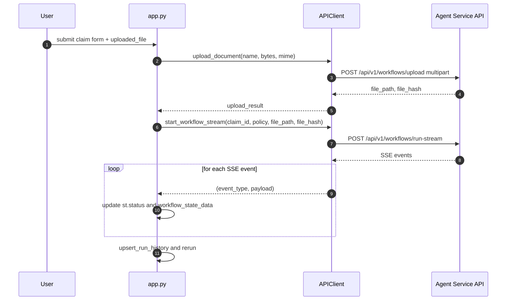
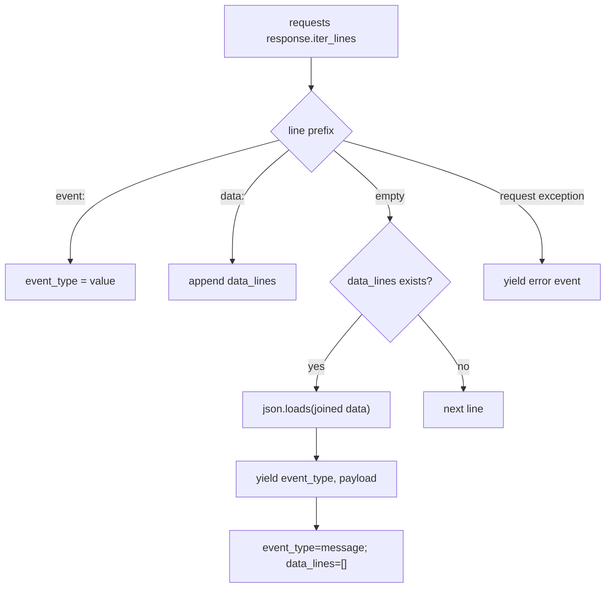
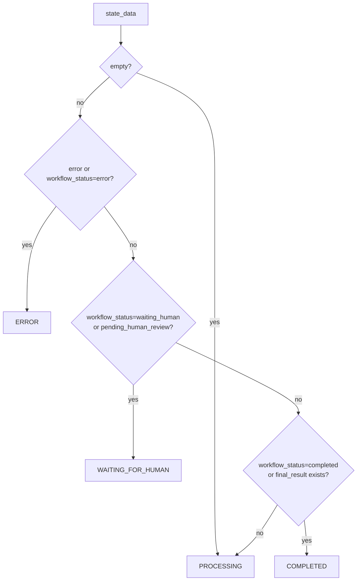
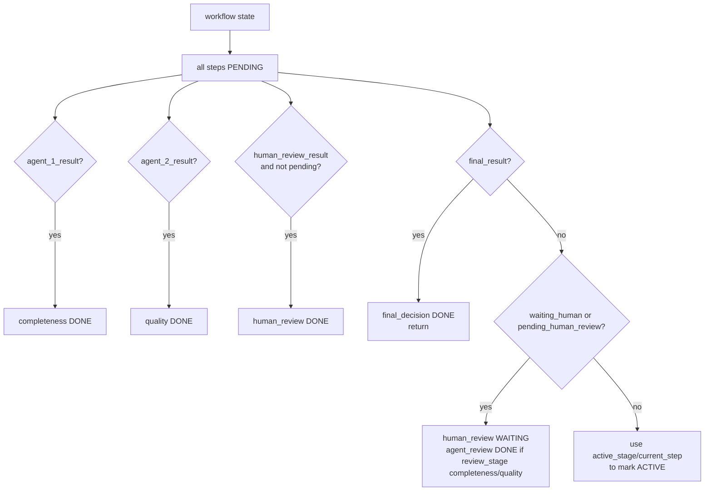
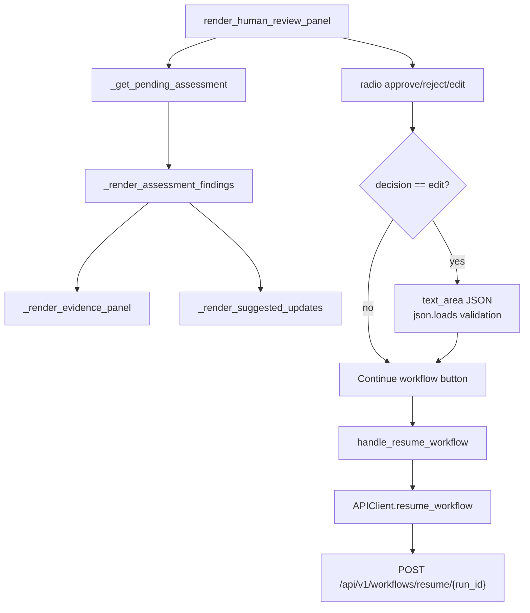

# Streamlit UI

Folder `interfaces/web/` là UI vận hành thủ công cho claim workflow. UI upload tài liệu, gọi API streaming để hiện tiến trình theo từng node, hiển thị bằng chứng/issue/suggested updates, và gửi quyết định Human-in-the-Loop.

## Module map

| Module | Logic chính |
| --- | --- |
| `interfaces/web/app.py` | Entry point Streamlit, session state, action handlers, auto polling, render flow |
| `interfaces/web/api_client.py` | HTTP client cho API JSON, upload multipart, SSE parser |
| `interfaces/web/components.py` | UI components, timeline, HITL panel, evidence/issues/medical findings |
| `interfaces/web/README.md` | Hướng dẫn chạy UI và endpoint liên quan |

## UI application flow

## Session state keys

| Key | Vai trò |
| --- | --- |
| `current_run_id` | Run đang được xem/chạy |
| `workflow_state_data` | Response state mới nhất từ API/SSE |
| `run_history` | Danh sách run gần đây trong sidebar |
| `api_base_url` | Base URL agent-service |
| `client` | Cached `APIClient` theo base URL |
| `auto_poll_enabled` | Bật/tắt polling khi workflow processing |
| `workflow_action_lock` | Chống double-submit resume |
| `paused_continue_button_disabled` | Disable nút continue khi request pending |
| `pending_paused_continue_request` | Trigger continue trong rerun kế tiếp |
| `refresh_in_flight` | Chặn refresh trùng |

## Upload + streaming workflow

## SSE parser in API client

`APIClient._consume_sse_stream` đọc từng line:

- `event:` cập nhật event type.
- `data:` append data lines.
- Empty line là event boundary, parse JSON và yield `(event_type, payload)`.
- Network error được yield thành `("error", {"error": ...})`.

SSE node map hiện có cả `ocr_extraction`; UI dùng `STEP_LABELS["ocr_extraction"]` để hiển thị bước OCR phase 2 là "Trích xuất OCR chi tiết" trong status stream, nhưng không thêm node này vào timeline chính để tránh đổi layout/pipeline hiển thị tổng quan.

## UI state mapping

`components.get_ui_state` map workflow response thành 4 trạng thái chính:

## Timeline computation

Timeline không chỉ dựa vào `current_step`; nó cũng đọc `agent_1_result`, `agent_2_result`, `human_review_result`, `final_result`, `active_stage`, `review_stage`, và `pending_human_review`.

## Human review panel

HITL panel lấy assessment pending từ state, hiển thị issue/evidence/suggested updates, cho reviewer chọn `approve`, `reject`, hoặc `edit`. Với `edit`, UI mở JSON editor và gửi `edited_result`.

