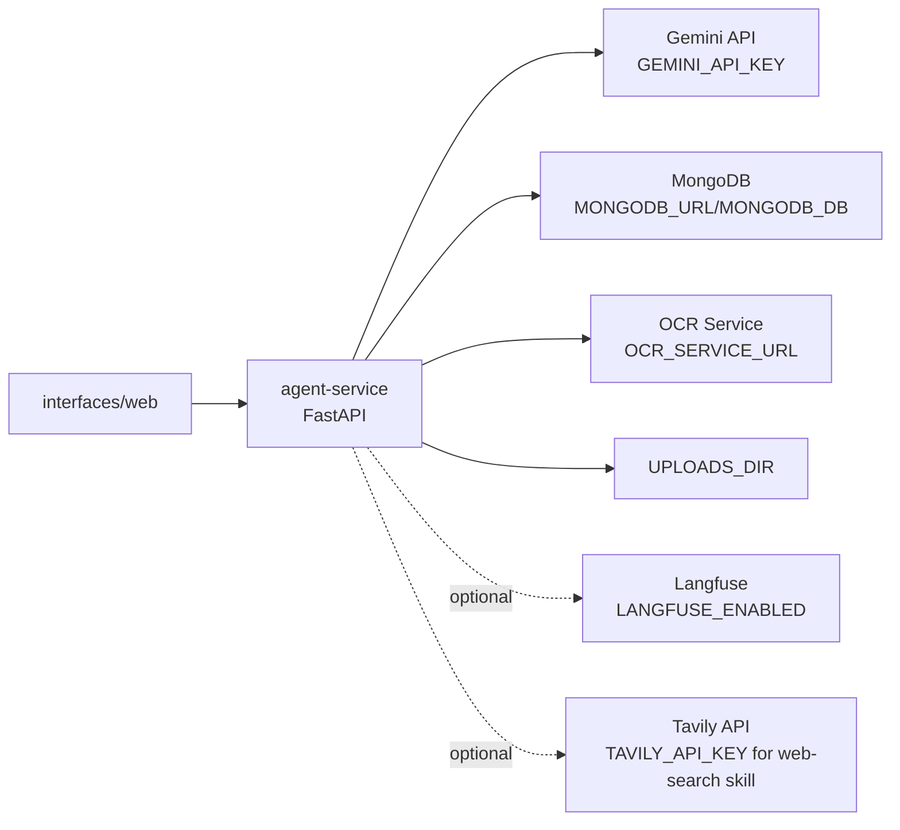
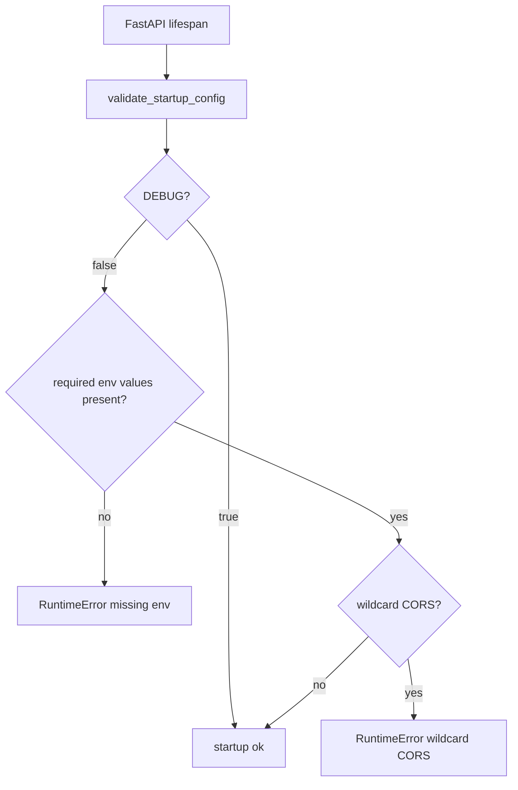
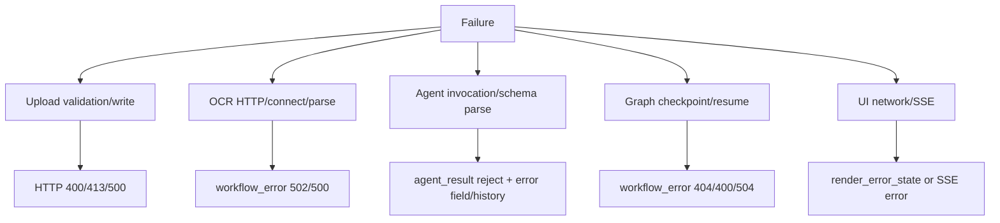
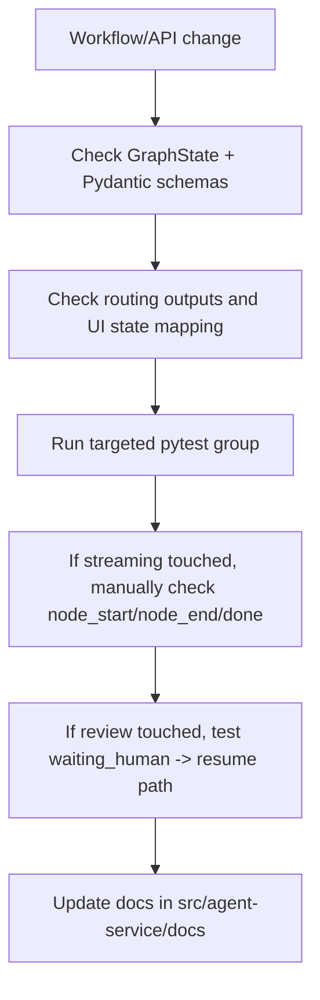

# Testing and Operations

Tài liệu này gom các điểm vận hành và regression test quan trọng cho agent-service.

## Test groups hiện có

| Test file | Phạm vi |
| --- | --- |
| `tests/test_config_lifecycle.py` | Env parsing, startup validation, CORS behavior, OCR pipeline validation |
| `tests/test_upload_policy.py` | Extension/MIME allowlist, safe filename, path containment |
| `tests/test_ocr_service.py` | OCR v1/v2 selection, cache query, v2 phase 1/phase 2 normalize payload |
| `tests/test_api_status.py` | Status/health API behavior và response shape |

Command smoke test cho P7/P8 hiện dùng:

```bash
python -m pytest src/agent-service/tests/test_config_lifecycle.py src/agent-service/tests/test_upload_policy.py src/agent-service/tests/test_ocr_service.py src/agent-service/tests/test_api_status.py -q
```

## Runtime dependencies



## Startup validation

Ở `DEBUG=false`, service yêu cầu:

- `GEMINI_API_KEY`
- `MONGODB_URL`
- `OCR_SERVICE_URL`
- `ALLOWED_ORIGINS` không được chứa `*`

Ở `DEBUG=true`, service cho phép cấu hình dev thoáng hơn.



## Common operational flows

### Run service locally

```bash
cd src/agent-service
uvicorn main:app --host 0.0.0.0 --port 8003 --reload
```

### Run Streamlit UI

```bash
cd src/agent-service/interfaces/web
streamlit run app.py --server.port 8501
```

### Validate docs/source whitespace

```bash
git diff --check -- src/agent-service/docs
```

## Failure handling map



## Regression checkpoints before changing workflow logic



## Notes for reviewers

- `run_id` must stay stable across `/status`, `/resume`, `/continue`, and `/stream`.
- `thread_id` in LangGraph config must equal `run_id`.
- `human_review` is an interrupt-before node; API must update state before resume.
- `accept_with_edit` should pass through Agent Review first, then escalate only when unsafe.
- OCR phase 2 depends on clean phase 1 classification metadata; do not pass stale `extracted_data` back into phase 2.

