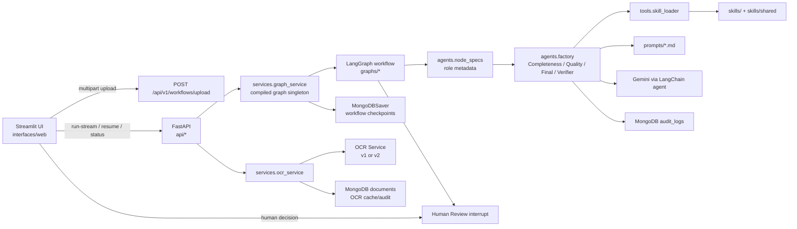
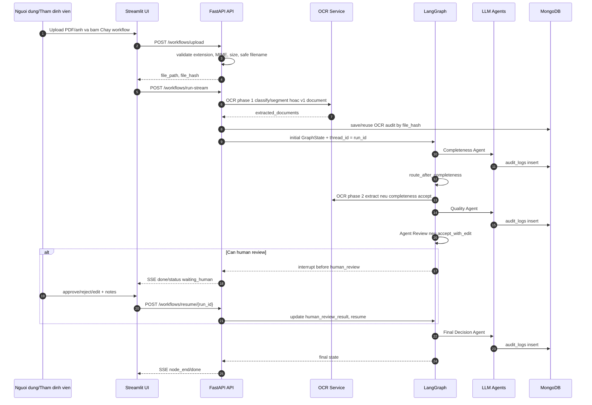

# Agent Service Logic Documentation

Thư mục này mô tả logic vận hành của `src/agent-service` theo từng layer/folder. Mục tiêu là giúp đọc nhanh luồng xử lý hồ sơ bồi thường, hợp đồng dữ liệu giữa các module, và các điểm cần chú ý khi sửa đổi.

## Bản đồ tài liệu

| Tài liệu | Phạm vi |
| --- | --- |
| [01-api-layer.md](01-api-layer.md) | FastAPI app, route group, upload, workflow, status, SSE, lỗi chuẩn hóa |
| [02-workflow-graph.md](02-workflow-graph.md) | LangGraph nodes, routing, HITL, agent review, OCR phase 2 |
| [03-agents-prompts-skills.md](03-agents-prompts-skills.md) | Agent factory, prompt builders, skill loader, output parsing, audit logs |
| [04-services-persistence.md](04-services-persistence.md) | Graph lifecycle, MongoDB checkpointer, OCR service, upload file policy, config |
| [05-schemas-state-contracts.md](05-schemas-state-contracts.md) | `GraphState`, API schemas, agent output schemas, verifier output |
| [06-streamlit-ui.md](06-streamlit-ui.md) | Streamlit app, API client, state mapping, timeline, HITL panel |
| [07-testing-operations.md](07-testing-operations.md) | Test groups, env/config checks, operational flows |

## Kiến trúc tổng quan

## Cấu trúc module chính

| Folder/module | Vai trò |
| --- | --- |
| `main.py` | Khởi tạo FastAPI app, lifespan validation, CORS, health/root endpoint |
| `config.py` | Pydantic settings, env parsing, OCR/Langfuse/Mongo/Gemini/upload limits |
| `agent.py` | Singleton LLM client, LangChain agent invocation, optional Langfuse callback |
| `api/` | HTTP surface cho upload, run/resume/continue/stream/status |
| `graphs/` | LangGraph state machine và routing nghiệp vụ |
| `graphs/workflow_policy.py` | Policy tập trung stage metadata, result-key mapping, routing decision và verifier target |
| `agents/` | Agent specs, factory tạo agent node, prompt composition, parse/validate/audit output |
| `services/` | Cross-cutting services: graph lifecycle, OCR, file policy, response state |
| `schemas/` | Pydantic contracts cho agent output và human review |
| `tools/` | Runtime discovery loader cho skill tools |
| `skills/` | Tool implementation + `SKILL.md` context theo agent |
| `prompts/` | System prompt tiếng Việt cho từng agent |
| `interfaces/web/` | Streamlit UI để upload, stream progress, thẩm định thủ công |
| `tests/` | Regression tests cho config, upload policy, OCR, API status |

## Luồng end-to-end

## Quy ước trạng thái quan trọng

| Trường | Ý nghĩa |
| --- | --- |
| `run_id` | Thread id của LangGraph checkpoint và định danh phiên UI |
| `current_step` | Nhãn tiến trình gần nhất, dùng cho timeline/debug |
| `active_stage` | Stage tự động đang chạy: `completeness`, `quality`, `final`, `none` |
| `review_stage` | Stage đang cần agent/human review |
| `workflow_status` | Lifecycle: `running`, `paused`, `waiting_human`, `completed`, `error` |
| `pending_human_review` | Cờ API/UI dùng để mở HITL panel |
| `history` | Audit nhẹ trong graph state, được merge bằng reducer `operator.add` |
