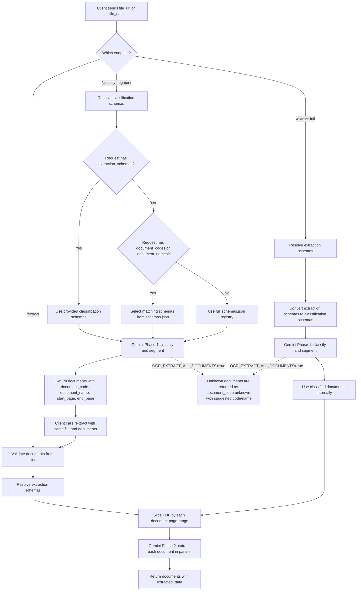

# OCR Service

FastAPI service for OCR and structured document extraction using Google Gemini.

This service exposes legacy v1 OCR endpoints and OCR v2 endpoints for schema-driven insurance claim document processing.

## Runtime

- App entrypoint: `main:app`
- Framework: FastAPI
- Default standalone port: `8091`
- Supported inputs: PDF, JPG, JPEG, PNG
- Max file size: 50 MB
- Default schema registry: [`schemas.json`](./schemas.json)

## Run Locally

```bash
cd src/ocr-service
cp .env.example .env
pip install -r requirements.txt
uvicorn main:app --reload --host 0.0.0.0 --port 8091
```

Health check:

```bash
curl http://localhost:8091/health
```

Interactive docs:

```text
http://localhost:8091/docs
```

## Docker

Standalone OCR compose:

```bash
cd src/ocr-service
docker compose up -d --build
curl http://localhost:8091/health
```

Root project compose:

```bash
docker compose up -d --build ocr-service
```

The root compose maps the OCR service for the rest of the claim system. Check the root `docker-compose.yml` and root `.env` for the active host/container port mapping.

## Configuration

Required:

```bash
GEMINI_API_KEY=your_gemini_api_key_here
```

Common settings:

```bash
PROJECT_NAME="Gemini OCR API"
VERSION="1.0.0"
API_PREFIX="/api/v1"
API_V2_PREFIX="/api/v2"

GEMINI_MODEL=gemini-2.5-pro
GEMINI_TEMPERATURE=
GEMINI_TOP_P=
GEMINI_TOP_K=
GEMINI_MAX_OUTPUT_TOKENS=
GEMINI_THINKING_BUDGET=
GEMINI_THINKING_LEVEL=

GEMINI_MAX_INLINE_IN_BYTES=104857600
GEMINI_MAX_CONCURRENT_EXTRACTIONS=3
OCR_EXTRACT_ALL_DOCUMENTS=true
OCR_HIGH_ACCURACY_DOCUMENT_CODES=claim_form
OCR_HIGH_ACCURACY_MODEL=gemini-2.5-pro

LOG_LEVEL=INFO
LOG_FILE=ocr_service.log
```

Notes:

- `OCR_EXTRACT_ALL_DOCUMENTS=true` lets v2 classification return `unknown` documents instead of dropping documents outside the known schema candidates.
- `OCR_HIGH_ACCURACY_DOCUMENT_CODES` is a comma-separated list of document codes that should use `OCR_HIGH_ACCURACY_MODEL` in Phase 2 extraction.
- Request-level `model_name`, `temperature`, `top_p`, `top_k`, `max_output_tokens`, `thinking_budget`, and `thinking_level` override default generation settings.

## API Overview

| Method | Endpoint | Purpose |
|---|---|---|
| `GET` | `/health` | Health check |
| `POST` | `/api/v1/ocr/raw` | Legacy raw text OCR |
| `POST` | `/api/v1/ocr/fields` | Legacy structured field OCR |
| `POST` | `/api/v1/ocr/document` | Legacy document-structure OCR |
| `POST` | `/api/v2/ocr/prefilter` | Check whether a document is in OCR scope |
| `POST` | `/api/v2/ocr/classify-segment` | Phase 1: classify documents and detect page boundaries |
| `POST` | `/api/v2/ocr/extract` | Phase 2: extract from already-classified documents |
| `POST` | `/api/v2/ocr/extract-full` | Convenience endpoint: classify, then extract in one request |
| `POST` | `/api/v2/ocr/classify-segment/form` | Multipart form version of classify-segment |
| `POST` | `/api/v2/ocr/extract/form` | Multipart form version of Phase 2 extract |

## Input Sources

V1 form endpoints accept one of:

- `file`
- `file_url`

V2 JSON endpoints accept exactly one of:

- `file_url`
- `file_data`

V2 form endpoints accept exactly one of:

- `file`
- `file_url`
- `file_data`

`file_data` may be plain base64 or a data URL such as:

```text
data:application/pdf;base64,JVBERi0xLjQ...
```

## OCR v2 Pipeline

OCR v2 separates classification from extraction.

```text
Phase 1: /classify-segment
  input: file + optional schema selector
  output: documents with document_code, document_name, start_page, end_page

Phase 2: /extract
  input: same file + documents from Phase 1
  output: documents with extracted_data
```

Use `/extract-full` when the client wants one call that runs both phases.



## Schema Registry

`schemas.json` is the default OCR v2 schema registry. Each schema defines one known document type:

```json
{
  "document_code": "medical_report",
  "document_name": "Báo cáo y tế",
  "fields": [
    {
      "field_key": "patient_name",
      "field_name": "Tên bệnh nhân",
      "data_type": "string",
      "description": "Patient name printed on the document",
      "nullable": true,
      "required": true
    }
  ]
}
```

Supported field `data_type` values:

- `string`
- `number`
- `boolean`
- `date`
- `array`

For `array`, provide `child_schema`.

Schema resolution precedence:

```text
1. extraction_schemas from request
2. document_codes/document_names lookup from schemas.json
3. full schemas.json registry
```

`document_codes` and `document_names` are selectors for known candidates. They do not remove unknown document support when `OCR_EXTRACT_ALL_DOCUMENTS=true`.

If a selector does not match any registry entry, the API returns `422`.

## JSON Examples

### 1. Classify and Segment

### With `uv` (recommended)

```bash
cd src/ocr-service
PYTHONPATH=. uv run uvicorn main:app --reload --port 8001
```

### With `pip`

```bash
curl -X POST "http://localhost:8091/api/v2/ocr/classify-segment" \
  -H "Content-Type: application/json" \
  -d '{
    "file_url": "https://example.com/claim.pdf",
    "document_codes": ["medical_report", "medical_receipt", "prescription"]
  }'
```

Example response:

```json
{
  "documents": [
    {
      "document_code": "medical_report",
      "document_name": "Báo cáo y tế",
      "start_page": 1,
      "end_page": 1
    },
    {
      "document_code": "unknown",
      "document_name": "",
      "suggested_document_code": "other_medical_document",
      "suggested_document_name": "Chứng từ y tế khác",
      "start_page": 2,
      "end_page": 2
    }
  ]
}
```

### 2. Extract From Classified Documents

`/extract` is Phase 2 only. It does not classify again.

```bash
curl -X POST "http://localhost:8091/api/v2/ocr/extract" \
  -H "Content-Type: application/json" \
  -d '{
    "file_url": "https://example.com/claim.pdf",
    "documents": [
      {
        "document_code": "medical_report",
        "document_name": "Báo cáo y tế",
        "start_page": 1,
        "end_page": 1
      }
    ]
  }'
```

### 3. Full Pipeline in One Request

Use `/extract-full` if the client does not want to call `/classify-segment` first.

```bash
curl -X POST "http://localhost:8091/api/v2/ocr/extract-full" \
  -H "Content-Type: application/json" \
  -d '{
    "file_url": "https://example.com/claim.pdf",
    "document_codes": ["medical_report", "medical_receipt", "prescription"],
    "extract_all_fields": false
  }'
```

This endpoint internally runs:

```text
classify-segment -> per-document extract
```

### 4. Explicit Extraction Schema

```bash
curl -X POST "http://localhost:8091/api/v2/ocr/extract-full" \
  -H "Content-Type: application/json" \
  -d '{
    "file_url": "https://example.com/claim.pdf",
    "extraction_schemas": [
      {
        "document_code": "custom_doc",
        "document_name": "Custom document",
        "fields": [
          {
            "field_key": "patient_name",
            "data_type": "string"
          }
        ]
      }
    ]
  }'
```

## Form Examples

### Classify Uploaded File

```bash
curl -X POST "http://localhost:8091/api/v2/ocr/classify-segment/form" \
  -F "file=@claim.pdf" \
  -F "document_codes=[\"medical_report\",\"medical_receipt\"]"
```

### Extract Uploaded File After Classification

```bash
curl -X POST "http://localhost:8091/api/v2/ocr/extract/form" \
  -F "file=@claim.pdf" \
  -F 'documents=[
    {
      "document_code": "medical_report",
      "document_name": "Báo cáo y tế",
      "start_page": 1,
      "end_page": 1
    }
  ]'
```

## Legacy v1 Example

```bash
curl -X POST "http://localhost:8091/api/v1/ocr/raw" \
  -F "file=@document.pdf" \
  -F "prompt=Extract patient information and diagnosis"
```

## Development Checks

```bash
python -m ruff check src/ocr-service
python -m ruff format --check src/ocr-service
python -m pytest src/ocr-service/tests -q
python -m compileall -q src/ocr-service
```

From inside `src/ocr-service`, the equivalent test command is:

```bash
python -m pytest tests -q
```
